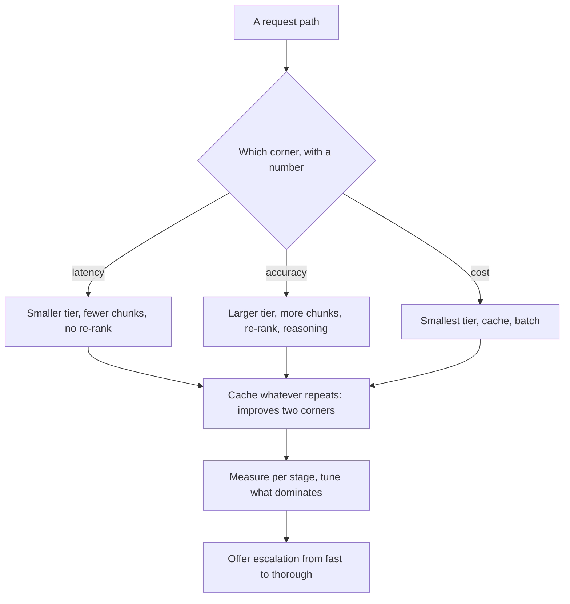
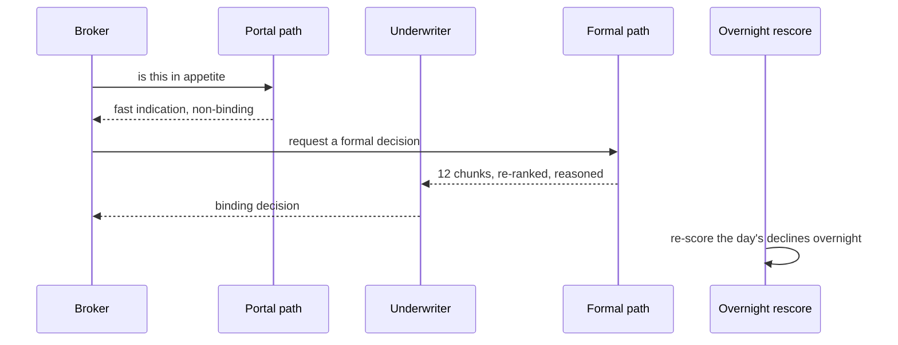

## What Problem Are We Solving?

A commercial insurer triages submissions from brokers: 2,800 a day, each a pack of documents that
has to be classified, checked against appetite, and either routed to an underwriter or declined.

The system was built once, tuned for accuracy — the largest model, twelve retrieved chunks,
re-ranking, chain-of-thought reasoning — and it is genuinely good. It is also 11 seconds per
submission, and brokers using the live portal see a spinner.

The obvious move is to make it faster, and the team did: smaller model, four chunks, no
re-ranking. Latency to 1.3 seconds. Appetite-check accuracy fell from 96% to 88%, and an 8-point
drop on a decline decision is a broker relationship and sometimes a regulatory conversation.

Then they moved it back, and brokers complained about the spinner again.

The mistake is the premise, not either configuration. There is no setting that maximises accuracy,
speed and cost simultaneously — push toward any corner and you pull resources from the other two.
What the system needed wasn't a better compromise; it was **two configurations for two different
requests**, because a broker checking whether a risk is in appetite and an underwriter running a
formal decline are not the same question with the same tolerance.

The architect's job here is to identify which corner a given path is optimising for, and to name
what is being given up to get there — explicitly, so the trade is a decision rather than a drift.

> **🗣️ In plain English:** You can't have all three. Decide per path which corner matters, say out loud what you're sacrificing, and stop trying to find one setting that pleases everyone.

## Meet the Moving Parts

| Optimise for | What to do | What you sacrifice |
|---|---|---|
| **Speed (low latency)** | Smaller model, fewer retrieved chunks, no re-ranking, caching | Some accuracy |
| **Accuracy** | Larger model, more chunks, re-ranking, chain-of-thought | Higher cost, slower response |
| **Cost** | Smallest suitable model, caching, batch processing | May reduce quality or speed |

The levers map onto stages, which is what makes them tunable independently:

- **Model tier** — the biggest single move on all three axes at once (2.1).
- **Chunk count** — more chunks raise the chance the right passage is present, and cost input
  tokens and dilution (3.2).
- **Re-ranking** — a second model call for precision, at a full extra round-trip.
- **Reasoning** — chain-of-thought buys accuracy with output tokens and wall-clock (2.2).
- **Caching** — the exception worth knowing.

Two things deserve emphasis.

**Caching is the one lever that isn't a trade-off.** A cache hit is both instant and effectively
free, so it improves speed *and* cost with no accuracy loss — for the subset of requests that
repeat. That's why cache strategy deserves architecting rather than treating as an afterthought.

**Cost and latency optimisation look similar and aren't the same.** Both reach for smaller models
and caching, but batch processing cuts cost roughly in half while making latency dramatically
worse. A lever that's correct for one corner can be actively wrong for the other.

> **💡 Tip:** Write the requirement as a number before choosing levers — "p95 under 2 seconds" or "under 1% false declines". A corner you haven't quantified is a preference, and preferences drift.

## How It Works, Step by Step

1. **Segment the paths.** A live portal check and a formal decline are different requests with
   different tolerances.
2. **Name the corner per path**, with a number: latency target, accuracy floor, or cost ceiling.
3. **Identify what you're sacrificing** and get it accepted. An unstated sacrifice becomes an
   incident later.
4. **Set the levers from the corner** — tier, chunk count, re-ranking, reasoning — rather than
   tuning globally.
5. **Take the free lever first.** Cache whatever repeats; it improves two corners at once.
6. **Measure per stage.** Retrieval, re-ranking and generation have separate latency profiles and
   you tune what dominates (3.6).
7. **Offer an escalation path.** A fast answer plus a "check this properly" action is often better
   than one compromise.
8. **Re-check when volume or model tiers change.** The right point moves.



## Minimal Working Implementation

The triangle is measurable, so measure your own. Save as `triangle.py` and run it — same question,
three configurations.

```python
import time
import anthropic

client = anthropic.Anthropic()
PRICES = {"claude-haiku-4-5": (1.00, 5.00),
          "claude-sonnet-5": (2.00, 10.00),
          "claude-opus-5": (5.00, 25.00)}
CHUNKS = [f"Appetite note {i}: we write UK commercial property up to "
          f"GBP {2 + i}m, excluding listed buildings and thatched roofs."
          for i in range(1, 13)]
QUESTION = ("Is a GBP 4m UK commercial property with a thatched roof in "
            "appetite? Answer yes or no, then one short reason.")

CONFIGS = [
    ("speed", "claude-haiku-4-5", 4, False),
    ("balanced", "claude-sonnet-5", 8, False),
    ("accuracy", "claude-opus-5", 12, True),
]

def run(model: str, n_chunks: int, reason: bool) -> tuple[float, float, str]:
    context = "\n".join(CHUNKS[:n_chunks])
    prompt = (f"{context}\n\n{QUESTION}"
              + ("\n\nWork through each appetite note in turn first."
                 if reason else ""))
    start = time.perf_counter()
    reply = client.messages.create(
        model=model, max_tokens=800 if reason else 120,
        messages=[{"role": "user", "content": prompt}])
    ms = (time.perf_counter() - start) * 1000
    rin, rout = PRICES[model]
    cost = (reply.usage.input_tokens / 1e6 * rin
            + reply.usage.output_tokens / 1e6 * rout)
    text = next(b.text for b in reply.content if b.type == "text")
    return ms, cost, text.strip().replace("\n", " ")[:46]

for label, model, n, reason in CONFIGS:
    ms, cost, answer = run(model, n, reason)
    print(f"{label:9} {ms:>7.0f}ms  ${cost * 1000:>7.4f}/1k  {answer}")
```

Three rows, three corners. The thatched-roof exclusion sits in every chunk, so all three should
get it right — which is the point: on easy cases the fast configuration is not a compromise at
all. The gap opens on the cases where the answer depends on a chunk that only appears at position
nine.

## Production Implementation

Production runs a configuration per path and makes the sacrifice explicit in the code.

```python
import dataclasses

@dataclasses.dataclass(frozen=True)
class PathConfig:
    name: str
    corner: str              # latency | accuracy | cost
    target: str              # the number that defines the corner
    sacrificing: str         # stated, not implied
    model: str
    chunks: int
    rerank: bool
    reasoning: bool

PATHS = {
    "portal_check": PathConfig(
        "portal_check", "latency", "p95 < 2.0s",
        sacrificing="~6 points of appetite accuracy; non-binding answer",
        model="claude-haiku-4-5", chunks=4, rerank=False,
        reasoning=False),
    "formal_decision": PathConfig(
        "formal_decision", "accuracy", "false declines < 0.5%",
        sacrificing="~9s latency and 40x cost per submission",
        model="claude-opus-5", chunks=12, rerank=True, reasoning=True),
    "overnight_rescore": PathConfig(
        "overnight_rescore", "cost", "< GBP 400/month",
        sacrificing="results available next morning only",
        model="claude-sonnet-5", chunks=8, rerank=False,
        reasoning=False),
}
```

The fast path is explicitly non-binding and offers the escalation:

```python
def answer(path: str, question: str) -> dict:
    cfg = PATHS[path]
    result = run_pipeline(cfg, question)
    if cfg.corner == "latency":
        result["binding"] = False
        result["escalation"] = ("Run a formal check for a binding "
                                "decision (about 10 seconds).")
    return result

def budget_alert(path: str, p95_ms: float) -> str | None:
    cfg = PATHS[path]
    if cfg.corner == "latency" and p95_ms > 2000:
        return (f"{path}: p95 {p95_ms:.0f}ms over target - this path "
                f"traded accuracy for latency it is no longer getting")
    return None
    # ...
```

**What changed, and why:**

- **`sacrificing` is a field.** Writing the cost of the trade next to the configuration is what
  stops it being rediscovered during an incident. It also makes a review ask whether the sacrifice
  is still acceptable.
- **The fast path is marked non-binding and offers escalation.** A fast approximate answer is
  entirely appropriate when the user can ask for the thorough one — this is what let both corners
  be served without a compromise that served neither.
- **A latency path that misses its target is alerted.** If p95 drifts past 2 seconds, the path is
  paying in accuracy for speed it isn't delivering — the worst position in the triangle and an
  easy one to sit in unnoticed.
- **The overnight path is separate.** It optimises cost with batch processing, which is correct
  for it and would be indefensible on either of the others.

## In Production: Submission Triage at a Commercial Insurer

2,800 broker submissions a day, a live portal, an underwriting team, and regulatory obligations
around declines.



**One configuration, tuned for accuracy.** 11s p95, 96% appetite accuracy, £0.31 per submission.
Brokers abandoned the portal check 34% of the time.

**One configuration, tuned for speed.** 1.3s p95, 88% accuracy. Abandonment fell to 4%, and false
declines rose to a level the compliance team stopped the rollout over.

**Two paths.** The portal check runs fast and non-binding: 1.4s, 88% accurate, and explicitly
labelled as an indication with a one-click formal check. The formal path keeps every accuracy
lever: 9.6s, 96.4%, and it only runs on the 31% of submissions where someone asks for it.

**What that did to the numbers.** Abandonment 5%. Cost per submission fell to £0.13, because
two-thirds of traffic now uses the cheap path. Accuracy where it is binding is *higher* than the
original single configuration, because the formal path got an extra lever the 11-second version
couldn't afford — a second re-ranking pass — now that it runs on a third of the volume.

**The overnight path.** Declines are re-scored nightly at higher thoroughness through the Batches
API, which catches roughly four incorrect declines a week before the broker is notified. Nobody
waits for it, so batch pricing applies and the latency cost is irrelevant — the cost corner, on a
path where it's the right corner.

> **🌍 Real-world example:** The escalation link did more than the model tiers. Once the fast answer was labelled as an indication with a visible "check this properly" action, broker complaints about accuracy essentially stopped — not because accuracy changed, but because an 88%-accurate answer presented as an indication is a useful answer, while the same answer presented as a decision is a wrong one. The framing of the trade-off to the user was part of the architecture, not the copy.

## Where This Applies — and Where It Doesn't

| Situation | Use this | Use instead |
|---|---|---|
| Sub-second, user-facing feature | Speed corner; accept some accuracy loss | Accuracy levers on the hot path |
| Compliance review that must not miss a clause | Accuracy corner; accept slower and costlier | A fast approximate answer |
| High volume, nobody waiting | Cost corner: smallest tier, cache, batch | Real-time calls |
| Requests that repeat | Caching — improves speed *and* cost | Treating it as a trade-off |
| Two audiences with different tolerances | Two paths plus an escalation | One compromise configuration |
| Latency target being missed anyway | Re-check: you're paying accuracy for nothing | Trimming further |
| Batch to fix a latency problem | — | Batch makes latency worse, not better |

Anti-patterns: one configuration for mixed tolerances; tuning globally rather than per path;
leaving the sacrifice unstated; using batch as a latency lever; and presenting a fast approximate
answer as a binding one.

## Failure Modes Seen in the Wild

### 1. The single compromise

**Symptom.** Too slow for the impatient users, not accurate enough for the careful ones.
**Cause.** One configuration serving paths with different tolerances.
**Fix.** Two paths, with an escalation from fast to thorough.

### 2. The unstated sacrifice

**Symptom.** An accuracy drop discovered during an incident, months after the tuning.
**Cause.** Levers were adjusted for latency and what it cost was never written down.
**Fix.** Record what each configuration sacrifices, next to the configuration.

### 3. Batch applied to latency

**Symptom.** A cost optimisation makes response times dramatically worse.
**Cause.** Cost and latency levers overlap enough to look interchangeable; batch is the one that
isn't.
**Fix.** Batch only where nothing is waiting.

### 4. Paying for speed you aren't getting

**Symptom.** A latency-tuned path missing its target anyway.
**Cause.** Something else in the pipeline — retrieval, a slow tool — became the bottleneck.
**Fix.** Per-stage latency measurement; you may be able to restore accuracy levers for free.

> **⚠️ Watch out:** Caching is the one lever that improves more than one corner at once — a cache hit is instant and free — but only for the subset of requests that actually repeat. Reaching for it on a workload where every request is unique produces a hit rate near zero and the comforting belief that an optimisation is in place.

## Exam Lens & Key Takeaway

> **📝 Exam focus:** These arrive as scenario questions where you map a stated business requirement to a corner and name the associated sacrifice. **"Sub-second responses"** or a customer-facing chat feature → **optimise for speed**: smaller/faster model, fewer retrieved chunks, skip re-ranking, cache — **sacrificing some accuracy**. **"Must not miss any relevant clause"**, legal or medical-adjacent, high-stakes financial → **optimise for accuracy**: larger model, more chunks, re-ranking, chain-of-thought — **sacrificing speed and cost**. **Cost optimisation looks similar to latency optimisation** (smaller model, caching) but is driven by a different objective, and **batch processing is a cost lever that often hurts latency**. The single most-tested nuance is that **caching appears under both speed and cost** because a cache hit is instant *and* free — it's the rare lever that isn't a strict trade-off, for the subset of requests that repeat. Remember there is **no configuration that maximises all three**.

> **🔑 Key takeaway:** Accuracy, latency and cost form a triangle with no corner-free configuration, so the decision is per path rather than global: name the corner with a number, set the levers from it, and write down what you're giving up. Two paths with an escalation from fast to thorough usually beat one compromise that serves neither audience — and caching is the exception worth taking first, because it improves speed and cost together for anything that repeats.
