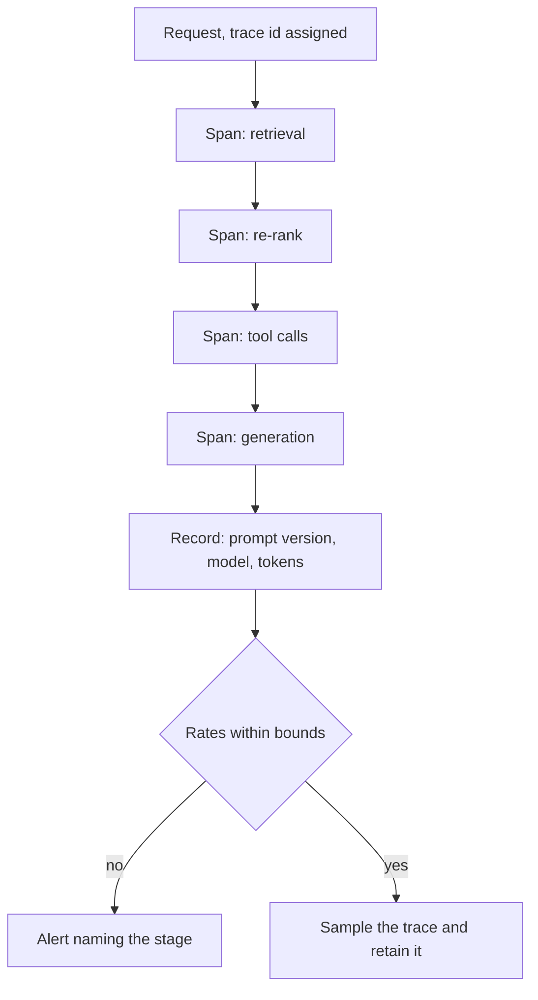
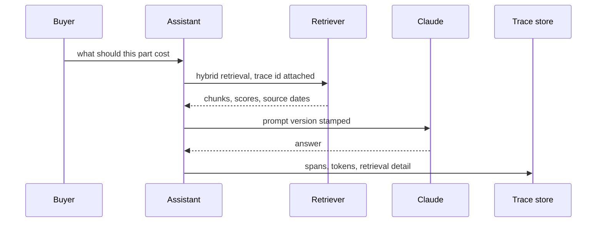

## What Problem Are We Solving?

A manufacturer runs a procurement assistant over supplier contracts, price lists and its own
purchasing policy. Buyers ask what a part should cost, which supplier is approved, whether a
quoted lead time is within terms.

Over about three weeks the answers get worse. Not wrong in an obvious way — vaguer, more often
hedged, occasionally citing a supplier agreement that expired. Buyers start double-checking, then
start not bothering with the assistant.

The team has logs: every request and response, with timestamps. They can see the bad answers.
They cannot see *why* any of them happened, because the answer is the last step of a pipeline and
the log only captured the last step.

Was it the prompt? A retrieval returning the wrong chunks? A tool serving stale data? A template
someone edited a fortnight ago? Each is plausible and the logs distinguish none of them. So the
team does what you do without instrumentation — re-runs queries and hopes the problem recurs,
which for non-deterministic output is close to useless.

With conventional software a bug reproduces from the same input and a stack trace points at the
function. Here the failure might live in the prompt, the retrieved context, the tool-call
sequence, or the model's reasoning, and it may not reproduce at all. **Observability for an
agentic system means capturing the whole pipeline, not the endpoints** — because the answer alone
tells you something went wrong and nothing about where.

> **🗣️ In plain English:** The difference between "it gave a wrong answer and we don't know why" and "here's the exact prompt, the chunks it retrieved, and the tool calls that produced it."

## Meet the Moving Parts

| Component | What it gives you |
|---|---|
| **Request/response logging with timestamps** | The raw record: what was asked and answered, when |
| **Token usage per request** | Cost attribution and anomaly detection — a spike usually means a prompt, retrieval or looping problem |
| **Latency, end-to-end *and per stage*** | Total tells you there's a problem; per-stage tells you *where* |
| **Error rate monitoring and alerting** | Turns passive logs into something that surfaces problems |
| **Retrieval quality metrics** | What was retrieved, not just what was generated — for any RAG system |
| **Prompt version tracking** | Connects "we changed the prompt last week" to "errors started last week" |

Three of these deserve emphasis, because they're the ones teams skip.

**Per-stage latency separates a symptom from a diagnosis.** End-to-end timing says the system is
slow. Retrieval at 2,400ms against a 180ms baseline says whose problem it is.

**Retrieval quality is not the model's output.** If retrieval returns the wrong chunks, generation
can be flawless and the answer still wrong. Logging only the model call instruments the one stage
that wasn't at fault.

**Prompt versions are the correlation nobody has.** Prompts change in production without a
deploy, so without a version on every request, "the prompt changed" and "quality dropped" stay two
unjoinable facts.

Separate this from **audit logging** (3.4): that exists for compliance and security — *who did
what, when* — while observability exists for debugging and quality — *why did it behave this way,
and where did it go wrong*. One set of instrumentation often serves both; the purposes differ.

> **💡 Tip:** For every stage, ask what you'd need to reconstruct a bad answer from six weeks ago without re-running it. Anything you'd want and don't have is a gap.

## How It Works, Step by Step

1. **Assign a trace id at the entry point** and carry it through every stage.
2. **Record each stage as a span** — retrieval, re-rank, each tool call, generation — with
   duration and outcome.
3. **Capture retrieval inputs and outputs**: the query, the chunk ids, their scores, and which
   made it into the prompt.
4. **Stamp the prompt version and the model id** on every request.
5. **Record token usage per request**, split into cached, fresh and output.
6. **Alert on rates, not logs** — error rate, p95 latency per stage, retrieval score
   distributions.
7. **Sample full traces**, including successes. You cannot diagnose a degradation with only
   failures to look at.
8. **Keep traces long enough to cover a slow drift.** Three weeks of degradation needs more than
   seven days of retention.



## Minimal Working Implementation

A trace that can answer "why", built from spans. Save as `tracing.py` and run it — no API key
needed; it simulates a retrieval slowdown and shows which stage the attribution names.

```python
import dataclasses

@dataclasses.dataclass
class Span:
    stage: str
    ms: float
    detail: dict

@dataclasses.dataclass
class Trace:
    trace_id: str
    prompt_version: str
    model: str
    spans: list = dataclasses.field(default_factory=list)

    def record(self, stage: str, ms: float, **detail) -> None:
        self.spans.append(Span(stage, ms, detail))

    def slowest(self) -> Span:
        return max(self.spans, key=lambda s: s.ms)

    def total_ms(self) -> float:
        return sum(s.ms for s in self.spans)

def handle(trace_id: str, retrieval_ms: float) -> Trace:
    t = Trace(trace_id, prompt_version="proc-v7", model="claude-opus-5")
    t.record("retrieval", retrieval_ms,
             chunk_ids=["c-91", "c-14", "c-77"],
             top_score=0.41, expired_sources=1)
    t.record("rerank", 180.0, kept=3)
    t.record("generation", 1420.0, in_tokens=5100, out_tokens=240)
    return t

BASELINE = handle("t-1000", retrieval_ms=190.0)
DEGRADED = handle("t-2000", retrieval_ms=2410.0)

for label, t in (("baseline", BASELINE), ("degraded", DEGRADED)):
    s = t.slowest()
    print(f"{label:9} total={t.total_ms():>7.0f}ms  "
          f"slowest={s.stage} ({s.ms:.0f}ms)  "
          f"prompt={t.prompt_version}")
    if s.stage == "retrieval":
        print(f"          retrieval detail: top_score={s.detail['top_score']}"
              f", expired_sources={s.detail['expired_sources']}")
```

Same answer quality question, two very different diagnoses. The degraded trace names retrieval,
and the retrieval detail carries the two facts that matter — a low top score and an expired source
in the results — neither of which appears anywhere in the request/response log.

## Production Implementation

Production alerts on rates per stage and keeps enough context to reconstruct a trace.

```python
import collections
import statistics

WINDOW = 500
by_stage = collections.defaultdict(
    lambda: collections.deque(maxlen=WINDOW))
retrieval_scores = collections.deque(maxlen=WINDOW)
prompt_versions = collections.deque(maxlen=WINDOW)

def observe(trace) -> None:
    for span in trace.spans:
        by_stage[span.stage].append(span.ms)
        if span.stage == "retrieval":
            retrieval_scores.append(span.detail.get("top_score", 0.0))
    prompt_versions.append(trace.prompt_version)

BASELINES = {"retrieval": 200.0, "rerank": 200.0, "generation": 1500.0}
```

Each alert names a stage and, where possible, the change that correlates with it:

```python
def alerts() -> list[str]:
    out = []
    for stage, samples in by_stage.items():
        if len(samples) < 100:
            continue
        p95 = statistics.quantiles(samples, n=20)[18]
        if p95 > BASELINES[stage] * 2:
            out.append(f"{stage}: p95 {p95:.0f}ms vs baseline "
                       f"{BASELINES[stage]:.0f}ms")
    if retrieval_scores:
        mean = statistics.fmean(retrieval_scores)
        if mean < 0.55:
            out.append(f"retrieval quality: mean top score {mean:.2f} - "
                       f"the generation step is not the problem")
    if len(set(prompt_versions)) > 1:
        out.append(f"prompt versions in window: {sorted(set(prompt_versions))}"
                   f" - correlate any quality change against this")
    return out
    # ...
```

**What changed, and why:**

- **Alerts are per stage with a baseline.** "The system is slow" sends everyone looking;
  "retrieval p95 is 12x baseline" sends one team looking, at the right thing.
- **Retrieval score distribution is monitored as a quality signal.** A falling mean top score is
  the earliest warning that a RAG system is degrading, and it moves well before answer quality is
  visibly bad.
- **Prompt versions in the window are surfaced on every alert.** It makes the correlation
  automatic rather than something someone has to remember to check.
- **Alerts say what *isn't* the problem.** "The generation step is not the problem" saves the
  reflex response — tuning the prompt — which is where teams go when the only instrumented stage
  is the model call.

## In Production: Debugging a Silent Regression at a Manufacturer

Roughly 1,900 procurement queries a day over 12,000 supplier documents.



**Before instrumentation.** Three weeks of gradual degradation, no diagnosis, and an assistant
buyers had stopped trusting. The team's working theory was that the model had changed.

**After.** Spans per stage, retrieval detail, prompt version, token split. The cause surfaced in
under a day: a nightly indexing job had been failing silently for eighteen days after an
infrastructure change, so the index was stale and increasingly out of step with the document set.
Retrieval latency had risen as the index fragmented, and mean top-match score had fallen from 0.71
to 0.44 — a number that had been dropping steadily the whole time and that nobody could see.

**What it would have caught earlier.** The retrieval-score alert would have fired on day four. The
per-stage latency alert would have fired on day six. The request/response logs they had would
never have fired at all, because request and response both looked fine.

**The prompt-version red herring.** Someone *had* edited the prompt eleven days into the
degradation — an entirely reasonable attempt to fix it — which made "the prompt changed" the
leading theory for a week. Version stamping settled it in minutes: the degradation predated the
edit, and the edit had made no measurable difference either way.

**Cost.** Trace storage runs about 1.2GB a day at full fidelity, so full traces are kept for 30
days and a 2% sample for a year. Thirty days was chosen deliberately after this incident: a
fourteen-day retention would not have covered the drift that mattered.

> **🌍 Real-world example:** The most valuable single field turned out to be the source date on retrieved chunks. Expired supplier agreements appearing in results was the specific symptom buyers noticed, and it was invisible in the answer log because the assistant cited them without commentary. Logging *what was retrieved* rather than only what was generated is what turned "the answers feel stale" into "31% of retrieved chunks are from expired agreements", which is a fixable statement.

## Where This Applies — and Where It Doesn't

| Situation | Use this | Use instead |
|---|---|---|
| Any multi-stage agentic pipeline | Per-stage spans under one trace id | End-to-end timing only |
| A RAG system | Retrieval quality metrics as first-class | Logging only the model call |
| Prompts iterated in production | Prompt version on every request | Recalling when things changed |
| Cost anomalies | Token usage per request | An aggregate monthly bill |
| Problems must surface proactively | Alerting on rates | Logs someone might read |
| Compliance: who did what | Audit logging (3.4) | Observability data repurposed |
| Debugging a slow drift | Retention longer than the drift | Seven-day retention |
| A single-call, deterministic pipeline | — | Full tracing is probably overhead |

Anti-patterns: logging only the request and response; end-to-end latency with no per-stage
breakdown; no retrieval instrumentation on a RAG system; prompts edited in production without
versions; retention shorter than the failures you need to diagnose; and collecting everything
while alerting on nothing.

## Failure Modes Seen in the Wild

### 1. Instrumenting the endpoints only

**Symptom.** You can see bad answers and cannot explain any of them.
**Cause.** The log captures the last stage; the failure lives upstream.
**Fix.** Spans per stage under one trace id, with the retrieval detail included.

### 2. The uninstrumented retrieval stage

**Symptom.** Prompt tuning with no effect; the model looks like the problem.
**Cause.** Retrieval was returning the wrong chunks and nothing recorded what they were.
**Fix.** Log chunk ids, scores and source metadata; alert on the score distribution.

### 3. No prompt version

**Symptom.** A change and a regression in the same week, and no way to connect them.
**Cause.** Prompts change in production without a deploy to correlate against.
**Fix.** Stamp a version on every request and surface it alongside alerts.

### 4. Retention shorter than the drift

**Symptom.** The onset of a gradual degradation is outside the window.
**Cause.** Retention sized for incidents, not for slow regressions.
**Fix.** Full traces for a month; a sample for much longer.

> **⚠️ Watch out:** Collecting telemetry is not observability. A team with complete logs, no alerting and no per-stage attribution has all the data and none of the capability — the difference is whether a problem finds you or you have to go looking, and a three-week degradation is exactly the shape that nobody goes looking for until users have already left.

## Exam Lens & Key Takeaway

> **📝 Exam focus:** Know the components by name: **request/response logging with timestamps**, **token usage tracking per request**, **latency measurement end-to-end *and per stage***, **error rate monitoring and alerting**, **retrieval quality metrics for RAG systems**, and **prompt version tracking**. The reasoning the exam wants is *why this is harder for AI systems*: a traditional bug reproduces from the same input and a stack trace points at the function, whereas an agent failure may come from an ambiguous instruction, a bad retrieval result, a wrong tool response, or the model's own reasoning — and may not reproduce deterministically. Two specific distinctions carry marks: **per-stage latency tells you *where* the problem is while end-to-end only tells you *that* there is one**, and **retrieval quality must be instrumented separately**, because generation can be flawless and the answer still wrong if the wrong chunks were retrieved. Expect to distinguish **observability (operational debugging and quality — why did it behave this way)** from **audit logging (compliance and security — who did what, when)**.

> **🔑 Key takeaway:** Instrument the pipeline, not the endpoints. An answer log tells you something went wrong and nothing about where, so carry a trace id through per-stage spans, capture what retrieval actually returned alongside what generation produced, stamp a prompt version on every request, and alert on rates rather than storing logs someone might read. Size retention for the slow drift, not just the sharp incident.
