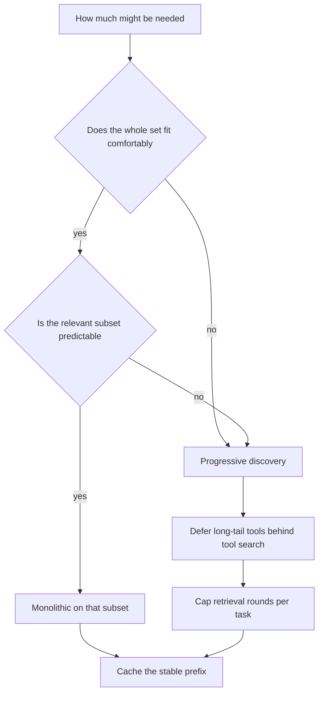
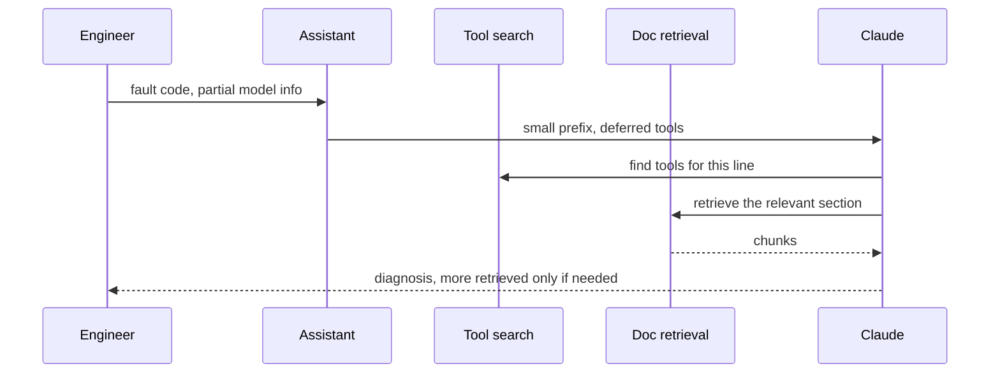

## What Problem Are We Solving?

An industrial equipment maker runs a field diagnostics assistant. Engineers on site describe a
fault; the assistant works out what's wrong across 340 machine models, each with its own manuals,
fault codes and service history.

The first build loaded everything relevant up front — all documentation for the model in question,
plus the general troubleshooting guide. Simple, no retrieval logic, and fast at generation time
because nothing pauses mid-task. For the flagship model, whose documentation is about 40,000
tokens, it works well.

It falls over on two fronts. The legacy line has 180,000 tokens across thirty variants, and an
engineer often doesn't know which variant they're facing — so "load everything relevant" means
loading everything, which doesn't fit. And where it *does* fit, most of what's loaded is
irrelevant to this fault, diluting attention and costing tokens on every call.

The same tension shows up in the toolset. The assistant has 140 tools — parts lookup, service
history, warranty, scheduling, per-line diagnostics — and declaring all of them on every request
costs about 18,000 tokens before anyone asks anything.

This is the eager-versus-lazy question in a new setting. **Monolithic context** loads everything
up front: simple, fast at generation, and it only works when the set is small and bounded.
**Progressive discovery** loads what's needed and fetches more as the task reveals it: scales to
anything, at the cost of complexity and a round-trip per step.

> **🗣️ In plain English:** Load it all, or fetch as you go. Loading it all is simpler and faster until the set gets big or unpredictable — then it's the only thing standing between you and a system that can't grow.

## Meet the Moving Parts

| Strategy | What it does | Use when |
|---|---|---|
| **Monolithic context** | Load the entire relevant set up front | Small, well-defined document sets; generation speed matters most |
| **Progressive discovery** | Load what's needed, retrieve more as required | Large knowledge bases; unpredictable or varied query patterns |

**Monolithic's advantages are real and often undersold.** No retrieval logic to build or tune, and
nothing pauses mid-task to fetch — everything the model might need is already present. For a
10-page handbook that's not a compromise, it's the correct design, and adding retrieval would be
complexity with no payoff.

**Its limits are two, not one.** It only works when the set fits comfortably, *and* it wastes
context on content irrelevant to this particular query — which costs tokens and dilutes attention
on the parts that matter.

**Progressive discovery's cost is latency per turn**, because each additional retrieval is a
round-trip, plus the retrieval logic itself. It buys scale and adaptability: you never have to
predict in advance what someone will ask.

The same choice applies to **tools**, and the API supports it directly. A tool search tool —
`tool_search_tool_regex_20251119` or the BM25 variant — plus `defer_loading: true` on the rest
means Claude discovers the tools it needs instead of carrying all 140 definitions in every
request. One constraint: the search tool itself must not be deferred, and at least one tool must
be non-deferred, or the request is rejected.

> **💡 Tip:** Size and predictability decide it. A small fixed set with predictable questions is monolithic; a growing set with unpredictable questions is progressive — and "growing" usually settles it on its own.

## How It Works, Step by Step

1. **Measure the set.** Total tokens if you loaded everything, and how much of it a typical query
   actually uses.
2. **Check predictability.** If you can determine the relevant subset up front from cheap
   metadata, monolithic on *that subset* may still be right.
3. **Small and bounded → monolithic.** Skip the retrieval machinery; it earns nothing.
4. **Large, growing, or unpredictable → progressive.** Retrieve on demand, across turns.
5. **Do the same for tools.** Defer the long tail behind a tool search tool; keep the search tool
   and at least one other loaded.
6. **Bound the discovery loop.** Each round-trip is latency; cap the number of retrieval rounds
   (3.5).
7. **Cache the part that is stable.** Even progressive systems have an invariant prefix worth
   caching (2.4).
8. **Measure rounds per task.** If most tasks resolve in one retrieval, a well-chosen monolithic
   subset may be cheaper.



## Minimal Working Implementation

Deferred tool loading is the concrete version of this choice. Save as `discovery.py` and run it —
it compares the request size with all tools loaded against the deferred form.

```python
import anthropic

client = anthropic.Anthropic()
MODEL = "claude-opus-5"

def tool(n: int) -> dict:
    return {
        "name": f"lookup_{n:03d}",
        "description": f"Look up diagnostic data for machine line {n}, "
                       f"including fault codes, service intervals and "
                       f"known failure modes for that line.",
        "input_schema": {"type": "object",
                         "properties": {"serial": {"type": "string"}},
                         "required": ["serial"]},
    }

ALL_TOOLS = [tool(n) for n in range(1, 141)]
SEARCH = {"type": "tool_search_tool_regex_20251119",
          "name": "tool_search_tool_regex"}

def deferred() -> list[dict]:
    """The search tool must stay loaded, and at least one other tool
    must be non-deferred, or the API rejects the request."""
    kept = [SEARCH, ALL_TOOLS[0]]
    rest = [{**t, "defer_loading": True} for t in ALL_TOOLS[1:]]
    return kept + rest

MESSAGES = [{"role": "user",
             "content": "Fault code E-217 on a line 87 unit, serial "
                        "PX-4429. What does it indicate?"}]

for label, tools in (("monolithic", ALL_TOOLS),
                     ("deferred", deferred())):
    n = client.messages.count_tokens(
        model=MODEL, tools=tools, messages=MESSAGES).input_tokens
    print(f"{label:11} {len(tools):>4} tools declared, {n:>6} input tokens")
```

The deferred form declares the same capabilities and costs a fraction of the tokens, because
deferred definitions aren't rendered into the request. Claude searches for what it needs. The
trade is a round-trip when it does.

## Production Implementation

Production picks per workload and bounds the discovery loop.

```python
import dataclasses

@dataclasses.dataclass(frozen=True)
class Workload:
    name: str
    corpus_tokens: int
    predictable_subset: bool
    strategy: str
    max_rounds: int

WORKLOADS = {
    "flagship_diag": Workload("flagship_diag", 40_000, True,
                              "monolithic", max_rounds=0),
    "legacy_diag": Workload("legacy_diag", 180_000, False,
                            "progressive", max_rounds=3),
    "safety_bulletins": Workload("safety_bulletins", 6_000, True,
                                 "monolithic", max_rounds=0),
}
FITS_COMFORTABLY = 60_000

def choose(corpus_tokens: int, predictable: bool) -> str:
    """Size and predictability, in that order. A set that fits but whose
    relevant subset is unknowable still wastes most of what it loads."""
    if corpus_tokens > FITS_COMFORTABLY:
        return "progressive"
    return "monolithic" if predictable else "progressive"
```

The discovery loop is capped, and the rounds are measured so the choice can be revisited:

```python
import collections

rounds_seen = collections.defaultdict(list)

def run(workload: str, question: str) -> dict:
    w = WORKLOADS[workload]
    if w.strategy == "monolithic":
        return answer_with(load_all(workload), question)
    context, rounds = [], 0
    while rounds < w.max_rounds:
        rounds += 1
        found = retrieve(question, exclude=context)
        context += found
        result = answer_with(context, question)
        if result["sufficient"]:
            break
    rounds_seen[workload].append(rounds)
    return result

def revisit(workload: str) -> str | None:
    seen = rounds_seen[workload]
    if len(seen) >= 200 and sum(s == 1 for s in seen) / len(seen) > 0.9:
        return (f"{workload}: 90% of tasks resolve in one retrieval - a "
                f"predictable monolithic subset may be cheaper")
    return None
    # ...
```

**What changed, and why:**

- **The choice is per workload, recorded with its inputs.** Corpus size and predictability are the
  two facts that decide it, so storing them makes a later reviewer's job a check rather than an
  investigation.
- **Size is checked before predictability.** A corpus that doesn't fit settles the question; a
  corpus that fits but whose relevant slice is unknowable still wastes most of what it loads.
- **Rounds are capped.** Each retrieval is a round-trip, and an uncapped discovery loop turns a
  latency budget into an open question.
- **Rounds per task are measured, and a mostly-one-round workload is flagged.** If discovery
  almost always resolves immediately, the complexity is buying less than it costs and a chosen
  subset may be better.

## In Production: Field Diagnostics at an Industrial Equipment Maker

340 machine models, 620 field engineers, answers given while standing next to a stopped machine.



**Flagship line: monolithic, and correct.** 40,000 tokens of documentation, the model is known
from the serial number, and everything loads up front. No retrieval logic, p50 latency 2.1s, and
the team deliberately did not "improve" it — adding discovery here would add complexity and a
round-trip for nothing.

**Legacy line: progressive, and necessary.** 180,000 tokens across thirty variants, with engineers
frequently unsure which variant they're looking at. Monolithic was not an option at any price.
Progressive retrieval resolves 71% of faults in one round, 24% in two, 5% in three.

**Tools.** Deferring 139 of 140 tool definitions behind a tool search tool took the base request
from about 18,000 tokens to 1,900. At 4,400 diagnostics a day that is roughly £2,600 a month, and
it removed a ceiling — new machine lines can now be added without every request getting larger.

**The latency trade, measured.** Progressive costs about 900ms per extra round. For the legacy
line, mean latency went from "impossible" to 3.4s, which engineers accept. On the flagship line a
progressive version was trialled and came in 1.1s slower than monolithic with no accuracy gain —
exactly the wrong trade, and the reason that line stayed as it was.

**What the round measurement later showed.** The safety bulletin workload had been built
progressive out of habit. 96% of tasks resolved in one retrieval over a 6,000-token corpus. It was
moved to monolithic, losing a round-trip and some code.

> **🌍 Real-world example:** The tool-deferral constraint caught them once. An early attempt set `defer_loading: true` on every tool including the search tool, and the request was rejected outright — at least one tool must remain loaded, and the search tool cannot be the deferred one. The error is clear once you've seen it and easy to misread as a schema problem the first time, because the deferral looks like an all-or-nothing switch rather than a long-tail optimisation.

## Where This Applies — and Where It Doesn't

| Situation | Use this | Use instead |
|---|---|---|
| Small, fixed document set | Monolithic — simplest and fastest | Retrieval machinery that earns nothing |
| Generation speed matters most, set is bounded | Monolithic | Progressive's per-round latency |
| Large or growing knowledge base | Progressive discovery | Loading everything |
| Unpredictable or varied query patterns | Progressive discovery | Guessing the subset in advance |
| Many tools, few used per request | Defer the long tail behind tool search | Declaring all of them every call |
| The relevant subset is cheaply determined | Monolithic on that subset | Full progressive complexity |
| Most tasks resolve in one retrieval | — | Progressive; a chosen subset is cheaper |
| Latency budget is tight and the set fits | — | Progressive; each round is a round-trip |

Anti-patterns: progressive by default on a small fixed corpus; monolithic on a corpus that grows;
declaring every tool on every request; uncapped discovery loops; and deferring every tool
including the search tool, which is rejected.

## Failure Modes Seen in the Wild

### 1. Monolithic on a growing corpus

**Symptom.** Works, then stops working as content is added, with no code change.
**Cause.** The design assumed a bounded set and the set wasn't.
**Fix.** Move to progressive before the ceiling, not after.

### 2. Progressive on a small fixed set

**Symptom.** Retrieval logic, per-round latency, and no benefit.
**Cause.** Progressive chosen as the more sophisticated option.
**Fix.** Measure rounds per task; a mostly-one-round workload wants a chosen subset.

### 3. The whole toolset on every request

**Symptom.** Thousands of tokens spent before the user has asked anything.
**Cause.** Tool definitions render on every call, whether used or not.
**Fix.** `defer_loading` on the long tail, behind a tool search tool.

### 4. Everything deferred

**Symptom.** Requests rejected with a tool-configuration error.
**Cause.** Every tool marked deferred, including the search tool.
**Fix.** Keep the search tool and at least one other loaded.

> **⚠️ Watch out:** Monolithic doesn't fail gradually. It works exactly as designed until the corpus crosses a threshold nobody is watching, and then it fails on the requests with the most content — which are usually the most complex and important ones. If your set grows with the business, the question isn't whether to move but when.

## Exam Lens & Key Takeaway

> **📝 Exam focus:** The stem signals the answer through **size and predictability of the knowledge base**. A **small, well-defined document set** — a single 10-page handbook, a fixed FAQ — favours **monolithic context**: simple to implement with no retrieval logic, and fast at generation because Claude never pauses to fetch. A **large or constantly growing knowledge base with unpredictable query patterns** — a sprawling internal wiki — favours **progressive discovery**: it scales because you never fit everything in one window, and it adapts because you don't have to predict what will be asked. Know both sets of trade-offs: monolithic **wastes context on irrelevant content and can dilute attention**, while progressive adds **architectural complexity and per-turn latency from each retrieval round-trip**. The exam frames it as the classic **eager versus lazy loading** tension, so reason about it that way when the wording is unfamiliar.

> **🔑 Key takeaway:** Size and predictability decide this, in that order. A small bounded set with a determinable relevant subset is monolithic, and adding retrieval there is complexity with no payoff; a large, growing or unpredictable set is progressive, and the cost is a round-trip per round plus the logic to manage it. The same choice applies to tools — deferring the long tail behind a tool search tool keeps the base request small — and either way, measure rounds per task, because that number tells you when the choice has stopped being right.
