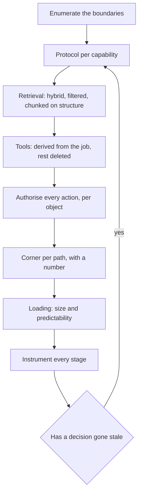
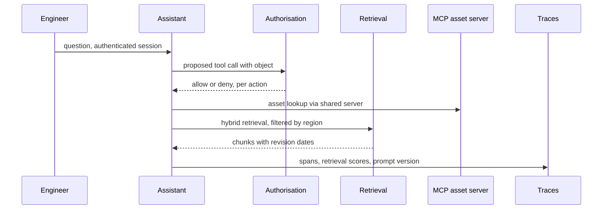

## What Problem Are We Solving?

This is the largest domain on the exam at 19%, and the weighting is a statement: in production
Claude is never alone. It reaches databases, internal APIs, document stores and other agents, and
almost everything that goes wrong in a deployed system goes wrong at one of those joins.

The domain's seven topics look like separate subjects — retrieval, protocols, permissions, auth,
trade-offs, telemetry, loading strategy — and they share one property. **Each is a decision about
what crosses a boundary**: which documents reach the prompt, which capability reaches the agent,
which caller reaches the action, which stage's behaviour reaches your dashboard.

That framing explains the failure pattern. Boundary decisions get made once, early, implicitly,
by whoever built that piece — and then they're invisible. Nobody chose to let an agent cancel
shipments; a tool was added. Nobody chose to authorise once per session; the check happened to go
there. Nobody chose to log only the endpoints.

So the professional skill is to make these decisions **explicit and revisitable**: to notice that
a boundary exists, decide deliberately what crosses it, and instrument enough that you'd know when
the decision stopped being right.

The other reason this domain is weighted so heavily is that its failures are expensive. A
retrieval that returns a superseded revision, an agent with a deletion tool it never needed, an
authorised session that drifts out of scope — none of these produce an error, and all of them
produce consequences.

> **🗣️ In plain English:** Integration is a set of decisions about what's allowed to cross a line — into the prompt, into the agent's hands, into an action. Most of them get made by accident.

## Meet the Moving Parts

| Boundary | Topic | The decision |
|---|---|---|
| How Claude reaches the world | **3.1** Protocol selection | MCP, direct API/CLI, or agent-to-agent — by consumer count and ownership |
| What documents reach the prompt | **3.2** RAG | Six stages; hybrid retrieval, structural chunking, metadata filtering |
| What capabilities reach the agent | **3.3** Least privilege | Remove the tool — mitigations are not the fix |
| Who may perform an action | **3.4** AuthN / AuthZ | Authenticate the caller, authorise **every action**, per object |
| What the system optimises for | **3.5** Accuracy-latency | Pick a corner per path, with a number, and name the sacrifice |
| What you can see | **3.6** Observability | Per-stage spans, retrieval quality, prompt versions |
| When information enters context | **3.7** Progressive vs monolithic | Size and predictability decide it |

Three relationships matter more than the rows.

**3.3 and 3.4 are the same principle at design time and call time.** Least privilege removes the
capability; authorisation enforces per action. You want both, because a manifest mistake shouldn't
be sufficient on its own — and audit logging is a detective control alongside them, never a
substitute.

**3.2, 3.5 and 3.7 are one tunable pipeline.** Chunk count and re-ranking are accuracy-latency
levers; monolithic-versus-progressive is the same question about loading. Tuning one without the
others is how a latency fix quietly becomes a recall problem.

**3.6 is what makes the rest revisitable.** Every other decision here goes stale — a corpus grows,
consumers multiply, a tier changes. Without per-stage instrumentation you find out from a user.

> **💡 Tip:** For each boundary, ask who decided and when. "It's been that way" means the decision was implicit, and implicit boundary decisions are this domain's whole failure catalogue.

## How It Works, Step by Step

1. **Enumerate the boundaries** before designing: data in, capabilities in, actions out,
   telemetry out.
2. **Choose the protocol per capability** from consumer count and ownership, not per system (3.1).
3. **Design retrieval as six stages**, with hybrid search and metadata filtering before ranking
   (3.2).
4. **Derive the tool manifest from the agent's job** and delete the rest (3.3).
5. **Authenticate the caller, then authorise every action against the object** — never once per
   session (3.4).
6. **Name the corner per path with a number**, and record what it sacrifices (3.5).
7. **Decide loading strategy from size and predictability**, and defer long-tail tools (3.7).
8. **Instrument every stage** with spans, retrieval quality and prompt versions, then alert on
   rates (3.6).



## Minimal Working Implementation

The domain's failures are implicit boundary decisions, so audit a design for them. Save as
`integration_review.py` and run it — no API key needed.

```python
import json
import sys

def review(d: dict) -> list[str]:
    gaps = []
    for cap in d.get("capabilities", []):
        users = len(cap.get("consumers", []))
        if users > 1 and cap.get("protocol") == "direct":
            gaps.append(f"3.1 {cap['name']}: {users} consumers on direct "
                        f"integrations - they will diverge")

    rag = d.get("retrieval", {})
    if rag.get("strategy") == "semantic":
        gaps.append("3.2 semantic-only retrieval - exact identifiers "
                    "(SKUs, codes) will fail; use hybrid")
    if rag and not rag.get("filters_before_ranking"):
        gaps.append("3.2 no metadata filter before ranking - superseded "
                    "or unpermitted chunks can win")
    if rag.get("chunking") == "fixed" and rag.get("structured_source"):
        gaps.append("3.2 fixed-size chunking on structured source - "
                    "values get split from their qualifiers")
    for agent in d.get("agents", []):
        extra = set(agent.get("tools", [])) - set(agent.get("required", []))
        if extra:
            gaps.append(f"3.3 {agent['name']}: {sorted(extra)} beyond the "
                        f"stated job - remove, do not gate")
        if agent.get("authz") == "session":
            gaps.append(f"3.4 {agent['name']}: authorised once per session "
                        f"- re-check every action, with the object")

    for path in d.get("paths", []):
        if not path.get("corner") or not path.get("sacrificing"):
            gaps.append(f"3.5 {path.get('name')}: no named corner or "
                        f"unstated sacrifice")
    obs = d.get("observability", {})
    for field in ("per_stage_latency", "retrieval_quality",
                  "prompt_version"):
        if not obs.get(field):
            gaps.append(f"3.6 observability: {field} not captured")
    return gaps
if __name__ == "__main__":
    found = review(json.load(open(sys.argv[1], encoding="utf-8")))
    print("\n".join(f"- {g}" for g in found) or "no boundary gaps found")
    sys.exit(1 if found else 0)
```

Every check corresponds to an incident in one of the seven topics. None of them inspects the model
call, which is the part a design review already looks at.

## Production Implementation

In production the boundaries become counters, and each alert names the topic that owns it.

```python
import collections

WINDOW = 1000
series = collections.defaultdict(lambda: collections.deque(maxlen=WINDOW))

def observe(event: dict) -> None:
    """One signal per boundary in this domain."""
    series["authz_denied"].append(event.get("authz") == "denied")
    series["retrieval_top"].append(event.get("retrieval_top_score", 0.0))
    series["expired_chunks"].append(event.get("expired_chunks", 0) > 0)
    series["tool_calls"].append(event.get("tool_name"))
    series["rounds"].append(event.get("retrieval_rounds", 1))
    series["p95_stage"].append(event.get("slowest_stage"))
```

Each threshold sends someone to a decision rather than a knob:

```python
def signals() -> list[str]:
    def mean(k):
        d = [x for x in series[k] if isinstance(x, (int, float, bool))]
        return sum(d) / len(d) if d else 0.0

    out = []
    if series["retrieval_top"] and mean("retrieval_top") < 0.55:
        out.append("3.2 retrieval quality falling - the generation step "
                   "is not the problem")
    if mean("expired_chunks") > 0.02:
        out.append("3.2 superseded chunks reaching the prompt - filter "
                   "by effectivity before ranking")
    if mean("authz_denied") > 0.05:
        out.append("3.4 denials high - either a broken workflow or the "
                   "tool manifest is wider than the role (3.3)")
    if series["rounds"] and mean("rounds") < 1.1:
        out.append("3.7 discovery resolves in one round - a chosen "
                   "monolithic subset may be cheaper")
    unused = {t for t in set(series["tool_calls"]) if t}
    if unused:
        out.append(f"3.3 tools actually called: {len(unused)} - compare "
                   f"against the manifest and delete the difference")
    return out
    # ...
```

**What changed, and why:**

- **Retrieval quality is a first-class counter.** It is the earliest warning in the domain and
  moves well before answers are visibly bad — and its alert says what *isn't* the problem, because
  the reflex is to tune the prompt.
- **Actually-called tools are recorded.** The manifest tells you what an agent *may* do; this
  tells you what it does. The difference is the least-privilege backlog, generated rather than
  audited by hand.
- **A high denial rate points at two topics.** Denials mean either a broken workflow or a manifest
  wider than the role — and the second is 3.3's problem surfacing through 3.4's enforcement.
- **Retrieval rounds are measured.** A discovery loop that always resolves immediately is
  complexity buying nothing, which is the only way to notice that a 3.7 decision has gone stale.

## In Production: A Field Engineering Assistant at a Utilities Company

3,400 field engineers across water and electricity networks, asking about assets, permits, safety
procedures and job history. All seven topics appear.



**How the seven fit.** Asset lookup is an MCP server shared by four teams, after three of them had
built their own and disagreed about what "decommissioned" meant (**3.1**). Retrieval is hybrid,
because engineers search by asset ID as often as by description, and filters by region and
revision before ranking (**3.2**). The read assistant has four tools; isolation and switching live
in a separate agent behind an approval step (**3.3**). Every tool call is authorised against the
engineer's region and role, on every call (**3.4**). Safety-critical procedures run the accuracy
corner with re-ranking; ordinary lookups run fast (**3.5**). Asset documentation is progressive —
it grows constantly — while the safety handbook is monolithic at 8,000 tokens (**3.7**). Traces
carry per-stage spans and retrieval scores (**3.6**).

**The incident that shaped it.** An engineer asked about isolation procedure for a substation and
received a procedure from a superseded revision. Similarity ranking had preferred the old
document; nothing filtered by revision. Nobody had decided to let superseded content into the
prompt — there simply was no decision. Filtering by effectivity before ranking closed it, and the
retrieval-quality counter now makes a recurrence visible within a day.

**What the numbers did.** Asset-ID lookup accuracy went from 41% (semantic only) to 93% (hybrid).
Superseded-content incidents went to zero. The shared MCP server removed three divergent
definitions of asset status. Per-stage tracing cut mean time to diagnose a quality complaint from
about four days to under two hours.

> **🌍 Real-world example:** The substation incident is the domain in one story. Every component worked: retrieval returned relevant chunks, authorisation permitted the read, the model answered accurately from what it was given, and the logs recorded a successful request. The failure was a boundary nobody had decided about — whether a superseded revision may reach the prompt — and it was only findable because someone thought to log *what was retrieved* rather than only what was answered.

## Where This Applies — and Where It Doesn't

| Situation | Use this | Use instead |
|---|---|---|
| Several teams need one capability | MCP server, owned and versioned (3.1) | Each team wiring its own |
| Exact identifiers failing in search | Hybrid retrieval (3.2) | Semantic alone |
| An agent has tools its job doesn't need | Remove them (3.3) | Confirmations or approvals |
| Multi-turn agent touching real data | Authorise every action, per object (3.4) | Session-start authorisation |
| Audiences with different tolerances | A path per corner, plus escalation (3.5) | One compromise configuration |
| Quality degrading with no explanation | Per-stage spans and retrieval metrics (3.6) | Request/response logs |
| A large or growing corpus | Progressive discovery (3.7) | Loading everything |
| A small fixed corpus, one consumer | — | Most of this; it earns nothing |

Anti-patterns across the domain: semantic-only retrieval; ranking without filtering by version or
permission; mitigating instead of removing a capability; authorising once per session; unstated
accuracy-latency sacrifices; instrumenting only the endpoints; and loading everything into a
corpus that grows.

## Failure Modes Seen in the Wild

### 1. The boundary nobody decided

**Symptom.** A superseded document, an unneeded tool, an over-scoped action — all working as
built.
**Cause.** The decision was implicit, made by whoever wired that piece.
**Fix.** Enumerate the boundaries and make each one an explicit, recorded choice.

### 2. Mitigating instead of removing

**Symptom.** Confirmation dialogs and approval queues around a capability nothing needs.
**Cause.** Blast-radius reduction mistaken for privilege reduction (3.3).
**Fix.** Ask whether the agent needs it at all; if not, delete it.

### 3. The standing permit

**Symptom.** A correctly authenticated user accessing data outside their scope, mid-conversation.
**Cause.** Authorisation evaluated once, at session start (3.4).
**Fix.** Re-check every action, with the object in the check.

### 4. Instrumented endpoints only

**Symptom.** Weeks of degradation with no diagnosis.
**Cause.** Logs capture the answer; the failure was upstream (3.6).
**Fix.** Per-stage spans, retrieval quality as its own metric, prompt versions on every request.

> **⚠️ Watch out:** Almost nothing in this domain errors. A superseded chunk, an over-permitted action, a stale index, a tool that shouldn't exist — each produces a fluent, plausible, successful-looking response. The instrumentation that catches them is per-stage and boundary-specific, which means it has to be designed in alongside the boundary rather than added when something goes wrong.

## Exam Lens & Key Takeaway

> **📝 Exam focus:** 19% of the exam, ~12 questions, the largest domain — and two areas are flagged as especially high-yield because they appear in the official sample questions: **least privilege** and **RAG/retrieval failure diagnosis**. For least privilege, the answer is **remove the unnecessary tools entirely**; confirmation steps, audit logging and human approval are reasonable defence-in-depth and none is the least-privilege fix. For retrieval, know the **six-stage pipeline** and that **exact identifiers failing points at semantic search, fixed by hybrid**. Beyond those: map protocol to scenario (**many teams → MCP**, **one narrow pipeline → API/CLI**, **delegation → agent-to-agent**); keep **authentication** separate from **authorization**, re-checked **on every action**, with audit logging as a **detective** control; map a requirement to a corner of the **accuracy-latency-cost triangle** and name the sacrifice, remembering **caching improves both speed and cost**; and choose **progressive discovery versus monolithic context** from the **size and predictability** of the knowledge base.

> **🔑 Key takeaway:** Every topic in this domain is a decision about what crosses a boundary — documents into the prompt, capabilities into the agent's hands, callers into an action, stages into your telemetry. The failures all come from boundaries nobody decided about, and none of them raise an error, so the discipline is to enumerate each boundary, make the choice explicitly, and instrument per stage so you find out when the choice stops being right before a user does.
