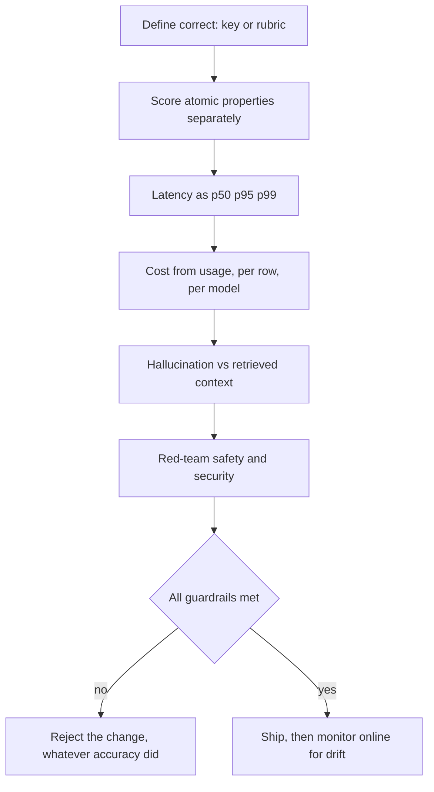
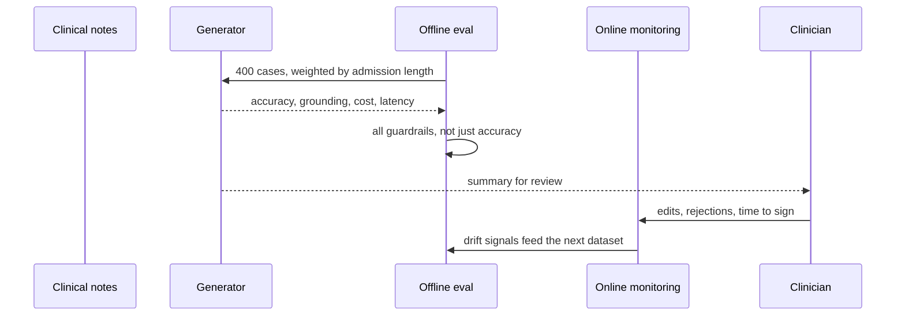

## What Problem Are We Solving?

A hospital trust generates discharge summaries from clinical notes. Before rollout it ran an
evaluation: 400 cases, scored against consultant-written summaries, 94% accuracy. Sign-off.

Three weeks into production the programme was paused. Not because accuracy had fallen — it hadn't.
Three other things had gone wrong, none of which the evaluation had been built to see.

p99 latency — what the slowest 1% of requests exceeded — was 34 seconds at ward-round time, when everyone generates summaries at once. Cost per
summary was 2.8x the modelled figure, because long admissions produce long notes and the
evaluation set had been sampled uniformly rather than weighted by real length distribution. And a
review of 60 summaries found four containing a medication dose that appeared nowhere in the source
notes — a hallucination rate of about 7% on a document type where that is a patient-safety matter.

The 94% was true. It was also a single number standing in for a portfolio, and the three things it
concealed were each individually sufficient to stop the programme.

Evaluation at architect level is a **dashboard with guardrails**, not a score. The metrics
interact — more retrieved context raises accuracy and raises cost and latency; trimming context
cuts both and raises hallucination rate — so tracking one in isolation guarantees you trade
against the others without noticing.

> **🗣️ In plain English:** One accuracy number can hide a system that's slow, expensive or unsafe. Track the portfolio, and set thresholds on each so trade-offs are decisions rather than accidents.

## Meet the Moving Parts

| Metric | The question | How it's measured |
|---|---|---|
| **Accuracy** | Is the output correct? | A ground-truth key, or a rubric scored by humans or an LLM judge |
| **Latency** | How responsive is it? | **Percentiles — p50, p95, p99** — never a mean; distributions are skewed |
| **Cost** | What does it cost? | Tokens in and out × the row's actual model rate, **per request** then aggregated |
| **Safety** | Can it produce harmful or policy-violating output? | Red-teaming and adversarial testing, not standard cases |
| **Security** | Can it be manipulated? | Prompt injection, jailbreaks, exfiltration — adversarial by design |
| **Hallucination rate** | Does it assert what the sources don't support? | Fact-check claims **against the retrieved context**, not world knowledge |

Three things decide whether these numbers mean anything.

**Percentiles, not means, for latency.** A mean hides the tail that users actually feel. The trust's
mean was 4.1 seconds and nobody was complaining about 4.1 seconds.

**Cost from recorded tokens, not estimates.** Take input, output, cache-read and cache-write from
the response's `usage` block, at that row's actual model rate. String-length estimates are off by
enough to reverse a comparison — and record any judge's cost separately, so it doesn't dampen
differences between variants.

**Hallucination is measured against the source, not the world.** A claim can be true in general
and unsupported by the retrieved context — in a grounded system that's still a failure.

| Mode | When it runs | Best for |
|---|---|---|
| **Offline (batch)** | Before deployment, on a fixed dataset | Accuracy, hallucination, safety — anything needing ground truth |
| **Online (production)** | Continuously, on live traffic | Latency, cost, drift — what a fixed dataset can't anticipate |

> **💡 Tip:** Score independent properties separately — `{correct, grounded, formatted}` — rather than one blended number. Atomic checks are more reproducible and tell you *what* broke.

## How It Works, Step by Step

1. **Define "correct" precisely** before measuring anything, as a key or a rubric.
2. **Score atomic properties separately**, one judge call per property where a judge is used.
3. **Record latency as percentiles**, timing the final successful request only — keep retries and
   local queueing out of the model-latency column.
4. **Derive cost from the `usage` block** per row, at that row's model rate, with judge cost
   recorded separately.
5. **Measure hallucination against the retrieved context**, claim by claim.
6. **Red-team safety and security separately.** These failures are by definition the inputs your
   normal set doesn't contain.
7. **Set a guardrail threshold per metric**, so a change that improves one and breaches another
   fails.
8. **Split offline and online.** Ground-truth metrics offline; latency, cost and drift on live
   traffic.



## Minimal Working Implementation

The portfolio, computed properly, on rows you already have. Save as `metrics.py` and run it — no
API key needed.

```python
import statistics

RATES = {"claude-opus-5": (5.00, 25.00),
         "claude-haiku-4-5": (1.00, 5.00)}
# model, in, out, ms, correct, grounded
ROWS = [("claude-opus-5", 4200, 380, 3100, 1, 1),
        ("claude-opus-5", 3900, 350, 2900, 1, 1),
        ("claude-opus-5", 4050, 370, 3050, 1, 1),
        ("claude-opus-5", 4100, 360, 3000, 1, 1),
        ("claude-opus-5", 3950, 340, 2950, 1, 1),
        ("claude-opus-5", 4300, 390, 3200, 1, 1),
        ("claude-opus-5", 4150, 365, 3100, 0, 1),
        ("claude-opus-5", 4000, 355, 2980, 1, 1),
        ("claude-opus-5", 41000, 1900, 33800, 1, 0),   # long admission
        ("claude-opus-5", 38000, 1750, 29500, 1, 1)]   # long admission

def cost(row) -> float:
    rin, rout = RATES[row[0]]
    return row[1] / 1e6 * rin + row[2] / 1e6 * rout

lat = sorted(r[3] for r in ROWS)
costs = [cost(r) for r in ROWS]

def pct(p: float) -> float:
    return lat[min(int(len(lat) * p), len(lat) - 1)]

metrics = {
    "accuracy": sum(r[4] for r in ROWS) / len(ROWS),
    "hallucination_rate": 1 - sum(r[5] for r in ROWS) / len(ROWS),
    "p50_ms": pct(0.50), "p95_ms": pct(0.95),
    "mean_ms": statistics.fmean(lat),
    "mean_cost": statistics.fmean(costs), "max_cost": max(costs),
}
GUARDRAILS = {"accuracy": (">=", 0.90), "hallucination_rate": ("<=", 0.02),
              "p95_ms": ("<=", 5000), "mean_cost": ("<=", 0.05)}

for name, value in metrics.items():
    print(f"{name:20} {value:>10.4f}")
print()
for name, (op, limit) in GUARDRAILS.items():
    got = metrics[name]
    ok = got >= limit if op == ">=" else got <= limit
    print(f"{'PASS' if ok else 'BREACH':7} {name:20} {got:>10.4f} "
          f"{op} {limit}")
```

Accuracy passes at exactly 0.90 — and three guardrails breach underneath it. Note what the mean
latency conceals: 8.8 seconds sounds survivable, p95 is 33.8. Note too that the expensive rows and
the ungrounded row are the *same* long-admission cases, which is the kind of correlation a single
score cannot express and the reason the trust's problems all arrived together.

## Production Implementation

Production separates offline ground-truth evaluation from online monitoring, and keeps judge cost
out of the system's cost.

```python
import dataclasses

@dataclasses.dataclass
class RowResult:
    case_id: str
    model: str
    usage: dict              # from the API response, never estimated
    model_ms: float          # final successful request only
    total_ms: float          # including retries and queueing, separately
    scores: dict             # atomic: correct, grounded, formatted
    judge_model: str | None = None
    judge_usage: dict | None = None

def row_cost(r: RowResult, rates: dict) -> tuple[float, float]:
    """System cost and judge cost, kept apart - a judge folded into the
    total dampens the difference between the variants you're comparing."""
    rin, rout = rates[r.model]
    system = (r.usage["input_tokens"] / 1e6 * rin
              + r.usage["output_tokens"] / 1e6 * rout
              + r.usage.get("cache_read_input_tokens", 0) / 1e6 * rin * 0.1
              + r.usage.get("cache_creation_input_tokens", 0)
              / 1e6 * rin * 1.25)
    judge = 0.0
    if r.judge_usage and r.judge_model:
        jin, jout = rates[r.judge_model]
        judge = (r.judge_usage["input_tokens"] / 1e6 * jin
                 + r.judge_usage["output_tokens"] / 1e6 * jout)
    return system, judge
```

Guardrails are evaluated as a set, so an accuracy gain can't buy a safety regression:

```python
GUARDRAILS = {
    "accuracy": (">=", 0.90), "hallucination_rate": ("<=", 0.02),
    "p95_ms": ("<=", 5000), "mean_cost_usd": ("<=", 0.05),
    "unsafe_rate": ("<=", 0.0),
}

def gate(metrics: dict) -> tuple[bool, list[str]]:
    breaches = []
    for name, (op, limit) in GUARDRAILS.items():
        if name not in metrics:
            breaches.append(f"{name}: not measured - not a pass")
            continue
        got = metrics[name]
        if not (got >= limit if op == ">=" else got <= limit):
            breaches.append(f"{name}: {got:.4f} {op} {limit} failed")
    return not breaches, breaches
    # ...
```

**What changed, and why:**

- **Cache tokens are priced at their real rates.** Counting cache reads at full input price makes
  a cached variant look no cheaper, and has talked teams out of caching that was working.
- **Judge cost is recorded separately.** Folded into the total it inflates every variant equally
  and shrinks the *relative* difference you are trying to measure.
- **Model latency and total wall-clock are separate columns.** Otherwise whichever variant hit
  more transient errors looks slower, and you compare retry luck rather than models.
- **An unmeasured guardrail is a failure, not a pass.** The trust's evaluation had no
  hallucination metric at all, and "no data" silently read as "fine".

## In Production: Discharge Summaries at a Hospital Trust

About 900 summaries a day across six sites, generated from clinical notes and reviewed by the
discharging clinician before filing.



**The pause.** 94% accuracy offline; p99 34s, cost 2.8x modelled, ~7% hallucination rate on
medication doses. Each was outside tolerance and none had been a tracked metric.

**What changed.** Six metrics with thresholds, evaluated as a set. Grounding scored per claim
against the source notes rather than holistically, because a summary can be 95% supported and
carry one invented dose — and a blended score averages that away.

**The correlation that mattered.** Long admissions drove all three failures at once: longer notes
meant more tokens (cost), more processing (latency), and more opportunity for an unsupported
claim. Re-weighting the evaluation set to match the real admission-length distribution moved
measured accuracy from 94% to 89% before any code changed — the original number had been produced
by a set that under-represented exactly the cases that were hard.

**After.** Retrieval narrowed to the relevant note sections rather than whole admissions; p95
4.2s, cost within 15% of model, hallucination rate 0.4% with every remaining case going to a
mandatory second review. Accuracy settled at 91% — lower than the original 94%, and the first
number anyone trusted.

**Online versus offline.** Latency and cost are now monitored on live traffic, where ward-round
concurrency exists and no fixed dataset would have reproduced it. Accuracy and grounding stay
offline, where ground truth exists.

> **🌍 Real-world example:** The single most valuable change was scoring grounding per claim instead of per summary. Under a document-level score a summary with one invented dose scored 0.95 and passed; under per-claim scoring it fails on the claim that matters. The metric's *granularity* decided whether a patient-safety failure was visible, and that is a design decision made long before any number is computed.

## Where This Applies — and Where It Doesn't

| Situation | Use this | Use instead |
|---|---|---|
| Deciding whether a system is ready | A metric portfolio with thresholds | A single accuracy score |
| Reporting responsiveness | p50, p95, p99 | A mean, which hides the tail |
| Comparing cost between variants | Tokens from `usage`, per row, per model | Estimates from string length |
| A grounded or RAG system | Hallucination measured vs retrieved context | Checking against world knowledge |
| Safety and security | Red-teaming and adversarial cases | Your normal test set |
| Latency, cost, drift | Online monitoring on live traffic | Offline only |
| Accuracy and grounding | Offline, against ground truth | Production, where truth is unknown |
| A quick smoke test in development | — | The full portfolio; it's overhead there |

Anti-patterns: a single blended score; mean latency; estimated token costs; judge cost folded into
system cost; treating an unmeasured guardrail as satisfied; and an evaluation set whose
distribution doesn't match production.

## Failure Modes Seen in the Wild

### 1. The number that hid three problems

**Symptom.** Strong accuracy, and the programme stops for something else.
**Cause.** One metric standing in for a portfolio.
**Fix.** Measure accuracy, latency, cost, safety, security and hallucination, with a threshold on
each.

### 2. The mean that hid the tail

**Symptom.** Reported latency is fine; users describe it as slow.
**Cause.** A skewed distribution reported as an average.
**Fix.** p50/p95/p99, and act on the tail.

### 3. Blended grounding

**Symptom.** A summary with one invented fact passes.
**Cause.** Grounding scored per document rather than per claim.
**Fix.** Atomic scoring — separate properties, and per-claim where the stakes are per-claim.

### 4. The unmeasured guardrail

**Symptom.** A failure mode nobody has data on is assumed absent.
**Cause.** The metric was never implemented, so it never breached.
**Fix.** Treat "not measured" as a failing gate.

> **⚠️ Watch out:** These metrics move against each other by construction — more context raises accuracy and raises cost and latency; less context cuts both and raises hallucination rate. Optimising any one in isolation is therefore guaranteed to trade against another, and without thresholds on all of them you will only discover which one after it has become an incident.

## Exam Lens & Key Takeaway

> **📝 Exam focus:** Know the metric set by name — **accuracy, latency, cost, safety, security, hallucination rate** — and what each is actually measured with. **Latency is reported as percentiles (p50, p95, p99), not an average**, because the distribution is skewed and the average hides the tail. **Cost is tokens in and out times the model's rate, tracked per request** then aggregated, because a system that looks cheap on average can have a few runaway requests. **Safety and security are tested adversarially — red-teaming — not with standard cases**, since these failures are by definition the inputs a normal dataset doesn't cover. **Hallucination rate is specific to grounded systems and is measured against the retrieved context**, not general world knowledge. The architect-level framing the exam rewards is a **dashboard with guardrail thresholds** rather than a single score, because the metrics trade against each other. Know the split too: **offline batch evaluation** before deployment for anything needing ground truth, **online monitoring** for latency, cost and drift.

> **🔑 Key takeaway:** "Good" is a portfolio, not a number, and the metrics in it move against each other — so a single score guarantees you will trade one away without noticing. Report latency as percentiles, derive cost from recorded tokens at the row's real model rate, measure hallucination against the retrieved context rather than the world, red-team safety separately, and put a threshold on every metric so an unmeasured one counts as a failure rather than a pass.
