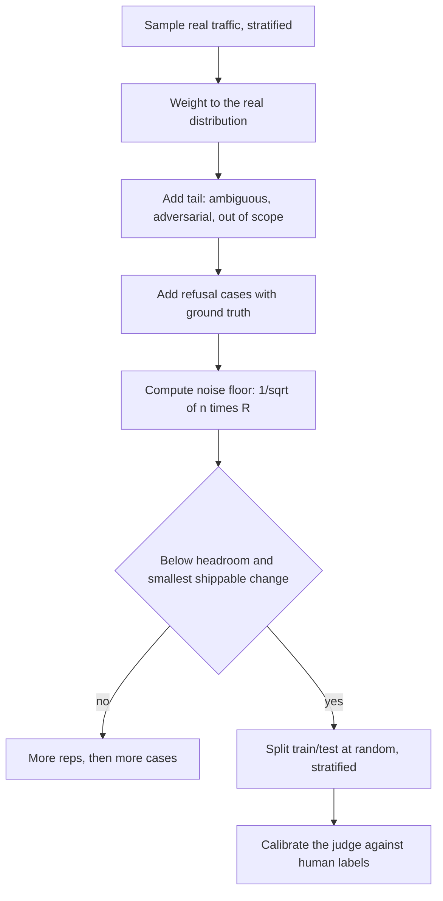
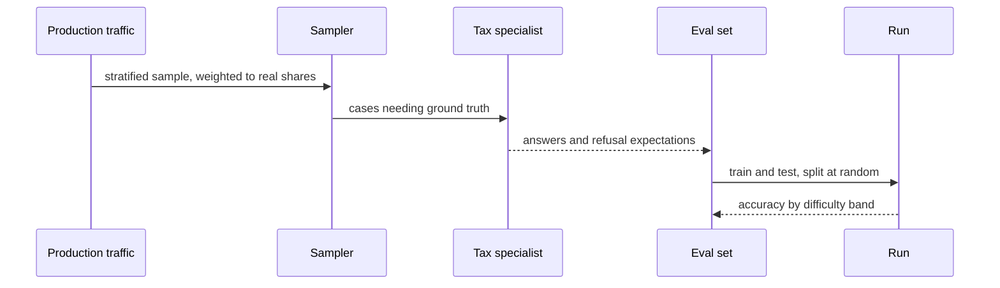

## What Problem Are We Solving?

An accountancy software vendor built a tax question assistant. The evaluation set was assembled
the sensible-looking way: export the 200 most-asked support questions, have a tax specialist write
the correct answer for each, score against those.

It scored 96%. In production it scored, by the same rubric on sampled real traffic, 71%.

Nothing was wrong with the 200 answers. The set was wrong in three separate ways, and each is a
different lesson.

It **selected for the easy majority**. The most-asked questions are the ones with clean answers —
"what's the VAT registration threshold?" The hard tail is ambiguous, multi-part, jurisdiction-
dependent, and rare individually while being common collectively.

It **contained no refusals and no out-of-scope cases**. Roughly 9% of real traffic asks for advice
the vendor is not authorised to give, and the set had no example of correctly declining, so that
behaviour was never measured.

And it was **too small to see the changes they wanted to make**. At 200 cases and one run each,
the **noise floor** — the smallest difference a set this size can tell apart from luck — on a pass
rate is around ±7 points. A 3-point gain measured against it is not a result. The team spent six weeks shipping prompt
changes that "improved" the score by 2–4 points, which is to say they were reading noise.

A dataset is not a chore before launch. It is the instrument every later decision depends on, and
an instrument with the wrong distribution, missing categories, or insufficient resolution will
confidently mislead you.

> **🗣️ In plain English:** A test set built from your easiest, most common questions tells you how good you are at the easy ones. And if it's too small, every improvement you measure might be noise.

## Meet the Moving Parts

A trustworthy set is hard to pass:

- **Covers common use cases, weighted by real frequency**, so the score reflects the user
  population rather than a curated greatest-hits.
- **Includes edge cases and difficult inputs** — ambiguous phrasing, adversarial inputs,
  out-of-scope requests, multi-step reasoning. Where systems silently degrade.
- **Mixes question types** — factual lookup, comparison, multi-hop, **refusal** — so one strength
  can't mask a different weakness.
- **Has ground truth** — an answer or a rubric — so scoring is repeatable, not a vibe check.
- **Is large enough for statistical power.** A 20-case set cannot detect a 3% improvement;
  run-to-run variance swamps it.

Two things about that last point, where most sets fail quietly.

**Noise floor, headroom and the smallest shippable change are three numbers you compare.** For a
pass rate the noise floor is roughly `1/sqrt(n·R)` — 25 cases × 2 reps is about ±14 points, 100 ×
2 about ±7. If it exceeds either your headroom or the smallest improvement you'd act on, the set
cannot answer your question.

**Cases and reps are two knobs on one dial.** Budget them together when sizing, not afterwards.

| Method | What it is | Best for |
|---|---|---|
| **Automated metrics** | Code scoring against rules or ground truth | Fast regression detection on every change |
| **Human evaluation** | People rating against a rubric | Nuanced judgement, subtle errors automation misses |
| **LLM-as-judge** | A separate Claude call scores outputs | Scales like automation, handles nuance — **needs calibration against human labels** |
| **Red-teaming** | Deliberate attempts to break it | Safety and security a normal set won't surface |

> **💡 Tip:** If your set was built from a "top N most common" export, assume it's measuring the easy majority until you've checked its distribution against real traffic.

## How It Works, Step by Step

1. **Sample from real traffic**, **stratified** by category — split so each category keeps its
   real share rather than whatever the export happened to contain — and weighted to the real
   distribution, not by popularity rank.
2. **Deliberately add the tail**: ambiguous, multi-part, adversarial, out-of-scope.
3. **Include refusal cases**, with the correct refusal as ground truth. Behaviour you don't
   measure isn't managed.
4. **Write ground truth or a rubric** per case, reviewed by someone who'd defend it.
5. **Size it against your noise floor.** Compute `1/sqrt(n·R)`, compare to headroom and the
   smallest shippable improvement.
6. **Split train and test at random**, stratified by category — never by baseline score, which
   buys you regression to the mean.
7. **Layer the methods**: automated on every change, human and judge on samples, red-team
   periodically.
8. **Calibrate any judge against human labels** before its scores steer decisions.



## Minimal Working Implementation

The sizing question is arithmetic, and answering it first saves weeks. Save as `power.py` and run
it — no API key needed.

```python
import math

def noise_floor(n_cases: int, reps: int) -> float:
    """Half-width of the paired-difference 95% CI on a pass rate, in
    points. The rule of thumb behind eval sizing."""
    return 1.0 / math.sqrt(n_cases * reps)

def verdict(n: int, reps: int, baseline: float, ceiling: float,
            smallest_shippable: float) -> str:
    floor = noise_floor(n, reps)
    headroom = ceiling - baseline
    if floor > headroom:
        return (f"BLIND: noise {floor:.1%} exceeds headroom "
                f"{headroom:.1%} - cannot see any real gain")
    if floor > smallest_shippable:
        return (f"UNDERPOWERED: noise {floor:.1%} exceeds the "
                f"{smallest_shippable:.1%} you would ship on")
    return f"OK: noise {floor:.1%} < {smallest_shippable:.1%} threshold"

def cases_needed(reps: int, target: float) -> int:
    return math.ceil(1.0 / (target ** 2 * reps))

SETUPS = [("original set", 200, 1), ("original, 2 reps", 200, 2),
          ("sized properly", 800, 2), ("small pilot", 25, 2)]

print(f"{'setup':20} {'noise':>7}  verdict")
for name, n, reps in SETUPS:
    print(f"{name:20} {noise_floor(n, reps):>6.1%}  "
          f"{verdict(n, reps, baseline=0.71, ceiling=0.95,
                     smallest_shippable=0.03)}")

print()
for reps in (1, 2, 4):
    need = cases_needed(reps, 0.03)
    print(f"to detect 3 points at {reps} rep(s): {need} cases "
          f"({need * reps} runs)")
```

The original 200-case, single-run set has a noise floor of about 7 points against a 3-point
shippable threshold — so every one of those six weeks of 2-to-4-point "improvements" was
indistinguishable from re-running the same system.

The last block is worth reading carefully: the **runs** column is identical at 1, 2 and 4 reps —
1,112 either way. Reps don't buy resolution more cheaply in compute; they buy it with a quarter as
many cases needing hand-written ground truth. That labelling cost, not the API bill, is what makes
reps the cheaper knob.

## Production Implementation

Production treats the set as a versioned artefact with a distribution that's checked against
reality.

```python
import collections
import dataclasses

@dataclasses.dataclass(frozen=True)
class Case:
    case_id: str
    question: str
    ground_truth: str
    tags: tuple[str, ...]        # tags[0] is the stratum
    difficulty: str              # common | tail | adversarial | refusal
    source: str                  # sampled | hand-written | incident

def distribution_drift(cases: list[Case],
                       production: dict[str, float]) -> list[str]:
    """The set must match production's shape, not the support team's
    recollection of it."""
    counts = collections.Counter(c.tags[0] for c in cases)
    total = sum(counts.values()) or 1
    out = []
    for stratum, real_share in production.items():
        got = counts[stratum] / total
        if abs(got - real_share) > 0.05:
            out.append(f"{stratum}: set {got:.0%} vs production "
                       f"{real_share:.0%}")
    return out
```

The train/test split is drawn at random and checked, because selecting on score is the subtle
killer:

```python
import random

def split(cases: list[Case], frac: float = 0.5, seed: int = 7):
    """Stratified random - never by baseline score. Picking the
    worst-scoring cases for train guarantees regression to the mean,
    which shows up as a healthy train gain and a flat held-out set."""
    by_stratum = collections.defaultdict(list)
    for c in cases:
        by_stratum[c.tags[0]].append(c)
    rng, train, test = random.Random(seed), [], []
    for group in by_stratum.values():
        rng.shuffle(group)
        cut = int(len(group) * frac)
        train += group[:cut]
        test += group[cut:]
    return train, test

def splits_agree(train_mean: float, test_mean: float,
                 floor: float) -> bool:
    """At baseline the two halves must agree within noise, or the split
    is not from one population and round 1 will mislead."""
    return abs(train_mean - test_mean) <= floor
    # ...
```

**What changed, and why:**

- **The set's distribution is checked against production, not assumed.** A support-ticket export
  is a popularity ranking, and popularity is inversely related to difficulty.
- **`difficulty` and `source` are recorded per case.** You can then report accuracy by difficulty
  band, which is what reveals a healthy aggregate sitting on a weak tail.
- **The split is stratified random and verified at baseline.** Splitting by score selects for
  cases that will improve on re-run by chance alone — the symptom is a strong train gain and a
  flat held-out set.
- **Refusal cases carry ground truth like any other.** Correctly declining is a behaviour with a
  right answer, and leaving it unmeasured is how 9% of traffic goes unevaluated.

## In Production: Tax Question Answering at an Accountancy Vendor

About 40,000 assistant questions a month from small-business customers, across VAT, payroll,
corporation tax and self-assessment.



**The gap.** 96% offline against 71% on sampled production. Decomposed by difficulty: 97% on
common questions, 74% on the tail, 31% on out-of-scope requests that should have been declined —
a category with literally no representation in the original set.

**The rebuild.** 800 cases sampled stratified from real traffic and weighted to production shares,
with a deliberate tail: 55% common, 25% tail, 12% adversarial or ambiguous, 8% refusal. Ground
truth written by two specialists with disagreements resolved rather than averaged.

**What the sizing bought.** At 800 cases × 2 reps the noise floor is about 2.5 points, under the
3-point threshold the team would ship on. The first four prompt changes tested against it produced
gains of 0.4, 1.1, 5.8 and −2.2 points. Under the old set, all four would have read as
improvements of a similar-looking size; under the new one only the third was shippable and the
fourth was a regression they would otherwise have deployed.

**The judge.** An LLM judge scores the rubric dimensions, calibrated against 60 human-labelled
cases before it was trusted — agreement came in at 91%, and the first version had been at 78%,
which was caught only because someone checked. That first judge had been systematically rewarding
longer answers.

> **🌍 Real-world example:** The refusal category is the finding worth carrying. Nobody had *decided* not to evaluate declining — the set was built from questions customers asked, and "questions we shouldn't answer" is not a category any support export labels. It was invisible by construction. Its absence meant a behaviour affecting 9% of traffic, with real regulatory exposure, was shipped entirely unmeasured for eleven months.

## Where This Applies — and Where It Doesn't

| Situation | Use this | Use instead |
|---|---|---|
| Building any evaluation set | Stratified sample weighted to production | A "top N most common" export |
| The system has out-of-scope requests | Refusal cases with ground truth | Leaving the behaviour unmeasured |
| You want to detect small improvements | Size against the noise floor first | Hoping the set is big enough |
| Budget is tight | More reps before more cases | Accepting an underpowered set |
| Hill-climbing with a split | Stratified random split, verified at baseline | Splitting by baseline score |
| Nuanced quality at scale | LLM judge, calibrated against human labels | An uncalibrated judge |
| Safety and security | Red-teaming, periodically | Expecting a normal set to surface it |
| A quick sanity check in development | — | Full rigour; it isn't the instrument yet |

Anti-patterns: building from a popularity ranking; no refusal or out-of-scope cases; a set too
small to resolve the changes you intend to make; splitting train/test by score; an LLM judge
trusted without calibration; and reporting one aggregate rather than accuracy by difficulty band.

## Failure Modes Seen in the Wild

### 1. The easy-majority set

**Symptom.** A large offline-to-production gap with no single obvious cause.
**Cause.** Cases drawn by popularity, which selects against difficulty.
**Fix.** Stratified sampling weighted to real shares, plus a deliberately added tail.

### 2. The invisible category

**Symptom.** A whole behaviour is unmeasured and nobody noticed.
**Cause.** It isn't a category anything in the source data labels — refusals especially.
**Fix.** Enumerate behaviours the system must exhibit, then check each has cases.

### 3. Measuring noise

**Symptom.** Months of small improvements that never show up in production.
**Cause.** The noise floor exceeds the effect being measured.
**Fix.** Compute `1/sqrt(n·R)` before the first run; add reps, then cases.

### 4. The split chosen by score

**Symptom.** Strong gains on train, flat on held-out.
**Cause.** Train was picked from the worst-scoring cases, so it regresses to the mean.
**Fix.** Stratified random split, and check the halves agree at baseline.

> **⚠️ Watch out:** An underpowered set doesn't fail loudly — it produces plausible numbers that move. Teams read a 3-point gain on a 200-case set as progress and ship it, and the only symptom is that offline improvements stop correlating with anything users experience. Compute the noise floor before the first run, not after six weeks of results.

## Exam Lens & Key Takeaway

> **📝 Exam focus:** Know what makes a dataset trustworthy, as a list: **cover common use cases weighted by real frequency**, **include edge cases and difficult inputs**, **mix question types including refusal cases**, **include ground truth** (a correct answer or rubric), and **be large enough for statistical power** — a 20-example set cannot reliably detect a 3% improvement because run-to-run variance swamps it. The most-tested scenario is a set **built from the most common or easiest examples** producing a strong offline score and poor production performance: the team selected for the easy majority instead of the full distribution including the hard tail. Know the four **evaluation methods** and their fits — **automated metrics** (fast, every change), **human evaluation** (nuanced judgement), **LLM-as-judge** (scales like automation but **requires periodic calibration against human ratings**), **red-teaming** (safety and security a normal set won't surface) — and that mature practice layers them rather than choosing one.

> **🔑 Key takeaway:** The dataset is the instrument every later decision rests on, so build it to be hard to pass: sample stratified and weighted to real traffic rather than by popularity, deliberately include the ambiguous tail and the refusals nothing in your source data labels, and give every case ground truth. Then size it — compute the noise floor against your headroom and the smallest improvement you'd ship on — because a set too small to resolve your changes will report plausible progress that isn't there.
