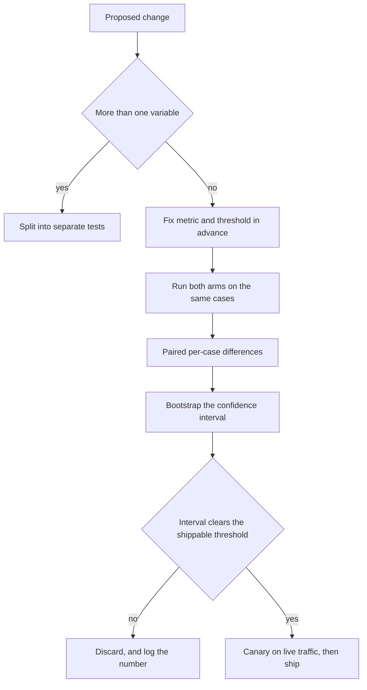
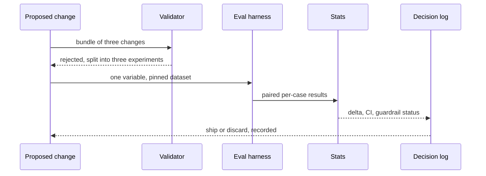

## What Problem Are We Solving?

An insurer summarises claims files for adjusters. A prompt rewrite was proposed: clearer structure,
a tighter role definition, and — while they were in there — a move from six retrieved documents to
four, and a switch to a cheaper model tier, because all three seemed obviously good.

Run against the evaluation set, the combined change scored 88% against the baseline's 85%. Ship.

Two months later, summaries were missing prior-claim history often enough that adjusters had gone
back to reading the files. Unpicking it took a week of work that a single afternoon would have
prevented: the prompt rewrite was worth about +6 points, the model downgrade about −2, and the
retrieval cut about −1 — netting +3, which looked like a modest win and was actually one good
change carrying two regressions.

That's the whole failure. **Three variables moved at once, so the result was a sum with no
addends.** And the +3 was inside the noise of their 250-case set anyway, so even the sum was not
reliably a win.

A/B testing is the discipline that replaces "this feels better on the four examples I tried" with
a comparison you can defend: one variable, a metric chosen in advance, the same fixed dataset for
both arms, and a significance check before anyone says the word "improvement".

> **🗣️ In plain English:** Change one thing, decide beforehand what "better" means, run both versions on the same cases, and check the difference is bigger than the noise. Otherwise you're shipping a guess.

## Meet the Moving Parts

| Step | What it means | What goes wrong without it |
|---|---|---|
| **Isolate one variable** | Exactly one change per test — model, prompt, chunking, chunk count | A sum with no addends; a win hiding a regression |
| **Choose the metric up front** | Decide what "better" means before seeing results | Cherry-picking whichever metric happened to look good |
| **Same evaluation dataset** | Both arms on identical cases | Differences attributable to the cases, not the change |
| **Check significance** | Not just the raw difference | 2% on 30 cases is noise; on 5,000 it's a signal |
| **Ship or discard, and log it** | Record the decision and the number | No audit trail when a later regression needs diagnosing |

Three things worth being precise about.

**Paired comparison beats two independent runs.** Both arms see the same cases, so you compare per
case and look at the *distribution of differences* — which removes most between-case variance and
buys resolution for free.

**"Significant" and "worth shipping" are different questions.** A change can be real and tiny.
Decide the smallest improvement you'd act on (4.2) before the test.

**Offline A/B and canary answer different questions**, so mature teams run both: offline catches
"it doesn't help", canary catches "it helps on paper and breaks under real load".

| Approach | How it works | Best for |
|---|---|---|
| **Offline A/B** | Both versions against a fixed dataset, pre-launch | Validating quickly and cheaply; catching regressions early |
| **Canary / shadow** | Version B on a small slice of live traffic, or run silently alongside A | Confirming the offline win survives real behaviour and real load |

> **💡 Tip:** If a proposed change is a bundle, insist on splitting it. "We'll test them together to save time" is how a −2 gets shipped inside a +6.

## How It Works, Step by Step

1. **Split the bundle.** One variable per test, even when the changes seem obviously
   complementary.
2. **Name the metric and the threshold in advance** — including the guardrails that must not
   regress (4.1).
3. **Run both arms on the same cases**, ideally interleaved so run-order effects don't land on one
   arm.
4. **Compare per case**, not just the two means — paired differences are the stronger test.
5. **Compute a confidence interval** on the mean difference; a bootstrap is fine and needs no
   distributional assumption.
6. **Compare the interval to your shippable threshold**, not to zero.
7. **Check guardrails independently.** An accuracy win that breaches a cost or safety threshold is
   not a win.
8. **Log the decision with the numbers**, so a regression six months out has an audit trail.



## Minimal Working Implementation

The significance check is the step teams skip, and it's a dozen lines. Save as `abtest.py` and run
it — no API key needed.

```python
import random
import statistics

random.seed(11)

def bootstrap_ci(diffs: list[float], reps: int = 10_000,
                 alpha: float = 0.05) -> tuple[float, float]:
    """Paired differences, resampled. No distributional assumption, and
    the paired design removes between-case variance."""
    n = len(diffs)
    means = sorted(statistics.fmean(
        [diffs[random.randrange(n)] for _ in range(n)])
        for _ in range(reps))
    return means[int(reps * alpha / 2)], means[int(reps * (1 - alpha / 2))]

def verdict(name: str, a: list[int], b: list[int],
            shippable: float) -> str:
    diffs = [x - y for x, y in zip(b, a)]
    delta = statistics.fmean(diffs)
    lo, hi = bootstrap_ci(diffs)
    if lo <= 0 <= hi:
        call = "NOT SIGNIFICANT - indistinguishable from no change"
    elif lo > shippable:
        call = f"SHIP - whole interval above the {shippable:.0%} bar"
    elif hi < 0:
        call = "REGRESSION - significantly worse"
    else:
        call = f"REAL BUT SMALL - below the {shippable:.0%} bar"
    return (f"{name:16} delta={delta:+.1%}  "
            f"95% CI [{lo:+.1%}, {hi:+.1%}]  {call}")

BASE_RATE = 0.85
def arm(n: int) -> list[int]:
    return [1 if random.random() < BASE_RATE else 0 for _ in range(n)]

def lifted(base: list[int], delta: float) -> list[int]:
    """Raise the pass rate by `delta` by fixing some of the failures -
    the only rows a real improvement can act on."""
    p = delta / (1 - BASE_RATE)
    return [1 if v or random.random() < p else 0 for v in base]

BASE_30, BASE_800 = arm(30), arm(800)
print(verdict("30 cases, +2pt", BASE_30, lifted(BASE_30, 0.02), 0.03))
print(verdict("800 cases, +2pt", BASE_800, lifted(BASE_800, 0.02), 0.03))
print(verdict("800 cases, +7pt", BASE_800, lifted(BASE_800, 0.07), 0.03))
```

The same intended +2 points is "not significant" at 30 cases and a real-but-below-bar effect at
800, where the interval is [+1.1%, +3.0%]. Without the interval both would read as "+2%, ship it".

The 30-case row is worth dwelling on: its measured delta is **exactly zero**. With 30 cases at an
85% baseline there are only about four failures available to fix, so a 2-point improvement is
less than one case — at that size the effect isn't merely lost in noise, it isn't *expressible*.
The smallest difference a 30-case set can represent is 3.3 points.

## Production Implementation

Production runs one variable at a time against a pinned dataset, and records every decision.

```python
import dataclasses
import datetime as dt

@dataclasses.dataclass(frozen=True)
class Experiment:
    exp_id: str
    variable: str            # exactly one
    baseline_ref: str        # pinned config hash
    candidate_ref: str
    dataset_version: str     # pinned - both arms, identical cases
    primary_metric: str
    shippable_delta: float   # decided before the run
    guardrails: dict         # must not regress

def validate(e: Experiment) -> list[str]:
    problems = []
    if "," in e.variable or " and " in e.variable:
        problems.append(f"{e.exp_id}: more than one variable - split it")
    if not e.primary_metric or e.shippable_delta <= 0:
        problems.append(f"{e.exp_id}: metric or threshold not set in "
                        f"advance")
    return problems
```

The decision is recorded whether it ships or not, because discards are the more useful half:

```python
@dataclasses.dataclass(frozen=True)
class Decision:
    exp_id: str
    delta: float
    ci: tuple[float, float]
    guardrail_breaches: tuple[str, ...]
    shipped: bool
    rationale: str
    decided_at: dt.datetime

def decide(e: Experiment, delta: float, ci: tuple[float, float],
           breaches: tuple[str, ...]) -> Decision:
    lo, _ = ci
    ship = lo > e.shippable_delta and not breaches
    why = ("clears the bar with no guardrail breach" if ship
           else f"breaches {list(breaches)}" if breaches
           else f"CI lower bound {lo:+.1%} below "
                f"{e.shippable_delta:+.1%}")
    return Decision(e.exp_id, delta, ci, breaches, ship, why,
                    dt.datetime.now(dt.timezone.utc))
    # ...
```

**What changed, and why:**

- **A bundled change is rejected before it runs.** The cheapest moment to split a three-variable
  test is before spending the compute, and `validate` makes it a mechanical check rather than a
  debate.
- **Both the dataset version and the config hashes are pinned.** Comparing against a baseline
  measured on last month's dataset is comparing two things at once again, less visibly.
- **The threshold is a field on the experiment, set before the run.** Deciding "what counts as
  better" after seeing results is how a −2 gets rationalised.
- **Discards are logged with their numbers.** "We tried that in March, it was +0.4 ± 2.1" is the
  single most useful artefact a team accumulates, and it only exists if you record the failures.

## In Production: A Prompt Change at an Insurance Claims Summariser

About 11,000 claims files summarised a week, read by adjusters who make reserve decisions from
them.



**The bundled test.** +3 points, shipped, and two months of degraded summaries. Unpicking it
afterwards cost a week and needed a rebuilt baseline, because the original configs had not been
pinned.

**Split into three.** Prompt rewrite +6.1 points, CI [+3.8, +8.4] — ships. Model downgrade −2.3,
CI [−4.1, −0.6] — a real regression, discarded. Retrieval 6→4 documents −0.9, CI [−2.6, +0.8] —
not significant, and discarded anyway because it was motivated by cost and the cost saving was
0.4% of the pipeline.

**Net effect of testing properly.** They shipped +6.1 instead of +3, and they knew which change
did it. The prompt rewrite was then extended, because knowing *that* was the lever is what tells
you where to spend the next week.

**The canary caught something offline couldn't.** The prompt rewrite passed offline and, on 5% of
live traffic, showed a p95 latency increase of 1.9 seconds — the new structure produced longer
summaries, which no accuracy metric noticed and which adjusters working through a queue felt
immediately. `max_tokens` and a tightened output instruction fixed it before full rollout.

**The decision log, a year on.** 41 experiments: 12 shipped, 29 discarded. The discards are
consulted more often than the ships, because "has anyone tried reducing chunk count?" now has an
answer with a number attached instead of an opinion.

> **🌍 Real-world example:** The retrieval change is the instructive one. It was *not significant* — the honest reading is "we don't know if this helps or hurts" — and the team discarded it anyway on the separate grounds that the cost saving it was motivated by turned out to be negligible. A non-significant result is not permission to ship the change because it "probably doesn't hurt"; it's an absence of evidence, and the decision then has to rest on something else that's actually measured.

## Where This Applies — and Where It Doesn't

| Situation | Use this | Use instead |
|---|---|---|
| Any change to a production prompt or config | One-variable A/B on a fixed dataset | Eyeballing a few examples |
| A bundle of "obviously good" changes | Split it; test each | Testing the bundle to save time |
| A small measured difference | A confidence interval vs your threshold | Comparing the raw means |
| The offline test passed | Canary on live traffic before full rollout | Shipping straight from offline |
| Cost-motivated changes | Test accuracy impact *and* verify the saving is real | Assuming the saving justifies itself |
| A non-significant result | Record it; decide on other grounds | Shipping because it "probably doesn't hurt" |
| An exploratory experiment | — | Formal A/B; explore first, then test properly |

Anti-patterns: changing several things at once; choosing the metric after seeing results;
comparing against a baseline run on a different dataset version; treating a raw difference as a
result; shipping a non-significant change; and discarding an experiment without logging the
number.

## Failure Modes Seen in the Wild

### 1. The bundled change

**Symptom.** A modest net win that later turns out to contain a regression.
**Cause.** Several variables moved together, so the result is a sum with no addends.
**Fix.** One variable per test, enforced before the run rather than argued about.

### 2. The raw difference

**Symptom.** Months of small "improvements" that never show up in production.
**Cause.** Differences smaller than the noise floor, reported as results.
**Fix.** A confidence interval, compared to a threshold decided in advance.

### 3. The moving baseline

**Symptom.** A regression that can't be reproduced or attributed.
**Cause.** Dataset version and configs weren't pinned, so the comparison drifted.
**Fix.** Pin both arms and the dataset version on the experiment record.

### 4. Offline-only confidence

**Symptom.** A validated change degrades the experience in ways the metric didn't cover.
**Cause.** Offline holds load, concurrency and real user behaviour constant, and production
doesn't.
**Fix.** Canary after the offline pass; watch the guardrails, not just the primary metric.

> **⚠️ Watch out:** "Not significant" means you have no evidence either way — it is not a quiet endorsement. The temptation to ship a non-significant change because it's cheaper, or simpler, or someone has already built it, is how regressions enter through a door marked "probably fine". If the justification is cost, measure the cost saving; if that's negligible too, there's nothing left supporting the change.

## Exam Lens & Key Takeaway

> **📝 Exam focus:** Know the process as an ordered list: **isolate one variable** (change exactly one thing, or you won't know which change caused the result — or whether one improvement is masking another's regression), **choose the metric up front** (before seeing results, to avoid cherry-picking), **run both versions on the same evaluation dataset** (holding the input distribution constant so the difference is attributable to the change), **check statistical significance rather than the raw difference** (a 2% improvement on 30 examples may be pure noise; the same 2% on 5,000 with a tight interval is real — which is exactly why dataset size from 4.2 matters), and **ship or discard, logging the decision** as an audit trail for later regressions. Distinguish **offline A/B** (fixed dataset, pre-launch) from **canary / shadow rollout** (version B on live traffic, confirming the win holds under real load); both **in sequence** beats either alone.

> **🔑 Key takeaway:** A/B testing turns "this feels better" into a defensible comparison, and its discipline is almost entirely about what you do *before* the run: split the bundle to one variable, fix the metric and the smallest shippable difference in advance, pin the dataset so both arms see identical cases. Then compare paired per-case differences with a confidence interval against that threshold rather than against zero — and log the discards, because they turn out to be the half the team consults.
