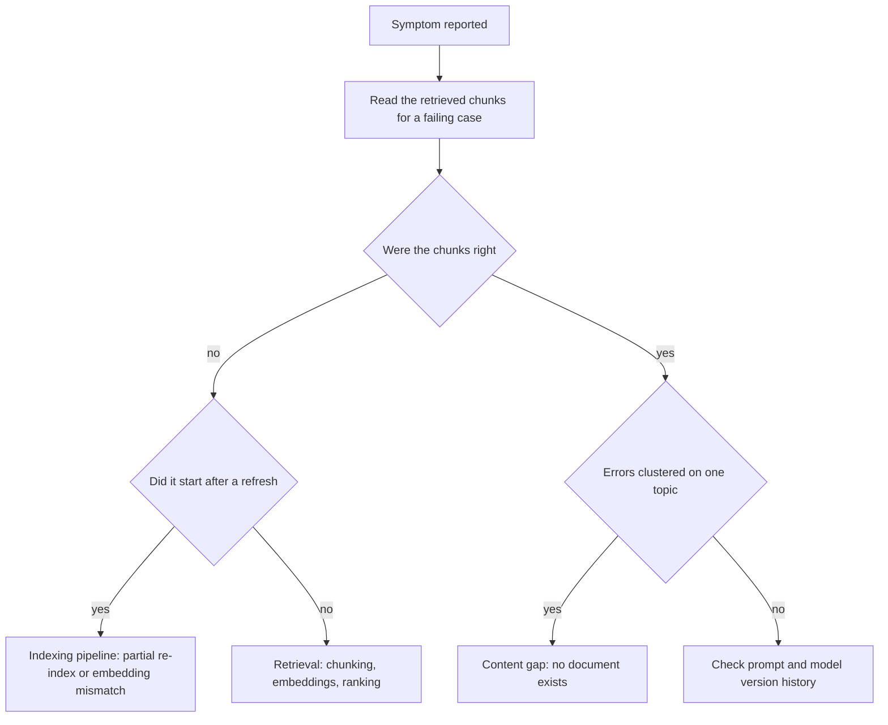
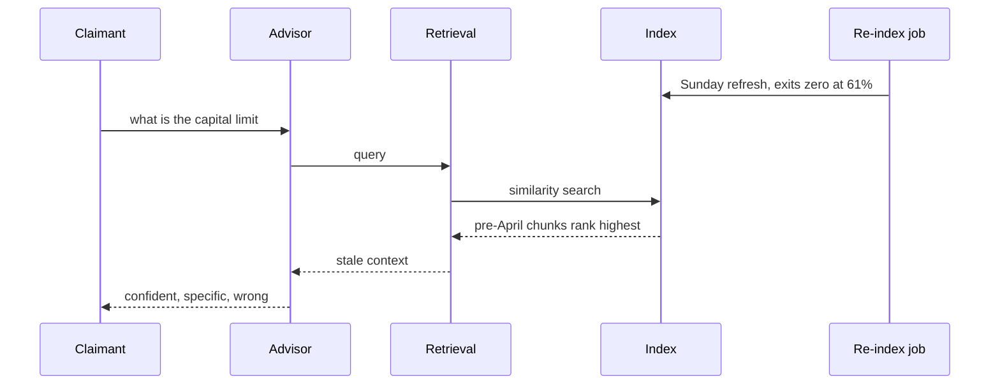

## What Problem Are We Solving?

A government agency runs a benefits advisor. Claimants ask what they're entitled to; the assistant
answers from current policy guidance.

On a Tuesday, complaints start. The answers are fluent, specific, confidently worded — and wrong
about the capital limit for one benefit, quoting a threshold that changed in April.

The team's first four hypotheses, in order: the model must have changed; the prompt must have
drifted; someone must have edited the guidance wrongly; the model is hallucinating. Three days
went into re-testing prompts and comparing model versions.

The actual cause was a re-index job that had failed partway through on Sunday night. It exited
zero. The index held a mix of current and pre-April chunks, retrieval preferred the older ones on
similarity, and the model faithfully summarised what it was handed.

Every wrong instinct there shared an assumption: that a wrong answer is the model's fault. In a
pipeline — retrieval, prompt construction, model call, post-processing — **the symptom is almost
never where the cause lives**, and the model is the stage least likely to be at fault because it's
the only one doing exactly what it was designed to do with the input it received.

Diagnosis is working backwards through the pipeline with the symptom as a clue about *which stage
to inspect first*, rather than guessing at fixes. The symptoms map to stages with enough
regularity to be worth memorising.

> **🗣️ In plain English:** Confident and wrong almost always means the model got bad context, not that the model is broken. Look at what was retrieved before you look at the prompt.

## Meet the Moving Parts

| Symptom | Most likely cause | Where to look first |
|---|---|---|
| **Confident but wrong answers** | **Retrieval** — irrelevant chunks, bad embeddings, poor chunking, stale index | What was actually retrieved for the failing query |
| **A wave of wrong answers after a document refresh** | **The indexing pipeline** — a partly-failed re-index, or new docs embedded with a different embedding model version | Re-index completion; embedding version consistency |
| **Prompt failures or unexpected output formats** | **A prompt or model version change** | Version history — did either change, even automatically? |
| **Hallucinations concentrated on one topic** | **A content gap** — no relevant document exists for that topic | Knowledge-base coverage for that topic, not the model |
| **A sudden latency increase** | **Operational** — more tokens per request, network, or a model version change | Token counts per stage; time retrieval separately from generation |

Three things make this table work.

**"Confident but wrong" is the most dangerous mode because it gives no signal.** The model can't
know its context was wrong; it synthesises something fluent from whatever it receives.

**Concentrated hallucination is a coverage problem.** Scattered errors suggest something systemic;
errors clustered on one topic mean no document covers it. The fix is content, not prompting.

**"The model changed" is the commonest first hypothesis and among the rarest causes.** Worth
checking — version history is cheap — but checking it *first* is how three days go missing.

| Approach | When | What it catches |
|---|---|---|
| **Reactive debugging** | After a symptom is reported | Root-causing a specific failure already happening |
| **Proactive monitoring** | Continuously | Silent drift — index staleness, latency creep — before users see it |

> **💡 Tip:** Before forming any hypothesis, pull the retrieved chunks for one failing query and read them. If they're wrong, the investigation is over and everything downstream was innocent.

## How It Works, Step by Step

1. **Collect failing examples**, with their trace — query, retrieved chunks, prompt version, model
   id, timing (3.6).
2. **Read what was retrieved** for a failing case before theorising about anything else.
3. **Check whether the failures cluster** — one topic, one time window, one document type. The
   shape names the stage.
4. **Match the symptom to the table** and inspect that stage first.
5. **Check version history** for prompt and model — cheap, and rules out a whole class.
6. **Check pipeline job status**, especially any re-index or sync near the onset.
7. **Compare against a known-good baseline** — the previous prompt or model version — to confirm
   or rule out.
8. **Fix the stage that failed**, then add the monitor that would have caught it (a completion
   check, an embedding-version assertion).



## Minimal Working Implementation

The triage is mechanical enough to encode, which stops the investigation starting at the model.
Save as `triage.py` and run it — no API key needed.

```python
import dataclasses

@dataclasses.dataclass(frozen=True)
class Incident:
    confident_wrong: bool
    started_after_refresh: bool
    topic_concentrated: bool
    format_broken: bool
    latency_up: bool
    prompt_changed: bool
    model_changed: bool

def triage(i: Incident) -> list[str]:
    """Ordered: the first hypothesis is the one to spend time on."""
    out = []
    if i.started_after_refresh:
        out.append("INDEXING: check the re-index completed and that new "
                   "docs used the same embedding model version")
    if i.confident_wrong and not i.topic_concentrated:
        out.append("RETRIEVAL: inspect the chunks returned for a failing "
                   "query before anything else")
    if i.topic_concentrated:
        out.append("CONTENT GAP: no document covers this topic - the "
                   "model is ungrounded, not malfunctioning")
    if i.format_broken or i.prompt_changed or i.model_changed:
        out.append("VERSION: diff the prompt and model version against "
                   "the last known-good")
    if i.latency_up:
        out.append("OPERATIONAL: token counts per stage; time retrieval "
                   "separately from generation")
    return out or ["No pattern matched - start from a full trace"]

F = False
CASES = {
    "benefits advisor (Tuesday)":
        Incident(True, True, F, F, F, F, F),
    "one product line only":
        Incident(True, F, True, F, F, F, F),
    "JSON stopped parsing":
        Incident(F, F, F, True, F, True, F),
}
for name, incident in CASES.items():
    print(f"{name}:")
    for n, hypothesis in enumerate(triage(incident), 1):
        print(f"  {n}. {hypothesis}")
```

Note that "the model is broken" is not an output. It isn't in the table because it is almost never
the answer, and encoding the triage is mostly a way of stopping a team from starting there.

## Production Implementation

Production turns each diagnosis into a monitor, so the next occurrence is caught rather than
investigated.

```python
import dataclasses
import datetime as dt

@dataclasses.dataclass(frozen=True)
class IndexHealth:
    job_id: str
    started: dt.datetime
    finished: dt.datetime | None
    docs_expected: int
    docs_indexed: int
    embedding_model: str

def index_alerts(h: IndexHealth, expected_model: str) -> list[str]:
    """The benefits incident, converted into two assertions. A job that
    exits zero having indexed 60% of documents is a silent failure."""
    out = []
    if h.finished is None:
        out.append(f"{h.job_id}: never finished")
    elif h.docs_indexed < h.docs_expected:
        out.append(f"{h.job_id}: indexed {h.docs_indexed}/"
                   f"{h.docs_expected} - partial index in production")
    if h.embedding_model != expected_model:
        out.append(f"{h.job_id}: embedded with {h.embedding_model}, "
                   f"index uses {expected_model} - vectors incomparable")
    return out
```

Proactive checks run continuously rather than waiting for a complaint:

```python
def staleness_alert(newest_indexed: dt.datetime,
                    newest_source: dt.datetime, hours: int = 26) -> str | None:
    lag = (newest_source - newest_indexed).total_seconds() / 3600
    return (f"index is {lag:.0f}h behind source (limit {hours}h)"
            if lag > hours else None)

def coverage_alert(unanswered_topics: dict[str, int],
                   floor: int = 20) -> list[str]:
    """Concentrated hallucination, caught before it is reported: topics
    where retrieval repeatedly returns nothing above threshold."""
    return [f"content gap: {topic} ({n} queries, no strong match)"
            for topic, n in unanswered_topics.items() if n >= floor]
    # ...
```

**What changed, and why:**

- **A re-index asserts completion, not exit status.** Exiting zero having indexed 60% of documents
  is the exact failure that cost three days, and a document count comparison would have caught it
  in minutes.
- **Embedding model version is checked against the index.** Vectors from different embedding
  models aren't comparable, and mixing them degrades retrieval without erroring — a distinct
  failure from a partial index with the same symptom.
- **Index staleness is monitored against the source.** This is the proactive half: the lag alarm
  fires before a claimant gets a wrong threshold.
- **Repeated weak-match topics are surfaced as content gaps.** Concentrated hallucination becomes
  a content backlog item rather than a mysterious model complaint.

## In Production: The Capital Limit Incident at a Benefits Agency

About 30,000 claimant questions a week over policy guidance that changes with every fiscal event.



**The three days.** Spent on model version comparison, prompt diffing, and a review of the
guidance documents themselves — all of which were fine. The trace that settled it took four
minutes to read once someone pulled the retrieved chunks for a failing query and saw an April
revision date.

**The tell they'd missed.** Onset was sharp and coincided with the Sunday refresh. "A wave of
wrong answers right after a document refresh" points at the indexing pipeline, and the sharpness
of the onset was itself diagnostic — model and prompt changes have deploy times you can check;
data changes have job schedules.

**What was added afterwards.** A completion assertion on the re-index (documents indexed versus
expected), an embedding-version check, and a staleness alarm on index lag. The re-index has failed
twice since, both caught within the hour, neither reaching a claimant.

**The second finding.** The staleness work surfaced a separate, older problem: one guidance
collection had not been re-indexed for four months because its sync had been quietly disabled
during an unrelated migration. Nobody had reported it, because its answers were wrong in a way
that looked merely unhelpful rather than incorrect.

**Reactive versus proactive, quantified.** Median time-to-diagnose on retrieval-layer incidents
went from about two days to under an hour — and more usefully, the count of such incidents
reaching users fell to near zero, because the monitors fire on the cause rather than waiting for
the symptom.

> **🌍 Real-world example:** The costliest habit was the ordering of hypotheses. "The model changed" is a satisfying theory — it's external, it explains a sudden change, and it's cheap to imagine. It's also checkable in about ninety seconds from version history, which is precisely why it should be checked early and *dismissed* early rather than investigated for three days. The discipline isn't avoiding the hypothesis; it's testing the cheap ones fast and then reading the retrieved chunks.

## Where This Applies — and Where It Doesn't

| Situation | Use this | Use instead |
|---|---|---|
| Confident but wrong answers | Inspect retrieval first | Prompt tuning |
| Wrong answers right after a refresh | Check the indexing pipeline | Blaming the model |
| Hallucinations on one topic only | Check knowledge-base coverage | A model or prompt fix |
| Broken output format | Diff prompt and model versions | Rewriting the prompt from scratch |
| Sudden latency increase | Token counts and per-stage timing | Assuming the provider is slow |
| Silent drift | Proactive monitoring | Waiting for a complaint |
| A genuinely novel failure | Start from a full trace | Forcing it into the table |

Anti-patterns: starting from the model; tuning the prompt before reading the retrieved chunks;
treating a re-index exit code as success; ignoring the shape of the failure distribution; and
diagnosing without a trace, which reduces the investigation to re-running and hoping.

## Failure Modes Seen in the Wild

### 1. Starting at the model

**Symptom.** Days spent comparing model versions on a retrieval problem.
**Cause.** A wrong answer feels like the model's fault; it is the stage least likely to be at
fault.
**Fix.** Read the retrieved chunks for one failing query before forming a hypothesis.

### 2. The silent partial re-index

**Symptom.** A sharp onset of confident errors after a scheduled refresh.
**Cause.** A job that exits zero having indexed part of the corpus.
**Fix.** Assert documents-indexed against documents-expected; alert on the gap.

### 3. The mixed embedding index

**Symptom.** Retrieval quality degrades after new documents are added, with no error.
**Cause.** New content embedded with a different embedding model version than the existing index.
**Fix.** Record the embedding version per index and assert consistency on write.

### 4. Content gap read as hallucination

**Symptom.** One topic produces invented answers; everything else is fine.
**Cause.** No document covers it, so the model is ungrounded.
**Fix.** Surface repeated weak-match topics as a content backlog, not a prompt problem.

> **⚠️ Watch out:** Fluency is not evidence of grounding. The model will write an equally confident, equally well-structured answer from a stale chunk, an irrelevant chunk, or no chunk at all — so the *quality of the prose* tells you nothing about the quality of the context, and any diagnosis that starts by reading the answer rather than the input is starting in the wrong place.

## Exam Lens & Key Takeaway

> **📝 Exam focus:** A symptom-to-root-cause mapping worth memorising — the exam tests it directly and the flagged pattern recurs across domains. **Confident but wrong answers → retrieval** (irrelevant chunks from bad embeddings, poor chunking or a stale index; the model synthesises confidently from whatever it was given) — explicitly called out as appearing repeatedly. **A wave of wrong answers right after a document refresh → the indexing pipeline**, most often a re-index that silently failed partway through, or new documents embedded with a different embedding model version than the existing index. **Prompt failures or unexpected output formats → a prompt or model version change**; check version history first. **Hallucinations concentrated on one topic → a content gap**: no relevant document exists, so the fix is coverage. **A sudden latency increase → operational causes**: more tokens per request, network, or a model version change. The standing wrong answer is blaming the model.

> **🔑 Key takeaway:** The symptom is rarely where the cause lives, and the model is the stage least likely to be at fault — so diagnose backwards through the pipeline using the symptom to choose which stage to open first. Confident and wrong means look at retrieval; a sharp onset after a refresh means look at the indexing job; errors clustered on one topic mean a content gap rather than a model problem. And once you've found it, convert the diagnosis into a monitor, because every one of these failures exits zero.
