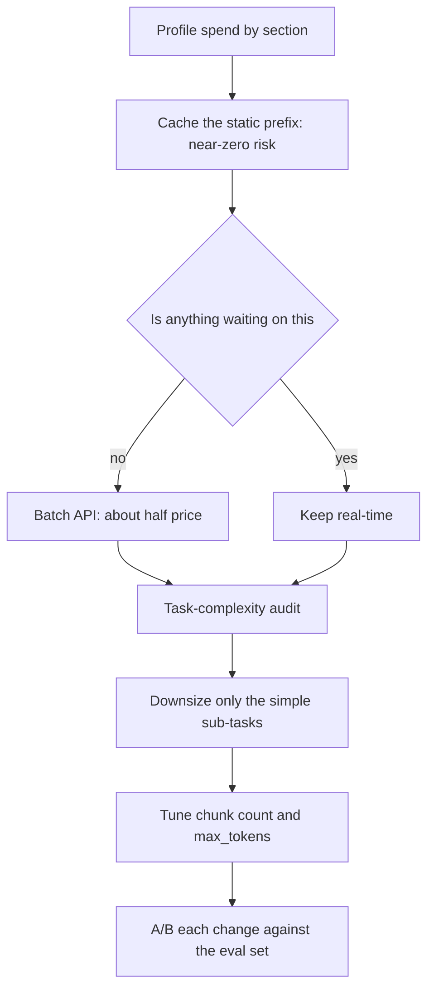
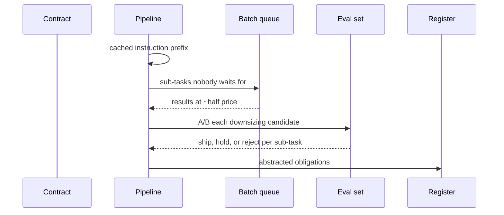

## What Problem Are We Solving?

A legal operations team abstracts contracts — parties, term, renewal, liability caps, governing
law — across about 60,000 documents a quarter. The bill reached $48,000 a month and the mandate
came down: halve it.

The team did the obvious thing and downgraded the model everywhere. Cost fell 58%. Liability-cap
extraction accuracy fell from 94% to 79%, which on a clause whose whole purpose is bounding
financial exposure is not a trade anyone would have authorised if it had been put to them as a
trade. It wasn't, because nobody measured the accuracy impact — the change was evaluated on the
invoice.

A uniform downgrade is a blunt instrument that cuts everywhere, including where the capability was
load-bearing. What the pipeline actually contained was five *different kinds of waste*, each with
its own lever and its own quality risk:

An identical 6,200-token instruction block re-sent on every one of 60,000 calls. Simple field
extraction — party names, dates — running on the most capable tier. A quarterly batch job with
nobody waiting, running synchronously. Ten retrieved chunks where three were relevant. And
`max_tokens` at 8,192 for abstracts averaging 240 tokens.

Each of those is a specific inefficiency addressed by a specific lever, and the levers differ
enormously in how much quality they put at risk. Cost optimisation is choosing the ones that cut
spend *without* cutting capability — and validating each against the evaluation set rather than
the invoice.

> **🗣️ In plain English:** Don't make everything cheaper. Find what's actually being wasted — repeated processing, an oversized model on easy work, synchronous calls nobody waits for — and fix each with the right lever, then check accuracy held.

## Meet the Moving Parts

| Lever | The waste it removes | Quality risk |
|---|---|---|
| **Prompt caching** | Re-processing content that doesn't change between calls | **Nearly zero** — the content is unchanged, only how it's processed |
| **Model downsizing** | An oversized model on simple sub-tasks | Real — needs a task-complexity audit, then A/B validation |
| **Batch API** | Paying real-time prices where nobody waits | None to quality; trades latency for ~50% cost |
| **Fewer retrieved chunks** | Context spent on loosely-relevant passages | Two-sided — can *improve* accuracy, or lose needed context |
| **`max_tokens` tuning** | Over-generation: rambling, repetition, padding | Low if sized from a measured p99 |

Three things worth being precise about.

**Caching is the one nearly-free lever.** It changes how content is processed, not what — so the
output is unchanged by construction. First move in almost every case.

**Fewer chunks cuts both ways, which is why it needs a test.** Three relevant chunks beat ten
loose ones on cost, latency *and* often accuracy, because irrelevant context dilutes. Under-
retrieve and you lose what the answer needed. Tune it against an eval set, never blindly.

**Model downsizing needs a task-complexity audit**, not a global setting — which is exactly where
the uniform downgrade went wrong, applying one answer to tasks with different requirements.

| Approach | Strategy | Risk |
|---|---|---|
| **Uniform downgrade** | Cut broadly — smaller model or less context everywhere | Fast, but regresses the tasks that needed the stronger setup |
| **Targeted lever selection** | Each lever only where it fits | More analysis; preserves quality, captures most savings |

> **💡 Tip:** Order the levers by quality risk, not by size of saving. Cache first because it risks nothing, batch next, and leave model downsizing until you've measured which sub-tasks actually need the tier.

## How It Works, Step by Step

1. **Profile spend by section** — repeated prefix, retrieved context, output — before choosing
   anything (2.6).
2. **Cache the static prefix.** Largest saving, lowest risk, usually a two-line change.
3. **Move anything nobody waits for to Batch**, for roughly half price at no quality cost.
4. **Audit task complexity.** List the sub-tasks and identify which genuinely need the strongest
   tier.
5. **Downsize only the simple ones**, and A/B each against the evaluation set (4.3).
6. **Tune chunk count against the eval set**, watching accuracy in both directions.
7. **Set `max_tokens` from a measured p99** of useful output, plus headroom, and monitor the
   truncation rate.
8. **Validate every change on accuracy, not the invoice.** A cheaper system that's less accurate
   is a trade, and trades need authorising.



## Minimal Working Implementation

Model the levers before pulling them, so the order and the risk are explicit. Save as `levers.py`
and run it — no API key needed.

```python
import dataclasses

IN_RATE, OUT_RATE = 5.00 / 1e6, 25.00 / 1e6
CALLS = 60_000

@dataclasses.dataclass
class Pipeline:
    prefix_tokens: int = 6_200
    chunk_tokens: int = 4_000      # 10 chunks
    out_tokens: int = 240
    cached: bool = False
    batched: bool = False

    def monthly(self) -> float:
        prefix = self.prefix_tokens * (0.1 if self.cached else 1.0)
        cost = ((prefix + self.chunk_tokens) * IN_RATE
                + self.out_tokens * OUT_RATE) * CALLS
        return cost * (0.5 if self.batched else 1.0)

LEVERS = [
    ("baseline", lambda p: p, "-"),
    ("cache the prefix", lambda p: setattr(p, "cached", True) or p,
     "near zero"),
    ("batch (nobody waits)", lambda p: setattr(p, "batched", True) or p,
     "none to quality"),
    ("10 chunks -> 3", lambda p: setattr(p, "chunk_tokens", 1200) or p,
     "two-sided: A/B it"),
    ("max_tokens to p99", lambda p: setattr(p, "out_tokens", 210) or p,
     "low if measured"),
]

pipe = Pipeline()
previous = pipe.monthly()
print(f"{'lever':24} {'monthly':>10} {'saved':>9}  quality risk")
print(f"{'baseline':24} ${previous:>9,.0f} {'':>9}  -")
for name, apply, risk in LEVERS[1:]:
    pipe = apply(pipe)
    now = pipe.monthly()
    print(f"{name:24} ${now:>9,.0f} {previous - now:>8,.0f}  {risk}")
    previous = now
print(f"\ntotal saved without touching the model tier: "
      f"${Pipeline().monthly() - pipe.monthly():,.0f}/month "
      f"({1 - pipe.monthly() / Pipeline().monthly():.0%})")
```

Every lever here is applied *before* model downsizing, and together they take out 87% at near-zero
quality risk. The uniform downgrade that cost 15 accuracy points was reaching for the riskiest
lever first.

Two honesty notes about the figures. The absolute numbers model **one extraction sub-task** at this
volume, not the team's whole bill — the proportions are the point, not the totals. And the model
batches *everything*, which the real pipeline couldn't: an interactive review path has someone
waiting, so its share stays at real-time prices. Both are the kind of assumption worth writing down
before a saving is promised to anyone.

## Production Implementation

Production audits task complexity, then applies each lever where it fits and validates it.

```python
import dataclasses

@dataclasses.dataclass(frozen=True)
class SubTask:
    name: str
    needs_reasoning: bool     # from a complexity audit, not a guess
    waits_on_human: bool
    share_of_calls: float
    accuracy_floor: float

SUBTASKS = (
    SubTask("party_extraction", False, False, 0.31, 0.98),
    SubTask("date_extraction", False, False, 0.24, 0.99),
    SubTask("liability_cap", True, False, 0.18, 0.93),
    SubTask("renewal_terms", True, False, 0.15, 0.92),
    SubTask("governing_law", False, False, 0.12, 0.97),
)

def plan(t: SubTask) -> dict:
    """Each lever applied only where it fits. Downsizing is gated on the
    complexity audit, never applied globally."""
    return {"model": ("claude-opus-5" if t.needs_reasoning
                      else "claude-haiku-4-5"),
            "cache_prefix": True,                 # always: near-zero risk
            "batch": not t.waits_on_human,        # ~50% where nothing waits
            "requires_ab": t.needs_reasoning is False}
```

No downsizing ships without an A/B result that clears the sub-task's accuracy floor:

```python
def gate(t: SubTask, measured: float, ci_low: float,
         saving_pct: float) -> str:
    """A cheaper change is only a win if accuracy holds on the eval set -
    not on the invoice."""
    if measured < t.accuracy_floor:
        return (f"{t.name}: REJECT - {measured:.1%} below floor "
                f"{t.accuracy_floor:.1%}, saving {saving_pct:.0%} "
                f"is not authorised")
    if ci_low < t.accuracy_floor:
        return (f"{t.name}: HOLD - CI reaches below the floor; "
                f"more cases before shipping")
    return f"{t.name}: SHIP - {measured:.1%} holds, saves {saving_pct:.0%}"
    # ...
```

**What changed, and why:**

- **Every sub-task carries its own accuracy floor.** Party extraction can tolerate a different bar
  from liability caps, and one global threshold either over-protects the easy work or
  under-protects the clause that matters.
- **Caching is unconditional.** It is the only lever with no quality question attached, so making
  it a decision at all invites an unnecessary debate.
- **Downsizing is gated on a measured A/B**, not on the complexity audit alone. The audit says
  where to *try*; the eval set says whether it worked.
- **A confidence interval reaching below the floor is a HOLD, not a ship.** A point estimate above
  the bar with an interval straddling it is exactly the situation where more cases are cheaper
  than a regression.

## In Production: Contract Abstraction at a Legal Ops Team

60,000 contracts a quarter, five extraction sub-tasks per document, output feeding an obligations
register that lawyers rely on.



**The uniform downgrade.** 58% cost reduction, liability-cap accuracy 94% → 79%. Reverted after
six weeks, during which the obligations register accumulated errors that took a paralegal three
weeks to re-check by hand.

**The targeted rebuild, in order of risk.** Caching the 6,200-token prefix: −34% of spend, no
measurable accuracy change. Batching everything except the interactive review path: a further −41%
of the remainder, again no quality question. `max_tokens` from 8,192 to 320 against a measured p99
of 240: −6%. Chunk count 10 → 3, A/B tested: accuracy actually *rose* 1.2 points on three
sub-tasks, because the seven extra chunks had been diluting, and −18% of input spend.

**Then, and only then, downsizing.** The complexity audit identified three of five sub-tasks as
mechanical extraction. A/B per sub-task: party extraction held at 98.4% on the cheaper tier and
shipped; date extraction held at 99.1% and shipped; governing law came in at 96.2% against a 97%
floor and was rejected. Liability cap and renewal terms were never candidates.

**Where it landed.** $48,000 → $9,100 a month, an 81% reduction, with accuracy equal or better on
every sub-task. The uniform downgrade had achieved 58% and cost 15 accuracy points on the clause
that mattered most.

**The lever nobody expected to matter.** Chunk reduction improved accuracy. It had been assumed to
be a pure cost-for-quality trade, and A/B testing it revealed the opposite — which is a decent
argument for testing even the levers you think you understand.

> **🌍 Real-world example:** The governing-law rejection is the one that justified the whole process. On the invoice it was indistinguishable from the two that shipped — same tier change, same saving — and only the A/B result separated them. Under a uniform downgrade it would have gone through silently alongside the others, contributing its own quiet accuracy loss to a number nobody was watching.

## Where This Applies — and Where It Doesn't

| Situation | Use this | Use instead |
|---|---|---|
| A large block repeats on every call | Prompt caching — first, near-zero risk | Rewording it |
| Nobody waits for the result | Batch API, ~50% cheaper | Real-time calls |
| Simple classification or extraction sub-tasks | Downsize *those*, A/B validated | Downsizing everything |
| Retrieving many loosely-relevant chunks | Fewer chunks, tuned on the eval set | Setting the count blindly |
| Output runs long | `max_tokens` from a measured p99 | The model's ceiling |
| Deep reasoning sub-tasks | Leave the tier alone | Cutting cost where capability is load-bearing |
| Any cost change | Validate accuracy on the eval set | Judging it on the invoice |
| A latency problem | — | Batch; it makes latency worse |

Anti-patterns: uniform downgrade; reaching for model downsizing before caching and batching;
setting chunk count without a test; leaving `max_tokens` at the ceiling; and evaluating a cost
change on cost alone.

## Failure Modes Seen in the Wild

### 1. The uniform downgrade

**Symptom.** Cost drops handsomely; a critical sub-task quietly degrades.
**Cause.** One blunt change applied to tasks with different capability requirements.
**Fix.** Task-complexity audit, then downsize only the simple sub-tasks, each A/B validated.

### 2. Riskiest lever first

**Symptom.** Quality is traded away while free savings sit untouched.
**Cause.** Model tier is the most obvious lever, so it gets pulled first.
**Fix.** Order by quality risk: cache, batch, output caps, chunk tuning, then tier.

### 3. Validated on the invoice

**Symptom.** A "successful" optimisation with no accuracy data at all.
**Cause.** The change was measured on spend, which is the one number that always moves.
**Fix.** Every cost change goes through A/B against the evaluation set.

### 4. Blind chunk reduction

**Symptom.** Cost falls, and answers start missing context.
**Cause.** Chunk count cut without testing where the useful signal stops.
**Fix.** Tune against the eval set — and expect the result to surprise you in either direction.

> **⚠️ Watch out:** Cost is the only metric that moves reliably and immediately, which makes it dangerously easy to declare victory on. Every one of these levers will reduce spend; only an evaluation set can tell you which of them also reduced capability — and a downgrade's accuracy cost usually appears weeks later, in a downstream artefact nobody is comparing against a baseline.

## Exam Lens & Key Takeaway

> **📝 Exam focus:** Know the five levers and the *specific* waste each removes: **prompt caching** (avoid re-processing unchanged content — 50%+ savings on the cached portion, nearly free in quality risk), **model downsizing** (simple tasks to a smaller model, reserving the strongest for genuine reasoning — requires a task-complexity audit, not a uniform choice), **Batch API** (non-urgent, non-interactive work at roughly half cost — only where nobody waits synchronously), **fewer retrieved chunks** (cuts cost *and* latency, and can even **improve** accuracy since irrelevant chunks dilute — but risks under-retrieving, so tune against an evaluation dataset), and **`max_tokens` tuning** (cap output to what the task needs). The tested judgment is **targeted lever selection over uniform downgrade**, and that **every change is validated by A/B against the accuracy metric** — a cheaper change is only a win if quality holds.

> **🔑 Key takeaway:** Cost optimisation is choosing levers, not turning everything down. Order them by quality risk rather than by saving: cache the repeated prefix first because it changes how content is processed and not what, batch anything nobody waits for, cap output from a measured p99, tune chunk count against the eval set — and only then, after a task-complexity audit, downsize the sub-tasks that don't need the tier, each validated by A/B. Cost is the one number that always moves, so it can never be the number you judge the change on.
