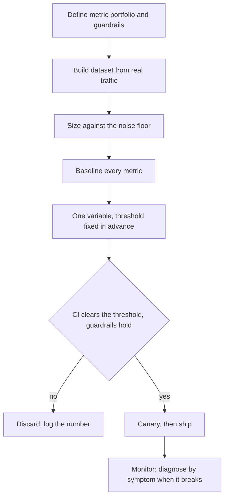
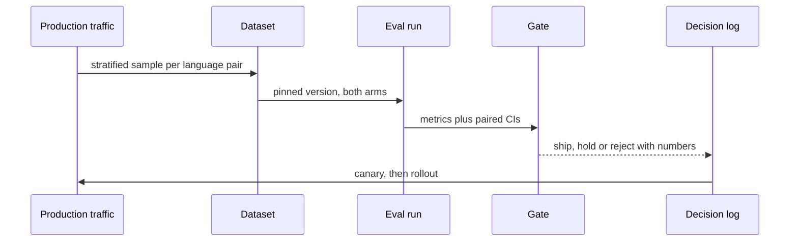

## What Problem Are We Solving?

Every other domain in this exam produces a system. This one answers the question that decides
whether any of it was worth doing: **how do you know?**

Not "does it work in the demo" — that question is answered by trying it. The professional question
is whether it works across the real input distribution, whether a change you made helped or hurt,
whether a cost saving cost you something else, and whether you'd find out before a user did.

The thread joining the five topics is that **each is a way of being wrong with numbers**. A single
accuracy score that conceals a latency and safety failure. A dataset built from the easy majority
that reports 96% on a system doing 71%. A three-variable change whose net +3 is one improvement
carrying two regressions. A three-day investigation that starts at the model. A cost optimisation
validated on the invoice.

None of those is a mistake of ignorance. Each is a competent team producing a number and believing
it, because the number was real — measured, reproducible, and answering a question slightly
different from the one they thought they'd asked.

So the discipline here is mostly about **what you do before you look at a result**: decide what
"better" means, size the instrument to the effect, isolate one variable, and know which stage a
symptom implicates. Afterwards is too late, because by then you have a number and a preference.

> **🗣️ In plain English:** This domain is about not fooling yourself with real measurements. Decide what you're measuring and whether you *can* measure it, before you have a result you like.

## Meet the Moving Parts

| Question | Topic | The decision |
|---|---|---|
| What counts as good? | **4.1** Metrics | A portfolio with guardrails — accuracy, latency, cost, safety, security, hallucination |
| What do we measure it on? | **4.2** Dataset design | Weighted to real traffic, with the tail and refusals, sized against the noise floor |
| Did this change help? | **4.3** A/B testing | One variable, metric fixed in advance, same dataset, significance checked |
| Why is it broken? | **4.4** Diagnosis | Symptom names the stage; the model is rarely the cause |
| How do we make it cheaper? | **4.5** Cost-performance | Targeted levers ordered by quality risk, each A/B validated |

Three relationships carry the domain.

**4.2 is the foundation for 4.3 and 4.5, and gets built last.** A/B testing and cost optimisation
both compare numbers computed on the dataset. If the set is underpowered or unrepresentative, both
produce confident nonsense — which is why "our improvements don't show up in production" is almost
always a dataset problem wearing an experiment's clothes.

**4.1 and 4.5 are the same tension from opposite ends.** Metrics exist because optimising one
thing trades against another; cost optimisation is the most common place that trade gets made
silently, because cost is the one number that always moves.

**4.4 is what happens when the others weren't enough.** Diagnosis is reactive by nature, and its
main lesson — the symptom is not the cause — is also the argument for the proactive monitoring
that would have caught it.

> **💡 Tip:** Before any evaluation result changes a decision, ask two questions: was the threshold set before the run, and could this set have detected an effect this size? Both are cheap and both are usually skipped.

## How It Works, Step by Step

1. **Define the metric portfolio and guardrail thresholds** — accuracy plus latency, cost, safety,
   security, hallucination (4.1).
2. **Build the dataset from real traffic**, stratified and weighted so each category keeps its
   real share, with the tail and refusal cases, and sized against the **noise floor** — the
   smallest difference the set can distinguish from luck (4.2).
3. **Size it against the noise floor** before the first run, comparing to your smallest shippable
   change.
4. **Establish a baseline** on every metric, not just the headline one.
5. **Change one variable at a time**, with the metric and threshold fixed in advance (4.3).
6. **Check the confidence interval against the threshold**, and the guardrails independently.
7. **Diagnose failures by symptom**, working backwards through the pipeline (4.4).
8. **Optimise cost by targeted lever**, ordered by quality risk, each validated against the eval
   set (4.5).



## Minimal Working Implementation

The domain's failures are decisions skipped before a run, so check for them. Save as
`eval_review.py` and run it — no API key needed.

```python
import json
import math
import sys

REQUIRED_METRICS = {"accuracy", "latency_p95", "cost_per_request",
                    "hallucination_rate", "unsafe_rate"}

def review(d: dict) -> list[str]:
    gaps = []
    measured = set(d.get("metrics", {}))
    gaps += [f"4.1 {m}: not measured - an unmeasured guardrail is a "
             f"failure, not a pass"
             for m in sorted(REQUIRED_METRICS - measured)]
    if "latency_mean" in measured and "latency_p95" not in measured:
        gaps.append("4.1 latency reported as a mean - report p50/p95/p99")
    ds = d.get("dataset", {})
    n, reps = ds.get("cases", 0), ds.get("reps", 1)
    if ds.get("source") == "top_n_common":
        gaps.append("4.2 built from most-common cases - selects for the "
                    "easy majority; sample real traffic")
    if not ds.get("has_refusal_cases"):
        gaps.append("4.2 no refusal cases - shipped unmeasured")
    smallest = d.get("smallest_shippable", 0.03)
    if n and 1 / math.sqrt(n * reps) > smallest:
        gaps.append(f"4.2 noise floor {1 / math.sqrt(n * reps):.1%} "
                    f"exceeds the {smallest:.1%} bar - underpowered")
    exp = d.get("experiment", {})
    if len(exp.get("variables", [])) > 1:
        gaps.append(f"4.3 {len(exp['variables'])} variables at once - "
                    f"the result will be a sum with no addends")
    if not exp.get("threshold_set_before_run"):
        gaps.append("4.3 threshold not fixed in advance - invites "
                    "choosing the metric that looks best")
    if exp.get("reported") == "raw_difference":
        gaps.append("4.3 raw difference reported without an interval")
    for change in d.get("cost_changes", []):
        if not change.get("ab_validated"):
            gaps.append(f"4.5 {change.get('name')}: validated on cost "
                        f"alone - accuracy impact unknown")
    return gaps

if __name__ == "__main__":
    found = review(json.load(open(sys.argv[1], encoding="utf-8")))
    print("\n".join(f"- {g}" for g in found) or "no evaluation gaps found")
    sys.exit(1 if found else 0)
```

Every check is a decision that has to be made *before* a run produces a number. None of them
inspects a result, because by the time there is a result these questions are no longer neutral.

## Production Implementation

Production makes the evaluation itself a versioned, gated artefact.

```python
import dataclasses
import datetime as dt

@dataclasses.dataclass(frozen=True)
class EvalRun:
    run_id: str
    dataset_version: str
    config_hash: str
    model: str
    metrics: dict
    ci: dict                    # per metric, paired vs baseline
    run_at: dt.datetime

GUARDRAILS = {"accuracy": (">=", 0.90), "hallucination_rate": ("<=", 0.02),
              "latency_p95": ("<=", 5000), "cost_per_request": ("<=", 0.05),
              "unsafe_rate": ("<=", 0.0)}

def gate(run: EvalRun, primary: str, threshold: float) -> tuple[bool, list]:
    notes = []
    for name, (op, limit) in GUARDRAILS.items():
        if name not in run.metrics:
            notes.append(f"{name}: not measured")
            continue
        got = run.metrics[name]
        if not (got >= limit if op == ">=" else got <= limit):
            notes.append(f"{name}: {got:.4f} breaches {op} {limit}")
    lo = run.ci.get(primary, (None, None))[0]
    if lo is None:
        notes.append(f"{primary}: no confidence interval")
    elif lo <= threshold:
        notes.append(f"{primary}: CI lower bound {lo:+.1%} below the "
                     f"{threshold:+.1%} bar")
    return not notes, notes
```

Every run is recorded whether it ships or not, and drift is watched between runs:

```python
def drift_alerts(history: list[EvalRun]) -> list[str]:
    """A baseline that moves on an unchanged config means the dataset
    or the world changed - not the system."""
    if len(history) < 2:
        return []
    latest, previous = history[-1], history[-2]
    out = []
    if latest.config_hash == previous.config_hash:
        delta = latest.metrics["accuracy"] - previous.metrics["accuracy"]
        if abs(delta) > 0.02:
            out.append(f"baseline moved {delta:+.1%} on an unchanged "
                       f"config - check dataset version and 4.4 symptoms")
    if latest.dataset_version != previous.dataset_version:
        out.append("dataset version changed - earlier comparisons are "
                   "not comparable to this run")
    return out
    # ...
```

**What changed, and why:**

- **The dataset version and config hash are on the run record.** Comparing against a baseline
  measured on a different dataset is comparing two things again, less visibly — and it's the most
  common way a regression becomes unattributable.
- **An unmeasured guardrail blocks the gate.** "No data" must not read as "fine", which is the
  single most expensive default in this domain.
- **The gate takes a confidence interval, not a point estimate.** A mean above the bar with an
  interval straddling it is precisely the case where shipping is a coin flip.
- **A moving baseline on an unchanged config is alerted.** That's either dataset drift or a live
  4.4 symptom, and both want investigating before the next experiment is trusted.

## In Production: A Translation Quality Programme at a Localisation Platform

The platform machine-translates and post-edits about 4 million segments a month across 30 language
pairs, with human linguists reviewing a sample.



**How the five fit.** Quality is a portfolio — adequacy, fluency, terminology adherence, plus
latency and cost per segment, each with a threshold (**4.1**). The dataset is sampled per language
pair weighted to real volume, deliberately including the low-resource pairs that are rare
individually and collectively significant, plus segments the system should decline to
auto-approve (**4.2**). Every prompt or model change is one variable against the pinned set with a
paired interval (**4.3**). Quality complaints are triaged by symptom, and the first question is
always what the terminology lookup returned (**4.4**). Cost work is lever-ordered — caching the
style guide, batching the non-urgent pairs — before any tier change (**4.5**).

**What the dataset rebuild found.** The original set was weighted by segment volume, so five major
pairs made up 78% of it. Adequacy scored 0.91 overall and 0.71 on the eleven low-resource pairs —
which were 4% of volume and 22% of complaints. Re-weighting to complaint-adjusted shares moved the
headline to 0.86 and made it useful for the first time.

**What the significance discipline found.** Over eighteen months, 63 experiments: 19 shipped, 44
discarded. Of the discards, 27 were non-significant rather than negative — changes that felt
better and weren't. At the previous cadence of shipping on eyeballed improvements, most of those 27
would have gone out.

**What diagnosis saved.** A quality drop on German was initially attributed to a model update
released the same week. The trace showed the terminology glossary sync had failed nine days
earlier. Median diagnosis time on quality incidents fell from four days to under three hours once
the symptom table was in use.

> **🌍 Real-world example:** The low-resource pairs are the domain in one finding. Nobody chose to under-measure them; the set was weighted by volume, which is the obviously-fair default, and volume weighting is exactly what buries a segment that is small in traffic and large in consequences. The number was honest, reproducible, and answering "how good are we on average" when the business question was "where are we losing customers".

## Where This Applies — and Where It Doesn't

| Situation | Use this | Use instead |
|---|---|---|
| Deciding if a system is ready | A metric portfolio with thresholds (4.1) | A single accuracy score |
| Building the test set | Stratified, weighted, with the tail (4.2) | A top-N-common export |
| Any change to a live system | One-variable A/B with a CI (4.3) | Eyeballing examples |
| Something is wrong in production | Symptom-to-stage triage (4.4) | Starting at the model |
| Cutting cost | Targeted levers, each A/B validated (4.5) | A uniform downgrade |
| Offline improvements not showing up live | Re-check the dataset's power and shape | More experiments |
| A prototype not yet in front of anyone | — | Full rigour; it isn't the instrument yet |

Anti-patterns spanning the domain: one score standing for quality; a set built from the easy
majority; running experiments a set can't resolve; changing several variables at once; starting
diagnosis at the model; and validating a cost change on cost alone.

## Failure Modes Seen in the Wild

### 1. The honest number answering the wrong question

**Symptom.** A metric everyone trusts that doesn't predict production behaviour.
**Cause.** The dataset's distribution, or the metric's granularity, encodes a question nobody
chose (4.1, 4.2).
**Fix.** Weight to reality, score atomically, and check the set against real traffic.

### 2. Measuring noise

**Symptom.** Steady small improvements that never materialise for users.
**Cause.** Effects smaller than the noise floor, reported as results (4.2, 4.3).
**Fix.** Size the set before the first run; report intervals, not differences.

### 3. The bundled change

**Symptom.** A net win that later contains a regression.
**Cause.** Several variables moved together (4.3).
**Fix.** One variable per experiment, enforced before the run.

### 4. Starting at the model

**Symptom.** Days spent on prompts and versions for a retrieval or indexing fault.
**Cause.** A wrong answer feels like the model's fault (4.4).
**Fix.** Read the retrieved context for a failing case first.

> **⚠️ Watch out:** The failures here are produced by teams doing measurement *properly* — real numbers, reproducible runs, honest reporting. What goes wrong is upstream of the measurement: a distribution, a threshold, a variable count, a granularity. Which means reviewing a result tells you much less than reviewing the decisions that were made before anyone pressed run.

## Exam Lens & Key Takeaway

> **📝 Exam focus:** 16% of the exam, ~10 questions, and two things are flagged as high-yield. First, **diagnosis from symptoms**, where the headline pattern is that **"confident but wrong" answers point at retrieval, not the model** — described as showing up repeatedly across the exam — along with a refresh-then-wrong-answers wave pointing at **indexing**, topic-concentrated hallucination pointing at a **content gap**, and format failures pointing at a **prompt or model version change**. Second, the concrete **cost levers**: prompt caching, right-sizing the model, the Batch API, and `max_tokens` limits. Beyond those: know the **metric set** (accuracy, latency as percentiles, cost, safety, security, hallucination) rather than a single score; know a good **dataset** covers common cases weighted by real frequency, includes edge cases and ground truth, and is **large enough for statistical power**; and know the **A/B discipline** — one variable, metric fixed up front, same dataset, **significance** not raw difference.

> **🔑 Key takeaway:** This domain is about not being fooled by your own measurements, and its failures are produced by careful teams with real numbers. The protection is almost entirely upstream of the result: build the dataset from the real distribution including the tail, size it so it can resolve the change you intend, fix the metric and threshold before the run, move one variable at a time, and when something breaks, let the symptom choose the stage rather than starting at the model.
