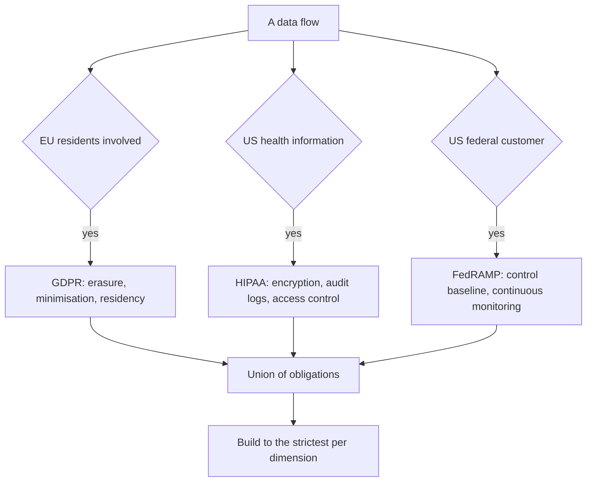
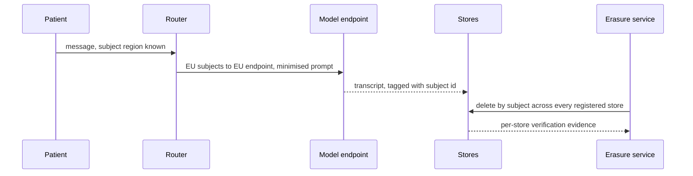

## What Problem Are We Solving?

A telehealth provider builds a patient messaging assistant. Patients describe symptoms, the
assistant drafts a reply for a clinician to approve, and it summarises the exchange into the
record.

The compliance work was done properly, once: the company is US-based and handles health
information, so the architecture was built to HIPAA. Encryption at rest and in transit, audit
logging, role-based access. That work was correct.

Then the company signed a contract with an employer whose workforce includes staff in Ireland and
Germany, and a separate pilot with a US federal health agency.

Overnight the system was subject to three regimes at once, and the architecture satisfied one of
them. GDPR requires a real erasure path — and patient transcripts had been used to build an
evaluation dataset that nobody could delete from selectively. It requires data residency
consideration, and EU patients' conversations were routing through a US region. FedRAMP requires a
defined control baseline and continuous monitoring that had never been scoped.

The mistake wasn't ignorance of GDPR. It was treating regulatory scope as a **property of the
company** rather than of **each data flow**. HIPAA applies because of what the data is; GDPR
applies because of who the person is; FedRAMP applies because of who the customer is. Those are
three different triggers, and a single system can fire all three at once.

> **🗣️ In plain English:** You don't pick a regulation. Each data flow drags in whichever regimes its data, its people and its customer trigger — and you build to the strictest of them.

## Meet the Moving Parts

Each answers a different question:

| Regulation | Trigger | Primary concern | Architectural implication |
|---|---|---|---|
| **GDPR** | Personal data of EU residents, wherever you're based | Individual rights and data minimisation | Deletion and export endpoints, consent tracking, possible EU data residency |
| **HIPAA** | US health information, covered entity or business associate | Confidentiality and integrity of health data | Encryption at rest and in transit, audit logs, strict access control |
| **FedRAMP** | A cloud service used by the US federal government | Security assurance of the service | A defined control baseline, continuous monitoring, formal authorisation |

GDPR recurs most, and maps almost one-to-one onto architecture:

1. **Data minimisation** — don't pipe more into the prompt than the task requires. A shipping
   question doesn't need full purchase history.
2. **Purpose limitation** — data collected for fraud detection can't silently become marketing
   data without new consent.
3. **Right to erasure** — a real deletion mechanism covering logs, **embeddings and vector
   stores**, and any fine-tuning or evaluation datasets. Not just the primary database.
4. **Transparency** — where AI makes or heavily influences a decision about a person, they're
   generally entitled to know and to get some explanation.
5. **Data residency** — some data must not leave the EU, constraining endpoints and
   subprocessors.

Two things architects get wrong.

**Erasure is a graph problem, not a row deletion.** Personal data propagates into transcripts,
logs, vector indexes, eval sets and prompt caches. A store you can't delete from selectively is a
store you shouldn't have put it in.

**Overlap is normal.** Build to the **strictest applicable requirement** per flow.

> **💡 Tip:** Draw the data-flow diagram and label every store with what personal data reaches it and how it gets deleted. The stores with no answer are your compliance backlog.

## How It Works, Step by Step

1. **Enumerate data flows**, not systems. Each flow has its own subjects, data types and customer.
2. **Determine triggers per flow** — EU residents (GDPR), US health data (HIPAA), federal customer
   (FedRAMP).
3. **Take the union, then the strictest requirement** on each dimension.
4. **Minimise at the source.** The cheapest compliance control is not collecting the data.
5. **Tag every store with a deletion path**, including vector indexes, logs and evaluation
   datasets.
6. **Route by residency** where required, and verify the model endpoint region, not just your own.
7. **Log access in enough detail to reconstruct who saw what**, which HIPAA requires and
   accountability (5.4) needs anyway.
8. **Disclose AI involvement** where a decision affects a person.



## Minimal Working Implementation

Erasure is where compliance is usually broken, and it's checkable. Save as `compliance.py` and run
it — no API key needed.

```python
import dataclasses

@dataclasses.dataclass(frozen=True)
class Store:
    name: str
    holds_personal_data: bool
    deletable_by_subject: bool     # can you delete ONE person's data
    region: str
@dataclasses.dataclass(frozen=True)
class Flow:
    name: str
    eu_residents: bool
    us_health_data: bool
    federal_customer: bool
    stores: tuple[Store, ...]
def regimes(f: Flow) -> set[str]:
    return {name for flag, name in ((f.eu_residents, "GDPR"),
                                    (f.us_health_data, "HIPAA"),
                                    (f.federal_customer, "FedRAMP"))
            if flag}

def findings(f: Flow) -> list[str]:
    applies = regimes(f)
    out = [f"{f.name}: subject to {', '.join(sorted(applies)) or 'none'}"]
    for s in (s for s in f.stores if s.holds_personal_data):
        if "GDPR" in applies and not s.deletable_by_subject:
            out.append(f"  GDPR erasure: {s.name} holds personal data "
                       f"with no per-subject deletion path")
        if "GDPR" in applies and not s.region.startswith("eu-"):
            out.append(f"  GDPR residency: {s.name} is in {s.region}")
    if "FedRAMP" in applies:
        out.append("  FedRAMP: control baseline and continuous "
                   "monitoring must be scoped")
    return out

FLOW = Flow("patient messaging", eu_residents=True, us_health_data=True,
            federal_customer=True, stores=(
                Store("primary_db", True, True, "us-east-1"),
                Store("conversation_logs", True, True, "us-east-1"),
                Store("vector_index", True, False, "us-east-1"),
                Store("eval_dataset", True, False, "us-east-1"),
                Store("metrics", False, True, "us-east-1")))

print("\n".join(findings(FLOW)))
```

The two stores with no per-subject deletion path are the vector index and the evaluation dataset —
exactly the two that get built from personal data by teams who are thinking about model quality
rather than about erasure, and exactly the two a "delete my data" request silently misses.

## Production Implementation

Production makes erasure executable and residency enforced rather than intended.

```python
import dataclasses

@dataclasses.dataclass(frozen=True)
class ErasureTarget:
    store: str
    delete: str              # the operation that removes one subject
    verified_by: str         # how you prove it happened

ERASURE_PLAN = (
    ErasureTarget("primary_db", "DELETE FROM patients WHERE id = :id",
                  "row count, then re-query"),
    ErasureTarget("conversation_logs",
                  "purge by subject_id partition key", "partition scan"),
    ErasureTarget("vector_index", "delete vectors WHERE meta.subject = :id",
                  "similarity probe returns nothing"),
    ErasureTarget("eval_dataset", "drop rows tagged subject:<id>, "
                  "rebuild frozen snapshot", "checksum change"),
    ErasureTarget("prompt_cache", "let the TTL expire; do not re-warm",
                  "cache read miss after TTL"),
)

def unhandled(stores: set[str]) -> set[str]:
    """Any store holding personal data that isn't in the plan is a
    GDPR gap, and the plan must be generated from the store registry
    rather than maintained by hand."""
    return stores - {t.store for t in ERASURE_PLAN}
```

Residency is enforced at the request boundary, not assumed from configuration:

```python
EU_ENDPOINT = "eu-west-1"

def route(subject_region: str, flow_regimes: set[str]) -> dict:
    """Residency applies to the model endpoint too - a compliant store
    behind a US inference call is still a transfer."""
    if "GDPR" in flow_regimes and subject_region.startswith("eu"):
        return {"region": EU_ENDPOINT, "log_retention_days": 30,
                "minimise": True}
    return {"region": "us-east-1", "log_retention_days": 2555,
            "minimise": True}

def assert_minimised(prompt_fields: set[str], required: set[str]) -> None:
    extra = prompt_fields - required
    if extra:
        raise ValueError(f"data minimisation: {sorted(extra)} in the "
                         f"prompt but not required by the task")
    # ...
```

**What changed, and why:**

- **The erasure plan names a verification for every store.** "We deleted it" is a claim; a
  similarity probe returning nothing is evidence, and a regulator asks for the second.
- **The plan is generated from the store registry.** A hand-maintained list drifts, and the store
  that gets forgotten is always the newest one — the vector index added last quarter.
- **The prompt cache is in the plan.** It holds personal data for its TTL, which is short but not
  zero, and teams routinely forget it exists as a data store at all.
- **Minimisation is asserted at request build.** Piping the full record because it's convenient is
  the default behaviour; making it raise turns a principle into a control.

## In Production: Patient Messaging at a Telehealth Provider

About 90,000 patient messages a month, clinicians in the loop on every clinical reply, and three
regulatory regimes after one sales quarter.



**The gap audit.** Seven stores held personal data. Three had per-subject deletion: primary
database, conversation logs, consent records. Four did not: the vector index, the evaluation
dataset, a nightly analytics extract, and the prompt cache. Of those, only the prompt cache was
low-risk, because its TTL bounded it.

**The evaluation dataset was the hardest.** It had been built from 40,000 real transcripts with no
subject tagging, because it was built by the ML team for quality work and nobody had classed it as
a patient data store. Retrofitting subject tags was three weeks; the alternative — destroying and
rebuilding it — was considered and rejected only because tagging turned out to be feasible.

**Residency.** EU subjects now route to an EU endpoint, which required the model call and not only
the storage layer. The team's initial fix had moved the database and left inference in us-east-1 —
a compliant store behind a non-compliant inference call, which is a transfer regardless of where
the row lives.

**Minimisation, measured.** The assertion at request build initially failed on 34% of requests,
because the prompt included the full patient record by default. Reducing it to the fields the task
required cut prompt size by 71% — which was also the single largest cost reduction that quarter,
entirely as a side effect of a compliance control.

**FedRAMP.** Scoped as a separate programme rather than a code change: control baseline,
continuous monitoring, formal authorisation. The architectural consequence was a separate
deployment boundary for the federal tenant rather than a shared one.

> **🌍 Real-world example:** The vector index is the store that catches nearly everyone. It holds embeddings, not text, and a team can reasonably tell themselves an embedding isn't personal data — which is a legal argument they should not be making, and which is moot anyway because the metadata alongside it identifies the subject. Any store built from personal data inherits the obligation, and "we only kept the vectors" is not an erasure strategy.

## Where This Applies — and Where It Doesn't

| Situation | Use this | Use instead |
|---|---|---|
| Any EU resident's personal data | GDPR: erasure path, minimisation, residency | Assuming your HQ location decides |
| US health information | HIPAA: encryption, audit logs, access control | General security hygiene |
| Selling to a US federal agency | FedRAMP: control baseline, monitoring, authorisation | Treating it as a data-protection law |
| Several triggers at once | Union of obligations, strictest per dimension | Picking one regime |
| Building an eval set from real traffic | Subject tags from day one | Retrofitting them later |
| Personal data in a vector store | A per-subject deletion path | Arguing embeddings aren't personal data |
| Synthetic or fully anonymised data | — | Most of this; the triggers don't fire |

Anti-patterns: treating regulatory scope as a company property; erasure that covers the primary
database only; residency applied to storage but not inference; evaluation datasets built from
personal data with no subject tagging; and satisfying one regime while assuming it covers the
others.

## Failure Modes Seen in the Wild

### 1. Scope treated as a company property

**Symptom.** A new customer or market silently puts the system out of compliance.
**Cause.** Regimes were assessed once, for the company, rather than per data flow.
**Fix.** Determine triggers per flow — data type, subject residency, customer — and re-assess when
any changes.

### 2. Erasure that stops at the database

**Symptom.** A deletion request completes, and the person's data is still in an index.
**Cause.** Personal data propagated into stores nobody classified as such.
**Fix.** A registry-generated erasure plan with per-store verification.

### 3. The untagged evaluation set

**Symptom.** A dataset built from real users that can't be selectively purged.
**Cause.** It was built for model quality by a team not thinking about subject rights.
**Fix.** Subject tags at construction. Retrofitting is expensive and sometimes impossible.

### 4. Residency at the storage layer only

**Symptom.** Data lives in-region and inference doesn't.
**Cause.** The model endpoint wasn't treated as part of the data path.
**Fix.** Route the request, not just the row.

> **⚠️ Watch out:** Regulatory scope is not either/or. Assume overlapping regimes are normal for anything operating internationally or in a regulated sector, and build to the **strictest applicable requirement per dimension** rather than choosing a regulation to satisfy — because the one you didn't choose doesn't stop applying.

## Exam Lens & Key Takeaway

> **📝 Exam focus:** Know which regime a scenario triggers and why. **GDPR** — personal data of EU residents, **regardless of where the company is headquartered**; concerns individual rights and data minimisation. **HIPAA** — health information handled in the US by a covered entity or business associate; **sector-specific rather than geographic**; concerns confidentiality and integrity, implying encryption at rest and in transit, detailed audit logs, strict access control. **FedRAMP** — a cloud service used by the US federal government; a **procurement/authorisation framework rather than a data-protection law**, implying a defined security control baseline, continuous monitoring and formal authorisation. Expect a scenario triggering **more than one simultaneously** and rewarding the union rather than a choice. On GDPR know the five principles as architecture: **data minimisation**, **purpose limitation**, **right to erasure** (reaching logs, embeddings/vector stores and evaluation or fine-tuning datasets, not just the primary database), **transparency** about AI involvement, and **data residency**.

> **🔑 Key takeaway:** Regulatory scope attaches to each data flow, not to your company — HIPAA from what the data is, GDPR from who the person is, FedRAMP from who the customer is — so overlap is normal and you build to the strictest requirement on each dimension. The control that fails most often is erasure, because personal data propagates into vector indexes, logs and evaluation sets that nobody classified as data stores; give every store a per-subject deletion path with evidence, and minimise at the source, where it's cheapest.
