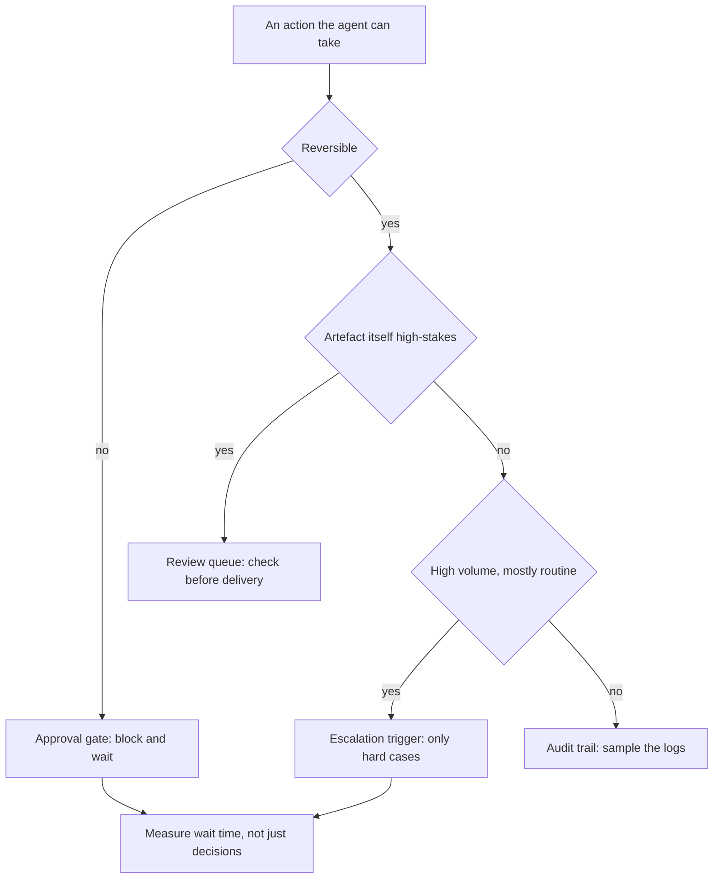
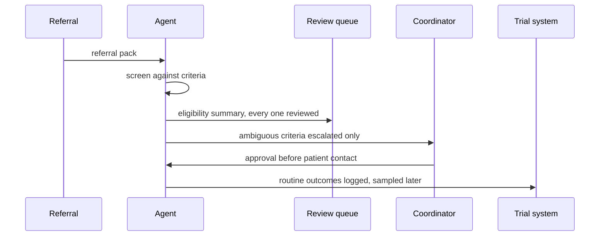

## What Problem Are We Solving?

A contract research organisation screens patients for clinical trials. An agent reads referral
packs against inclusion and exclusion criteria, drafts an eligibility summary, and — where the
patient looks eligible — initiates first contact.

Because trials are regulated and the stakes are obvious, the design used an approval gate on
everything. Every action waited for a coordinator's sign-off.

It was safe and it was useless. 2,400 referrals a month against six coordinators meant a
four-day median wait, by which point competing sites had already enrolled the patient. Enrolment
fell. The agent had automated the reading and left the queue exactly where it was — a manual
process with extra steps.

The overcorrection was worse. Approval was removed everywhere except patient contact, and within
two months an eligibility summary containing a mis-read exclusion criterion went into a regulatory
file unreviewed. That artefact is auditable and its error was permanent.

Both failures come from applying one pattern uniformly. Blanket approval destroys the throughput
you built the agent for; blanket autonomy exposes you to actions nobody approved. The actual
question is per action: **how reversible is it, how high-stakes is the artefact, and how much
volume is there?**

Four patterns exist because those three questions have different answers for different actions in
the same system.

> **🗣️ In plain English:** Don't pick one level of human oversight for the whole system. Pick one per action, from how reversible it is and how much of it there is.

## Meet the Moving Parts

The four patterns reduce to two strategies:

| Strategy | Patterns | Human acts | Best for |
|---|---|---|---|
| **Synchronous (block-and-wait)** | Approval gate | *Before* the action executes — the agent cannot proceed | High-risk, hard-to-reverse actions: publishing, deleting, moving money |
| **Asynchronous (act-then-review)** | Review queue, escalation trigger, audit trail | *After* execution, or only on a flagged subset | High-volume, lower-risk, or time-sensitive work |

The three asynchronous patterns are genuinely different:

- **Review queue** — every output is checked, *after* generation and *before* delivery.
  Appropriate when the artefact matters a lot (a contract, a medical summary) but the bottleneck
  is review-before-send rather than speed of generation.
- **Escalation trigger** — only the *hard* cases reach a human. The agent handles routine volume
  autonomously and hands off on a policy trigger or an edge case. **This scales best**, because
  human attention goes only where it adds value.
- **Audit trail** — nothing is gated in real time; the agent acts autonomously and a human reviews
  a sample of logs periodically. Only appropriate when the action is genuinely low-risk but
  regulated enough to need a paper trail.

Two things worth being precise about.

**An approval gate on high volume recreates the manual process.** It is the strongest guarantee
and it does not scale. Used everywhere, it converts an automation project into a queue.

**An audit trail gates nothing.** It is a detective control (5.1), appropriate for low-risk
regulated actions and never a substitute for prevention on a consequential one.

> **💡 Tip:** Ask the three questions in order — reversible? artefact high-stakes? high volume and mostly routine? The first "yes" usually names the pattern.

## How It Works, Step by Step

1. **Enumerate actions, not workflows.** One system typically needs several patterns.
2. **Ask: is this reversible?** If not, lean to an approval gate.
3. **If reversible, is the artefact itself high-stakes?** If so, a review queue before delivery.
4. **If volume is high and most cases routine**, use an escalation trigger and define the trigger
   in code (5.1, and CCAR-F 5.2 for what makes a reliable trigger).
5. **Everything else that's regulated but low-risk** gets an audit trail with periodic sampling.
6. **Size the human capacity** against the expected queue. A pattern that exceeds it silently
   becomes a backlog.
7. **Measure the queue**, not just the decisions — wait time is the failure mode of synchronous
   patterns.
8. **Re-check when volume changes.** A pattern that fits at 200/month may not at 2,400.



## Minimal Working Implementation

The pattern choice is a decision procedure, and the throughput consequences are arithmetic. Save
as `hitl.py` and run it — no API key needed.

```python
import dataclasses

@dataclasses.dataclass(frozen=True)
class Action:
    name: str
    reversible: bool
    artefact_high_stakes: bool
    per_month: int
    routine_share: float        # fraction needing no judgement
    minutes_each: float         # human time when a human touches it

def pattern(a: Action) -> str:
    if not a.reversible:
        return "approval gate"
    if a.artefact_high_stakes:
        return "review queue"
    if a.per_month > 200 and 0.70 < a.routine_share <= 0.95:
        return "escalation trigger"
    return "audit trail"

def touched(a: Action, p: str) -> float:
    return {"approval gate": a.per_month,
            "review queue": a.per_month,
            "escalation trigger": a.per_month * (1 - a.routine_share),
            "audit trail": a.per_month * 0.05}[p]

ACTIONS = [
    Action("contact patient", False, True, 620, 0.80, 5),
    Action("write eligibility summary", True, True, 2400, 0.75, 12),
    Action("log screening outcome", True, False, 2400, 0.98, 2),
    Action("request missing records", True, False, 900, 0.85, 5),
]
CAPACITY = 6 * 130             # six coordinators, hours per month

mixed = sum(touched(a, pattern(a)) * a.minutes_each / 60 for a in ACTIONS)
uniform = sum(a.per_month * a.minutes_each / 60 for a in ACTIONS)

print(f"{'action':26} {'pattern':20} {'hrs/mo':>8}")
for a in ACTIONS:
    p = pattern(a)
    print(f"{a.name:26} {p:20} "
          f"{touched(a, p) * a.minutes_each / 60:>8.0f}")
print()
print(f"mixed patterns    {mixed:>6.0f}h  {mixed / CAPACITY:>5.0%} utilised")
print(f"all approval gate {uniform:>6.0f}h  {uniform / CAPACITY:>5.0%} utilised")
```

The last two lines are the argument, and the interesting part is that the uniform gate **fits** —
88% of capacity, under the line. Which is exactly why the blanket design survived review: on a
spreadsheet it was affordable.

Utilisation is the wrong number to read, though. Queue waiting time doesn't rise linearly with
utilisation; it climbs sharply as a queue approaches capacity, so the difference between 70% and
88% utilised is not a 25% longer wait — it's the difference between hours and days. A control
sized to *just* fit is a control that will produce a backlog the first time volume moves.

## Production Implementation

Production makes the pattern a property of the action and watches the queue as a first-class
signal.

```python
import collections
import dataclasses
import datetime as dt

@dataclasses.dataclass(frozen=True)
class Gate:
    action: str
    pattern: str
    trigger: str | None      # for escalation: the rule, in code
    sla_hours: float
    sample_rate: float       # for audit trail

GATES = {
    "contact_patient": Gate("contact_patient", "approval_gate", None,
                            sla_hours=8, sample_rate=1.0),
    "eligibility_summary": Gate("eligibility_summary", "review_queue",
                                None, sla_hours=24, sample_rate=1.0),
    "request_records": Gate("request_records", "escalation_trigger",
                            "criteria_ambiguous or records_conflict",
                            sla_hours=4, sample_rate=1.0),
    "log_outcome": Gate("log_outcome", "audit_trail", None,
                        sla_hours=720, sample_rate=0.05),
}

waits = collections.defaultdict(list)

def record_wait(action: str, queued: dt.datetime,
                decided: dt.datetime) -> None:
    waits[action].append((decided - queued).total_seconds() / 3600)
```

The queue is monitored, because a synchronous pattern's failure mode is delay rather than error:

```python
import statistics

def queue_alerts() -> list[str]:
    out = []
    for action, samples in waits.items():
        if len(samples) < 20:
            continue
        gate = GATES[action]
        p90 = statistics.quantiles(samples, n=10)[8]
        if p90 > gate.sla_hours:
            out.append(f"{action}: p90 wait {p90:.1f}h over the "
                       f"{gate.sla_hours}h SLA - the gate has become a "
                       f"backlog; re-check the pattern against volume")
    return out
    # ...
```

**What changed, and why:**

- **The escalation trigger is a rule recorded in the gate.** A trigger that's "the model flags it"
  reintroduces self-assessment, which CCAR-F 5.2 covers at length: escalate on observable facts,
  not the model's confidence.
- **Every gate has an SLA** — a promised bound, such as "reviewed within four hours" — **including
  the audit trail.** An unbounded review window means periodic
  sampling quietly becomes never, which is the audit trail's characteristic failure.
- **Wait time is measured and alerted on.** A synchronous gate fails by delaying, not by erring —
  and delay is invisible in any metric about decision quality.
- **Sample rate is explicit for audit trails.** "Periodically" is not a rate, and a control
  without a number is an intention.

## In Production: Trial Recruitment at a Contract Research Organisation

2,400 referrals a month, six coordinators, regulated artefacts and a competitive enrolment window.



**Blanket approval.** Four-day median wait and enrolment down 22% against the pre-agent
baseline — with coordinators at 88% utilisation, which is why nobody spotted it in the capacity
plan. The queue, not the headcount, was the failure.

**Blanket autonomy.** Wait time near zero; an unreviewed eligibility summary with a mis-read
exclusion criterion reached a regulatory file. Reversible in the sense that it could be corrected,
and not in the sense that matters — it had been filed.

**Per-action patterns.** Patient contact keeps an approval gate: irreversible, and 620 a month is
within capacity. Eligibility summaries go to a review queue: reversible before delivery, but the
artefact is regulated. Records requests use an escalation trigger, with ambiguity defined in code
rather than by model confidence. Outcome logging gets an audit trail at 5% sampling.

**Result.** Median time-to-contact 6 hours against four days. Coordinator load about 71% of
capacity. Every regulated artefact still reviewed, because the review queue was kept where it
mattered and removed where it didn't.

**What the queue metric caught later.** Referral volume grew to 3,100 a month and the review queue
p90 crossed its 24-hour SLA. The alert fired before enrolment was affected, and the fix was to
split eligibility summaries into a straightforward class (single-criterion, unambiguous) sampled
at 20%, and a complex class still reviewed entirely. That's the pattern decision being re-made
because volume changed — exactly the re-check that the original blanket design had no mechanism
for.

> **🌍 Real-world example:** The four-day wait is the detail worth keeping, because it never registered as a safety problem. Every artefact was reviewed, no errors reached a file, and the dashboard showed 100% human oversight — which is why the review took eleven months to be recognised as a failure. The metric that would have caught it immediately was queue wait time, and nobody had thought to measure the cost of the control.

## Where This Applies — and Where It Doesn't

| Situation | Use this | Use instead |
|---|---|---|
| Irreversible: publishing, deleting, moving money | Approval gate | Act-then-review |
| Reversible, but the artefact is high-stakes | Review queue before delivery | Autonomous action |
| High volume, mostly routine, some hard cases | Escalation trigger — scales best | Approval on everything |
| Low-risk but regulated | Audit trail with a defined sample rate | A real-time gate |
| A gate whose queue exceeds human capacity | Re-choose the pattern for that action | Hiring to feed the queue |
| Time-sensitive work | Asynchronous patterns | Block-and-wait |
| Nothing regulated, nothing consequential | — | HITL machinery at all |

Anti-patterns: one pattern applied system-wide; approval gates on high-volume routine actions;
escalation triggers keyed on model confidence rather than observable facts; audit trails with no
defined sample rate; and measuring decision quality without measuring queue wait.

## Failure Modes Seen in the Wild

### 1. The gate that became a backlog

**Symptom.** Full human oversight, and the business outcome the agent existed for gets worse.
**Cause.** A synchronous gate on volume the humans can't absorb.
**Fix.** Per-action patterns, and monitor queue wait as a first-class metric.

### 2. Blanket autonomy after a bad gate

**Symptom.** An unreviewed high-stakes artefact reaches somewhere permanent.
**Cause.** Overcorrection from the previous failure — one uniform setting replaced by another.
**Fix.** Choose per action from reversibility and stakes, not from the last incident.

### 3. The trigger that trusts the model

**Symptom.** The hardest cases don't escalate.
**Cause.** The escalation rule was "when the model is unsure", and confidence is uncalibrated.
**Fix.** Trigger on observable facts — policy gap, conflicting records, missing required field.

### 4. "Periodic" review that never happens

**Symptom.** An audit trail nobody has sampled in months.
**Cause.** No defined rate, no SLA, no owner.
**Fix.** A sample rate, a cadence and a named owner; alert when the cadence slips.

> **⚠️ Watch out:** The cost of a control is invisible in every metric that measures its benefit. A universal approval gate scores perfectly on oversight coverage and error rate while destroying the throughput the system was built for — so measure wait time and human utilisation alongside quality, or you will only discover the trade when someone notices the business outcome moved the wrong way.

## Exam Lens & Key Takeaway

> **📝 Exam focus:** Expect scenario questions describing an action and asking which HITL pattern fits — and the answer hinges on **reversibility and volume**, not on a blanket assumption that more human oversight is always better. Know the four: an **approval gate** blocks and waits before execution, giving the strongest guarantee and suiting high-risk, hard-to-reverse actions (publishing, deleting, sending money) but scaling badly; a **review queue** checks every output after generation and before delivery, right when the artefact matters a lot but review-before-send is the real bottleneck; an **escalation trigger** routes only the hard cases to a human and **scales best**, because the agent handles routine volume and human effort goes where it adds most value; and an **audit trail** gates nothing in real time, with a human sampling logs periodically — appropriate only when the action is genuinely low-risk but needs a paper trail for accountability. The tested judgment is that a single system properly uses **several patterns at once**, chosen per action.

> **🔑 Key takeaway:** Calibrate oversight per action rather than per system, asking in order whether the action is reversible, whether the artefact itself is high-stakes, and whether volume is high and mostly routine. Blanket approval turns an automation into a queue; blanket autonomy files errors permanently. And measure the queue — a synchronous gate fails by delaying rather than by erring, which is invisible in every metric about how well the humans decided.
