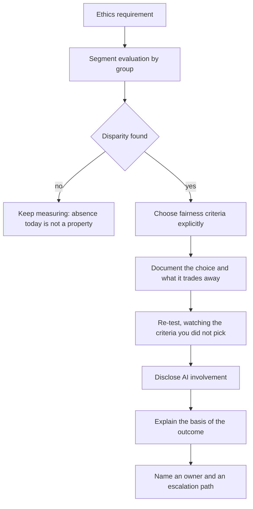
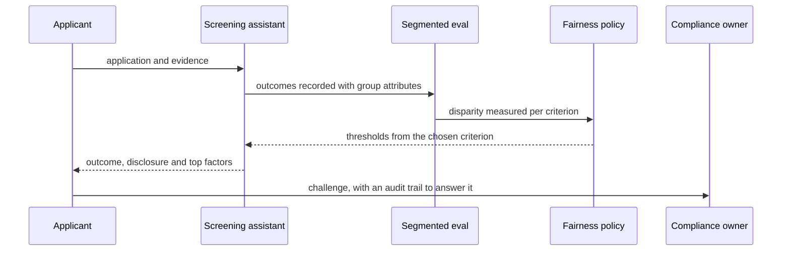

## What Problem Are We Solving?

A property management platform screens rental applications. An assistant reads references,
employment evidence and affordability documents, and recommends approve, decline, or refer.

The team took ethics seriously and wrote it into the charter: *the system must be fair and
unbiased.* Nobody disagreed, and nobody could act on it.

Three separate things went wrong under that single sentence.

Aggregate accuracy was 93% and nobody had segmented it, so a lower approval rate for applicants
with non-salaried income went unnoticed for eight months. That's a **bias** finding, and it only
exists once you measure.

When it surfaced, the team argued for three weeks about whether it was unfair. One camp wanted
equal approval rates across groups; another wanted equal accuracy. Both are defensible, they
conflict mathematically, and the charter's word "fair" adjudicated nothing. That's a **fairness**
question — a normative choice the organisation has to make and document.

A declined applicant asked why. The platform could say an automated system was involved but not
what drove the outcome — **transparency**, which has two halves and they had one.

And when the complaint escalated, no one owned it. That's **accountability**.

Four words that get listed together as one vague requirement, answering four different questions
and needing four different engineering artefacts.

> **🗣️ In plain English:** "Be fair" isn't a requirement you can build. Bias is what you measure, fairness is what you decide counts as acceptable, transparency is what the user gets told, accountability is who fixes it.

## Meet the Moving Parts

| Concept | The question | The artefact |
|---|---|---|
| **Bias** | Does output differ systematically across groups in a way the task doesn't justify? | Segmented evaluation on diverse test data |
| **Fairness** | Is an observed difference acceptable? | An explicitly chosen and documented fairness metric |
| **Transparency** | Does the user know AI was involved, and why the outcome happened? | Disclosure *and* explanation — both, separately |
| **Accountability** | Who is responsible when it causes harm? | Audit logs, escalation paths, a named owner |

Three things carry the topic.

**Bias is measurable; fairness is normative.** Bias is a property you can find by segmenting
outputs. Fairness is the standard you apply to decide whether a difference is a problem — and
that's a choice, not a discovery.

**Fairness definitions conflict, and sometimes provably.** A system can satisfy equal accuracy
across groups while failing equal positive-outcome rates, and with different base rates it is
mathematically impossible to satisfy all reasonable definitions at once. So the team must
*choose* which criteria matter for this use case and write the choice down. "Unbiased" is not a
single well-defined target.

**Disclosure and explanation are both transparency and neither substitutes.** A system can say
"AI was involved" without explaining why it concluded what it did, and vice versa. The rental
platform had the first and not the second.

Accountability is the organisational half: audit logs detailed enough to reconstruct what
happened, defined escalation paths, and enough oversight that "the AI did it" is never an
acceptable end of the conversation internally.

> **💡 Tip:** If your ethics requirement is one sentence, it's four requirements in a trenchcoat. Write the four artefacts instead.

## How It Works, Step by Step

1. **Segment evaluation by group** from the start. An aggregate number cannot show you a
   disparity.
2. **Use diverse test data** that actually contains the groups you care about (4.2).
3. **Quantify the disparity** before debating it, so the conversation is about a number.
4. **Choose fairness criteria explicitly**, knowing they conflict, and document which you picked
   and why.
5. **Re-test against the chosen criteria**, and watch the ones you didn't pick so you know what
   you traded.
6. **Disclose AI involvement** where a decision affects a person.
7. **Explain the basis** — the top factors behind an outcome — separately from disclosure.
8. **Name an owner and an escalation path**, with audit logs detailed enough to reconstruct a
   decision months later.



## Minimal Working Implementation

The claim that fairness definitions conflict is easy to assert and better to watch happen. Save as
`fairness.py` and run it — no API key needed.

```python
import dataclasses

@dataclasses.dataclass(frozen=True)
class Applicant:
    group: str
    score: float        # well-calibrated: same score given qualification
    qualified: bool

def cohort(group: str, n: int, base_rate: float):
    """Identical, well-calibrated scoring. The only difference between
    groups is the base rate - which is enough to make the fairness
    definitions incompatible."""
    out = []
    for i in range(n):
        qualified = (i % 100) < base_rate * 100
        score = (0.55 if qualified else 0.30) + (i % 10) * 0.03
        out.append(Applicant(group, score, qualified))
    return out

POP = cohort("A", 1000, 0.60) + cohort("B", 1000, 0.40)

def metrics(group: str, threshold: float) -> dict:
    rows = [a for a in POP if a.group == group]
    approved = [a for a in rows if a.score >= threshold]
    qualified = [a for a in rows if a.qualified]
    return {"approval": len(approved) / len(rows),
            "tpr": sum(a.qualified for a in approved) / len(qualified),
            "accuracy": sum((a.score >= threshold) == a.qualified
                            for a in rows) / len(rows)}

def threshold_matching(target: float) -> float:
    """The group-B threshold that equalises approval rate."""
    return min((abs(metrics("B", t / 100)["approval"] - target), t / 100)
               for t in range(20, 90))[1]

def show(label: str, ta: float, tb: float) -> None:
    print(f"{label}  (A at {ta:.2f}, B at {tb:.2f})")
    for g, th in (("A", ta), ("B", tb)):
        m = metrics(g, th)
        print(f"   group {g}: approval {m['approval']:.2f}  "
              f"TPR {m['tpr']:.2f}  accuracy {m['accuracy']:.2f}")

show("equal treatment, one threshold:", 0.60, 0.60)
target = metrics("A", 0.60)["approval"]
show("equal approval rates:", 0.60, threshold_matching(target))
```

Read the two blocks against each other. **TPR** is the true positive rate: of the cases that
should have been approved, the share that were. With **one threshold** both groups get an
identical TPR of 0.80 — equal opportunity is satisfied — and approval rates differ, 0.48 against 0.32. Equalising
**approval rates** requires a lower threshold for group B, and the moment you do it their TPR goes
to 1.00 against group A's 0.80: equal opportunity is now violated, in the other direction.

Nothing is broken in either configuration. The scoring is identical and well-calibrated; the only
difference between the groups is their base rate, and that alone is enough to make the two
definitions unsatisfiable together. Neither row is "the unbiased one" — and a charter saying
"be fair" selects neither, which means whichever threshold happens to ship makes the choice
instead.

## Production Implementation

Production records the fairness choice as a versioned artefact and monitors what it traded away.

```python
import dataclasses
import datetime as dt

@dataclasses.dataclass(frozen=True)
class FairnessPolicy:
    version: str
    primary_criterion: str        # the one you optimise
    tolerance: float              # max acceptable disparity
    monitored_criteria: tuple[str, ...]   # the ones you traded
    rationale: str                # why, in plain language
    approved_by: str
    reviewed_on: dt.date

POLICY = FairnessPolicy(
    version="v3",
    primary_criterion="equal_opportunity_tpr",
    tolerance=0.03,
    monitored_criteria=("approval_rate_parity", "accuracy_parity"),
    rationale="A qualified applicant should have the same chance of "
              "approval regardless of group. Approval-rate parity is "
              "monitored but not enforced, because group base rates "
              "differ for reasons the task does treat as relevant.",
    approved_by="head-of-compliance",
    reviewed_on=dt.date(2026, 2, 1))
```

The criteria you *didn't* choose are monitored, so the trade stays visible:

```python
def fairness_report(measured: dict) -> list[str]:
    out = []
    primary = measured[POLICY.primary_criterion]
    if primary > POLICY.tolerance:
        out.append(f"BREACH {POLICY.primary_criterion}: disparity "
                   f"{primary:.3f} over tolerance {POLICY.tolerance}")
    for name in POLICY.monitored_criteria:
        out.append(f"traded: {name} disparity {measured[name]:.3f} "
                   f"(monitored, not enforced - see policy {POLICY.version})")
    return out

def explanation(factors: list[tuple[str, float]], top: int = 3) -> str:
    """Transparency has two halves. Disclosure says AI was involved;
    this is the other half, and neither substitutes for the other."""
    ranked = sorted(factors, key=lambda kv: -abs(kv[1]))[:top]
    return "Main factors: " + ", ".join(f"{n}" for n, _ in ranked)
    # ...
```

**What changed, and why:**

- **The fairness choice is a versioned record with a named approver.** It's a normative decision,
  so it needs a person accountable for it — which is also the accountability artefact.
- **The rationale is in plain language.** A regulator, a journalist or an applicant may ask why
  this criterion; "it's what we optimised" is not an answer anyone accepts.
- **The criteria you didn't pick are reported every time.** A trade you stop looking at becomes a
  trade you've forgotten you made, and the report keeps it in front of the reviewer.
- **Explanation is a separate function from disclosure.** They are different obligations, and
  building one and calling it transparency is the commonest version of this failure.

## In Production: Tenant Screening at a Property Platform

About 18,000 rental applications a month across 2,400 managed properties, in a sector with
specific anti-discrimination obligations.



**The bias finding.** Applicants with non-salaried income — contractors, self-employed, benefit
recipients — were referred for manual review at 2.3x the rate of salaried applicants, and approved
at 0.81x. Aggregate accuracy was 93% throughout. Nobody had segmented, so nobody knew.

**The fairness decision.** Three weeks of argument ended when the question was reframed from "is
this fair?" to "which criterion do we commit to, and what does it cost?" The team chose equal
opportunity — a qualified applicant should have the same approval chance regardless of group —
with a 3-point tolerance, and explicitly *declined* approval-rate parity because affordability
genuinely differs across income types in ways the task treats as relevant. That choice is written
down, signed, and reviewed annually.

**What it traded.** Approval-rate disparity remains at about 0.9x and is reported monthly rather
than enforced. Making it visible is the point: when a future reviewer asks why rates differ,
there's a documented answer instead of a scramble.

**Transparency, both halves.** Applicants are told upfront that an automated system assists
screening, and every outcome carries the top three factors. The second half was the harder build
and the one that reduced complaints — being declined is tolerable; being declined with no reason
is not.

**Accountability.** A named compliance owner reviews all escalations, with audit logs holding the
inputs, the model version, the policy version and the outcome. When a complaint reached the
regulator, the platform could reconstruct the decision exactly.

> **🌍 Real-world example:** The eight months is the part worth sitting with. Nothing was broken, no control failed, and the team had an ethics charter they believed in. The disparity was invisible because every metric was an aggregate — and aggregates are the default way anyone reports accuracy. Bias that nobody has segmented for isn't a bias you don't have; it's a bias you haven't looked for.

## Where This Applies — and Where It Doesn't

| Situation | Use this | Use instead |
|---|---|---|
| Any decision affecting people | Segmented evaluation from day one | Aggregate accuracy |
| A disparity has been found | Choose and document a fairness criterion | Arguing about "fair" in the abstract |
| Several fairness definitions proposed | Pick one, monitor the others, record the trade | Assuming they can all hold |
| A person is affected by an outcome | Disclosure **and** explanation | Either alone |
| Harm has occurred | A named owner, escalation path, audit logs | "The algorithm decided" |
| The ethics requirement is one sentence | Split it into four artefacts | Treating it as one goal |
| No group attributes available at all | Proxy analysis, carefully — and say so | Claiming fairness untested |

Anti-patterns: "be fair and unbiased" as a requirement; aggregate-only evaluation; assuming
"unbiased" is a single target; disclosure treated as the whole of transparency; and audit logs
with no named owner, which is accountability theatre.

## Failure Modes Seen in the Wild

### 1. The unsegmented aggregate

**Symptom.** Healthy overall accuracy; a group-level disparity running for months.
**Cause.** Nobody segmented, so there was nothing to notice.
**Fix.** Segment by group from the start, on test data that contains those groups.

### 2. Arguing about "fair"

**Symptom.** Weeks of debate that produces no decision.
**Cause.** Competing fairness definitions, none named, with a charter word doing the arbitration.
**Fix.** Enumerate the candidate criteria, pick one explicitly, document what it trades.

### 3. Half of transparency

**Symptom.** Users know AI was involved and still can't find out why.
**Cause.** Disclosure shipped; explanation didn't.
**Fix.** Build both. They're separate obligations and neither substitutes.

### 4. Nobody owns it

**Symptom.** A harm is identified and the conversation ends with "the model did that".
**Cause.** No named owner, no escalation path, logs too thin to reconstruct.
**Fix.** A person, a route, and logs detailed enough to answer a regulator.

> **⚠️ Watch out:** Fairness criteria genuinely conflict, and with unequal base rates some combinations are provably unsatisfiable together — so a team that refuses to choose has not stayed neutral, it has let an implicit choice be made by whichever threshold happened to ship. Choosing explicitly and documenting the trade is the only version of this that can be defended later.

## Exam Lens & Key Takeaway

> **📝 Exam focus:** Expect questions testing whether you **distinguish these four terms** rather than treating them as synonyms. The model: **bias** is the technical *problem* — a measurable disparity across groups, found by evaluating segmented by group on diverse test data; **fairness** is the *goal* — a normative standard, chosen by the team, for whether a disparity is acceptable; **transparency** is how *users* understand decisions — **disclosure** that AI was involved *and* **explanation** of the basis, neither substituting for the other; **accountability** is what happens *organisationally* — audit logs, escalation paths, a named owner, so "the AI did it" is never the end of it. The distinction most often tested: a **transparency failure** (user wasn't told AI was involved) versus an **accountability failure** (nobody owns the fix once harm is found). And **fairness definitions conflict** — a system can satisfy equal accuracy across groups while failing equal positive-outcome rates, and satisfying all reasonable definitions at once can be mathematically impossible — so the team must explicitly choose and document which criteria matter.

> **🔑 Key takeaway:** "Be ethical" is four requirements with four artefacts. Bias is found by segmenting evaluation, so an aggregate can never tell you it's absent. Fairness is a choice between criteria that genuinely conflict — declining to choose just hides the choice your thresholds already made. Transparency needs disclosure *and* explanation. Accountability needs a person, not a log: a perfect audit trail with nobody responsible for acting on it records a failure nobody owns.
