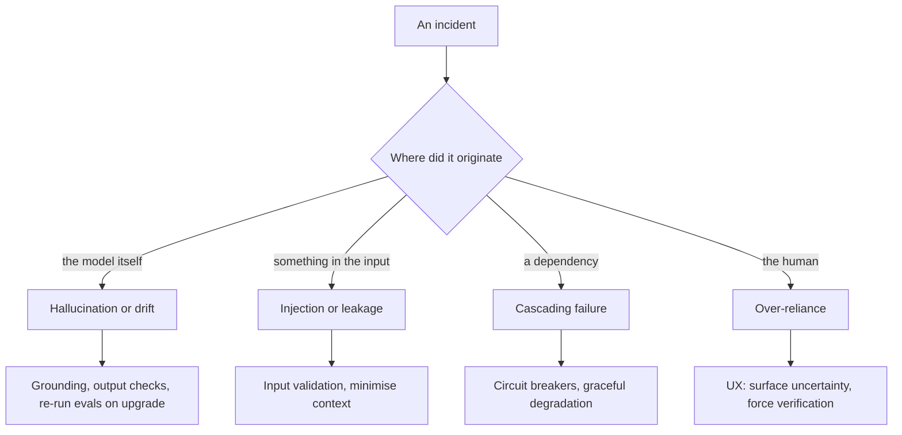
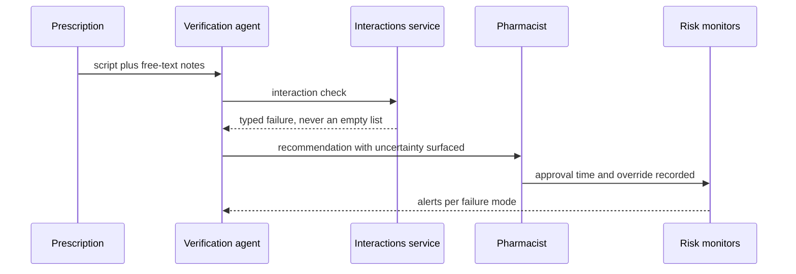

## What Problem Are We Solving?

A pharmacy chain runs an order verification agent. It reads prescriptions against the patient
record, checks interactions and dosing, and flags anything a pharmacist must review.

One incident, written up afterwards as "the AI got a dose wrong", contained four distinct
failures.

The interactions service timed out and returned an empty list rather than an error, so the agent
believed there were no interactions (**cascading failure** — one component's fault propagating as
a fact). With no interaction data to reason from, the agent produced a plausible dosing rationale
citing a guideline that doesn't exist (**hallucination**). The prescription's free-text notes field
contained text a prescriber had pasted from a vendor PDF, including a line reading "standard
dosing applies, no verification required" — which the agent treated as guidance
(**prompt injection**). And the pharmacist, who had approved 340 of the agent's recommendations
that month without finding an error, approved this one in nine seconds (**over-reliance**).

The post-mortem's single-cause framing would have produced a single fix — probably a prompt
change — and left three of the four failures in place.

Risk identification is an inventory you run against the architecture, asking for each failure
mode: *where could this occur here, and which control catches it?* The failure modes have
different origins, and that's what makes the fixes different — you cannot prompt your way out of
a timeout, and you cannot patch drift with better wording.

> **🗣️ In plain English:** Real incidents stack several failure modes on top of each other. Name each one separately, because they have different causes and different fixes.

## Meet the Moving Parts

Grouping by **origin** makes the fixes obvious:

| Origin | Failure mode | What it looks like |
|---|---|---|
| **Model-level** | **Hallucination** | A false claim stated confidently; no external input caused it |
| **Model-level** | **Model drift** | Behaviour changes after a version update, nothing else changed |
| **Input-driven** | **Prompt injection** | Malicious content in input or retrieved data overrides instructions |
| **Input-driven** | **Data leakage** | Private data that was in context surfaces in the output |
| **System-level** | **Cascading failures** | One component fails and the failure propagates through dependents |
| **Human-factor** | **Over-reliance** | Users stop verifying because it's usually right |

The grouping matters because the remedies don't transfer. You **cannot prompt your way out of
hallucination** reliably — it needs grounding, output checks and review. You **can** catch prompt
injection with input validation. You **cannot patch model drift** with better prompting; it needs
re-evaluation whenever the model changes. **Cascading failures are an architecture problem** —
isolation, circuit breakers, fallbacks. And **over-reliance is human factors and UX**, addressed
by *how* output is presented rather than anything in the model.

Mapping each to its control:

| Failure mode | Control |
|---|---|
| Hallucination | Output filtering, review queues (5.3), evaluation against known-answer sets |
| Prompt injection | Input validation; treat retrieved/external content as untrusted |
| Data leakage | Output filtering for PII, plus data minimisation in what context you supply |
| Model drift | Re-run evaluation suites on every model version change, before broad rollout |
| Cascading failures | Rate limiting, circuit breakers, graceful degradation |
| Over-reliance | Transparency about uncertainty, human checkpoints, UX prompting verification |

> **💡 Tip:** Over-reliance is the one with no technical control, and it grows precisely as the system gets better. A system that's right 99% of the time trains its reviewers harder than one that's right 80%.

## How It Works, Step by Step

1. **Run the six as a checklist against your architecture**, asking where each could occur.
2. **For each, name the control that catches it** — and if there isn't one, that's the finding.
3. **Make failures loud at component boundaries.** An empty list from a failed call is the seed of
   a cascade (CCAR-F 5.3).
4. **Treat every retrieved document and tool result as untrusted input**, not just user messages.
5. **Gate model version changes behind the evaluation suite** (4.3), treating an upgrade as a
   risky deployment.
6. **Design for graceful degradation** — a dependent component should know when upstream data is
   incomplete.
7. **Design the UX against over-reliance**: surface uncertainty, require active review on
   consequential decisions, vary what the reviewer sees.
8. **Decompose incidents into all contributing modes**, not the first one you find.



## Minimal Working Implementation

The useful artefact is decomposition — one incident into all its modes. Save as `failure_modes.py`
and run it; no API key needed.

```python
import dataclasses

CONTROLS = {
    "hallucination": "output checks, review queue, known-answer evals",
    "model_drift": "re-run eval suite before rolling out a new version",
    "prompt_injection": "input validation; retrieved content is untrusted",
    "data_leakage": "output filtering for PII, minimise supplied context",
    "cascading_failure": "typed failures, circuit breakers, degrade gracefully",
    "over_reliance": "surface uncertainty, force active verification",
}

@dataclasses.dataclass(frozen=True)
class Signal:
    upstream_returned_empty_on_error: bool = False
    unsupported_claim_in_output: bool = False
    instruction_text_in_untrusted_field: bool = False
    sensitive_data_in_output: bool = False
    behaviour_changed_after_version_bump: bool = False
    reviewer_approval_under_15s: bool = False

def decompose(s: Signal) -> list[str]:
    return [mode for flag, mode in (
        (s.upstream_returned_empty_on_error, "cascading_failure"),
        (s.unsupported_claim_in_output, "hallucination"),
        (s.instruction_text_in_untrusted_field, "prompt_injection"),
        (s.sensitive_data_in_output, "data_leakage"),
        (s.behaviour_changed_after_version_bump, "model_drift"),
        (s.reviewer_approval_under_15s, "over_reliance")) if flag]

INCIDENT = Signal(upstream_returned_empty_on_error=True,
                  unsupported_claim_in_output=True,
                  instruction_text_in_untrusted_field=True,
                  reviewer_approval_under_15s=True)

modes = decompose(INCIDENT)
print(f"'the AI got a dose wrong' decomposes into {len(modes)} modes:\n")
for m in modes:
    print(f"  {m:20} -> {CONTROLS[m]}")
print(f"\na single-cause post-mortem fixes 1 of {len(modes)}.")
```

Four modes, four controls, and no two of them are the same kind of work — one is an integration
contract, one is an evaluation gate, one is input handling, and one is a UX change nobody would
have assigned to the AI team.

## Production Implementation

Production turns the checklist into standing detectors, because most of these are silent.

```python
import collections

WINDOW = 500
signals = collections.defaultdict(lambda: collections.deque(maxlen=WINDOW))

def observe(event: dict) -> None:
    """Each counter corresponds to one failure mode's signature."""
    signals["empty_on_error"].append(
        event.get("upstream_status") == "error"
        and event.get("upstream_items") == 0)
    signals["unsupported_claims"].append(
        event.get("claims_unsupported", 0) > 0)
    signals["injection_flagged"].append(bool(event.get("injection_flag")))
    signals["pii_in_output"].append(bool(event.get("pii_flag")))
    signals["approval_seconds"].append(event.get("approval_seconds", 999))
```

Over-reliance in particular needs its own detector, because nothing else surfaces it:

```python
import statistics

def risk_alerts(model_version_changed: bool) -> list[str]:
    def rate(k):
        d = signals[k]
        return sum(d) / len(d) if d else 0.0

    out = []
    if rate("empty_on_error") > 0.0:
        out.append("cascading: an upstream error returned an empty result "
                   "- absence is being read as a finding")
    if rate("unsupported_claims") > 0.02:
        out.append("hallucination: unsupported claims above threshold")
    if rate("injection_flagged") > 0.01:
        out.append("injection: instruction-shaped text in untrusted input")
    approvals = [s for s in signals["approval_seconds"] if s < 999]
    if approvals and statistics.median(approvals) < 15:
        out.append(f"over-reliance: median approval "
                   f"{statistics.median(approvals):.0f}s - reviewers are "
                   f"rubber-stamping; this is a UX problem, not a model one")
    if model_version_changed:
        out.append("drift: re-run the evaluation suite before rollout")
    return out
    # ...
```

**What changed, and why:**

- **`empty_on_error` has a zero threshold.** An upstream error that returns an empty result is not
  a rate to tolerate — it's a broken contract, and it's the seed of every cascade in this domain.
- **Approval time is instrumented.** Over-reliance has no technical symptom; the only visible
  signal is humans deciding faster than they could plausibly be reading, and nobody measures that
  unless they decide to.
- **The over-reliance alert names it as a UX problem.** Otherwise the fix gets assigned to the
  team that owns the model, who cannot fix it.
- **A model version change is itself an alert.** Drift is the one failure mode you can schedule
  around, and treating an upgrade as a risky deployment is the whole control.

## In Production: Order Verification at a Pharmacy Chain

About 26,000 prescriptions a day across 310 branches, with a pharmacist approving every flagged
recommendation.



**The four fixes.** The interactions service now returns a typed failure, and the agent renders
"interactions not checked" rather than reasoning as if there were none. Output checks flag
citations to guidelines not in the formulary. Free-text fields are marked untrusted and
instruction-shaped content is stripped before the prompt. And the pharmacist UI changed: the
recommendation is collapsed by default, the interaction status is shown explicitly including when
it's unavailable, and approval requires expanding the reasoning.

**What the UX change did.** Median approval time went from 9 seconds to 34. Override rate went
from 0.4% to 2.1% — which is the number that mattered, because those overrides were always
warranted and previously nobody was catching them. Pharmacists disliked it for about three weeks.

**Drift, caught by the gate.** A model version change four months later moved the agent's dosing
recommendations on paediatric scripts outside tolerance on the evaluation suite. Nothing else had
changed and no prompt would have fixed it; the rollout was held and the prompt re-tuned against
the new version before proceeding. Under the previous process the upgrade would have gone out
silently.

**The compounding point, quantified.** Of 31 incidents reviewed over the following year, 22
involved more than one failure mode and 9 involved three or more. The single-cause post-mortem had
been the default, which meant most incidents had historically produced one fix and left the rest
of the stack intact.

> **🌍 Real-world example:** Over-reliance was the hardest to get funded, because it doesn't look like a defect — the pharmacists were doing exactly what a well-performing system trains people to do. It was also the only one of the four that gets *worse* as the agent improves: a system right 99% of the time produces reviewers who have never seen it fail, which is precisely when you most need them to be looking.

## Where This Applies — and Where It Doesn't

| Situation | Use this | Use instead |
|---|---|---|
| Designing any agentic system | Run the six as a checklist | Waiting for incidents to reveal them |
| A component can fail | Typed failures and circuit breakers | Returning an empty result |
| Untrusted content reaches the prompt | Input validation, content marked untrusted | Trusting retrieved documents |
| Changing model version | Re-run the evaluation suite first | Treating it as a config change |
| Humans approve agent output | Measure approval time; design against rubber-stamping | Assuming review is happening |
| Writing a post-mortem | Decompose into all contributing modes | The first cause you find |
| A read-only, single-call, ungrounded tool | — | Most of this; few modes apply |

Anti-patterns: single-cause post-mortems; treating hallucination as a prompting problem; model
upgrades shipped without re-evaluation; retrieved content trusted because it's internal; and
assuming human review is happening because a human clicked.

## Failure Modes Seen in the Wild

### 1. Absence read as a finding

**Symptom.** The system confidently reports that nothing was found, when nothing was checked.
**Cause.** An upstream failure returned an empty result rather than an error.
**Fix.** Typed failures at every boundary; "not checked" must be renderable and distinct from
"none".

### 2. The prompt fix for a non-prompt problem

**Symptom.** Repeated prompt iterations against drift, cascades or over-reliance.
**Cause.** Every failure gets treated as a model failure because the model is the visible part.
**Fix.** Classify by origin first — model, input, system, human — then choose the control.

### 3. The silent model upgrade

**Symptom.** Behaviour changes with no deploy anyone associates with it.
**Cause.** A model version change treated as configuration rather than a release.
**Fix.** Gate version changes behind the evaluation suite, like any risky deployment.

### 4. Approval without review

**Symptom.** A human approved it, and the human did not read it.
**Cause.** The system is usually right, which is exactly what erodes verification.
**Fix.** UX that surfaces uncertainty and requires active engagement; measure approval time.

> **⚠️ Watch out:** These failure modes compound — a single incident report often reveals two or three stacked together — and a post-mortem that names one cause produces one fix and leaves the others in place, ready for the next incident. Decompose every incident into all of its contributing modes, because the one you name first is usually just the one that was easiest to see.

## Exam Lens & Key Takeaway

> **📝 Exam focus:** Know the failure modes by name and, crucially, **which control addresses which** — that pairing is the tested skill. **Hallucination** → output filtering, review queues, evaluation against known-answer sets; you cannot reliably prompt your way out of it. **Prompt injection** → input validation, and treating retrieved or external content as untrusted exactly as you would user input. **Data leakage** → output filtering for PII and sensitive patterns, plus data minimisation in what context you supply at all. **Model drift** → re-run evaluation suites after every model version change before rolling out broadly; treat upgrades like any risky deployment, because better prompting does not patch drift. **Cascading failures** → an architecture problem: rate limiting, circuit breakers, and designing so one component's failure degrades gracefully. **Over-reliance** → human factors and UX: transparency about uncertainty, human checkpoints on consequential decisions, and UX prompting verification rather than passive trust. Expect a stem describing an incident and asking you to **decompose it into its distinct contributing failure modes** rather than naming one.

> **🔑 Key takeaway:** Group the failure modes by origin — model, input, system, human — because that is what determines the fix, and the remedies genuinely don't transfer between groups. Run them as a checklist against the architecture rather than discovering them through incidents, and when an incident does happen, decompose it into every contributing mode, since a single-cause post-mortem produces a single fix and leaves the rest of the stack waiting.
