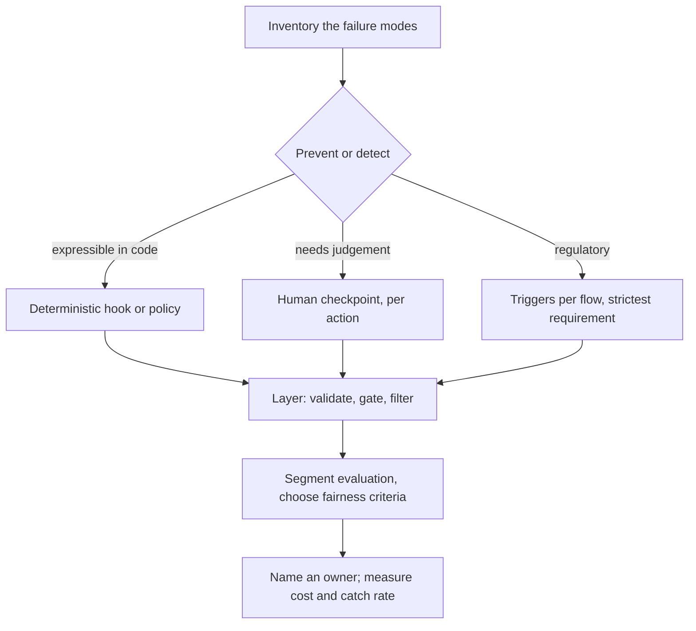
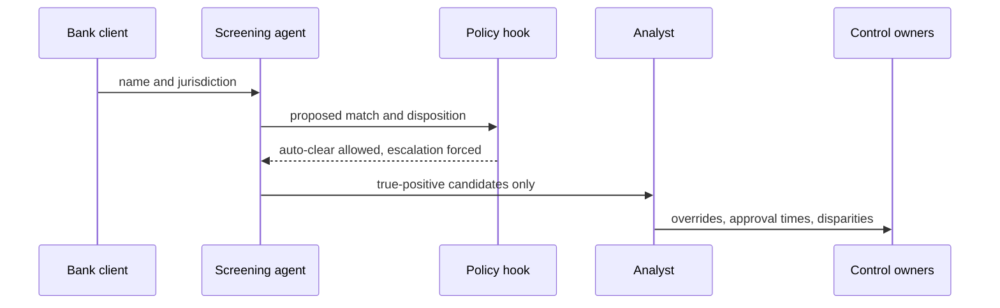

## What Problem Are We Solving?

Every other domain optimises something — cost, accuracy, latency, throughput. This one exists
because AI systems that make mistakes can harm real people, and an architect is responsible for
the controls that prevent it.

That changes what "good" means. Elsewhere a control is justified by what it improves; here it's
justified by what it makes impossible. And the recurring failure across all five topics is the
same substitution: **a control that observes where a control that prevents was needed.**

A system prompt saying never to delete production resources. An audit log that faithfully records
an exposure. A confirmation dialog around a capability nothing legitimate needs. An ethics charter
saying "be fair". A post-mortem naming one cause. Each of these is real work by competent people,
and each is *detective where it needed to be preventive* — it tells you afterwards instead of
stopping it.

The second thread is that governance failures are **decisions nobody made**. Nobody decided the
agent could terminate clusters, or that erasure would stop at the primary database, or that one
approval gate would apply to everything, or which fairness criterion the thresholds encode. Those
all got settled by default, and defaults in this domain have consequences that reach people
outside your organisation.

So the professional skill is knowing which control class a situation needs, and noticing when a
reasonable-sounding measure is the wrong class.

> **🗣️ In plain English:** This domain is about the difference between finding out and preventing. Logging, confirming and documenting all feel like safety, and none of them stop anything.

## Meet the Moving Parts

| Question | Topic | The decision |
|---|---|---|
| What stops an unsafe action? | **5.1** Guardrails | Layered controls; a deterministic hook, not a prompt instruction |
| Which rules apply to us? | **5.2** Compliance | Triggers per data flow; build to the strictest, and erasure reaches every store |
| When does a human decide? | **5.3** HITL | Per action, from reversibility, stakes and volume |
| What do we owe the people affected? | **5.4** Ethical AI | Four artefacts: measure bias, choose fairness, disclose *and* explain, name an owner |
| What can go wrong? | **5.5** Risk & failure modes | Six modes by origin, each with a different control |

Three relationships carry the domain.

**5.1 and 5.3 are the same axis at different costs.** A hook is a cheap preventive control that
scales; a human checkpoint is an expensive one that doesn't. Use the hook wherever the rule is
expressible in code, and reserve human gates for judgment that genuinely isn't.

**5.5 is the checklist that drives 5.1.** You cannot design a guardrail stack without an inventory
of what you're guarding against — and the six failure modes have different origins, so a stack
that only covers model-level failures leaves the input, system and human ones open.

**5.2 and 5.4 both end in a named person.** Compliance needs someone accountable for the erasure
path; accountability needs someone who owns a harm. A control with no owner degrades to a
document.

> **💡 Tip:** For each control, ask: does this stop the thing, or record it? Both are legitimate — but if your stack is all recording, you have observability, not safety.

## How It Works, Step by Step

1. **Inventory the failure modes** against your architecture — model, input, system, human (5.5).
2. **For each, name the control** and check whether it prevents or detects.
3. **Move rules into code wherever expressible.** A PreToolUse hook beats a prompt instruction
   every time (5.1).
4. **Layer in both directions** — validate input including retrieved content, filter output, gate
   the tool call between them.
5. **Determine regulatory triggers per data flow** and build to the strictest, with an erasure
   path per store (5.2).
6. **Choose a HITL pattern per action** from reversibility, stakes and volume — not one for the
   system (5.3).
7. **Segment evaluation by group**, choose and document a fairness criterion, ship disclosure
   *and* explanation (5.4).
8. **Name an owner for every control**, and measure what each one costs as well as what it
   catches.



## Minimal Working Implementation

The domain's failure is detective controls standing in for preventive ones, so audit a design for
exactly that. Save as `governance_review.py` and run it — no API key needed.

```python
import json
import sys

DETECTIVE = {"audit_log", "monitoring", "confirmation_prompt",
             "system_prompt_rule", "documentation"}
PREVENTIVE = {"remove_tool", "pretooluse_hook", "input_validation",
              "output_filter", "rate_limit", "approval_gate"}

def review(d: dict) -> list[str]:
    gaps = []
    for action in d.get("actions", []):
        controls = set(action.get("controls", []))
        name = action.get("name")
        if not action.get("reversible") and not (controls & PREVENTIVE):
            gaps.append(f"5.1 {name}: irreversible with only "
                        f"{sorted(controls & DETECTIVE) or 'no'} controls "
                        f"- detective where preventive is needed")
        if action.get("rule_location") == "system_prompt":
            gaps.append(f"5.1 {name}: rule lives in the system prompt - "
                        f"instruction, not enforcement")
        heavy = action.get("per_month", 0) > 1000
        if action.get("hitl") == "approval_gate" and heavy:
            gaps.append(f"5.3 {name}: approval gate on "
                        f"{action['per_month']}/month - becomes a queue")
    for store in d.get("stores", []):
        if store.get("personal_data") and not store.get("erasure_path"):
            gaps.append(f"5.2 {store['name']}: personal data, no "
                        f"per-subject erasure path")
    if not d.get("evaluation", {}).get("segmented_by_group"):
        gaps.append("5.4 evaluation is not segmented by group - bias "
                    "cannot be found in an aggregate")
    if not d.get("fairness_criterion"):
        gaps.append("5.4 no fairness criterion chosen - the thresholds "
                    "are making the choice instead")
    if not d.get("explanation_provided"):
        gaps.append("5.4 disclosure without explanation - that is half "
                    "of transparency")
    gaps += [f"5.4 {c.get('name')}: no named owner"
             for c in d.get("controls", []) if not c.get("owner")]
    return gaps

if __name__ == "__main__":
    found = review(json.load(open(sys.argv[1], encoding="utf-8")))
    print("\n".join(f"- {g}" for g in found) or "no governance gaps found")
    sys.exit(1 if found else 0)
```

The first check is the domain in one rule: an irreversible action whose only controls are
detective. Every incident in these five topics passes a review that asks "is there a control?" and
fails one that asks "does it prevent?"

## Production Implementation

Production tracks what each control catches *and* what it costs, because a control with no
measured cost gets over-applied.

```python
import collections
import dataclasses

@dataclasses.dataclass(frozen=True)
class Control:
    name: str
    kind: str              # preventive | detective
    topic: str
    owner: str
    covers: tuple[str, ...]      # failure modes from 5.5

CONTROLS = (
    Control("pretooluse_policy", "preventive", "5.1", "platform-eng",
            ("prompt_injection", "cascading_failure")),
    Control("output_pii_filter", "preventive", "5.1", "platform-eng",
            ("data_leakage",)),
    Control("eval_gate_on_upgrade", "preventive", "5.5", "ml-eng",
            ("model_drift",)),
    Control("review_queue", "preventive", "5.3", "operations",
            ("hallucination", "over_reliance")),
    Control("audit_log", "detective", "5.2", "compliance", ()),
)
ALL_MODES = {"hallucination", "model_drift", "prompt_injection",
             "data_leakage", "cascading_failure", "over_reliance"}

def uncovered() -> set[str]:
    """A failure mode with no preventive control is the finding."""
    covered = {m for c in CONTROLS if c.kind == "preventive"
               for m in c.covers}
    return ALL_MODES - covered
```

Each control's catch rate and cost are tracked together:

```python
fires = collections.Counter()
costs = collections.Counter()      # human minutes, or added latency ms

def observe(control: str, fired: bool, cost_units: float) -> None:
    fires[control] += int(fired)
    costs[control] += cost_units

def control_report(total_events: int) -> list[str]:
    out = [f"uncovered failure modes: {sorted(uncovered()) or 'none'}"]
    for c in CONTROLS:
        rate = fires[c.name] / max(total_events, 1)
        out.append(f"{c.name:22} {c.kind:10} fires {rate:>6.2%}  "
                   f"cost {costs[c.name]:>8.0f}  owner {c.owner}")
    return out
    # ...
```

**What changed, and why:**

- **Coverage is computed from preventive controls only.** A failure mode "covered" by an audit log
  is not covered; separating the two kinds is what makes `uncovered()` mean anything.
- **Every control names the failure modes it covers.** Without that link, a stack accumulates
  controls that all guard the same well-understood risk while others go untouched.
- **Cost is tracked alongside catch rate.** A control's cost is invisible in every metric about
  its benefit — which is how a universal approval gate survives review (5.3).
- **Every control has an owner.** Unowned controls decay: nobody re-tunes the thresholds, nobody
  reads the sampled logs, and nobody is accountable when one fails.

## In Production: Adverse Media Screening at a Compliance Vendor

The vendor screens 4 million names a month against news and sanctions sources for bank customers,
flagging potential financial-crime exposure. All five topics appear.



**How the five fit.** The agent may auto-clear a no-match but can never auto-confirm a match: that
rule is a hook, not a prompt, because confirming a match creates a regulatory filing (**5.1**).
Screening subjects are worldwide, so GDPR applies alongside sectoral obligations, and every store
— including the embedding index of past matches — has a per-subject erasure path (**5.2**).
Auto-clear runs on an audit trail at 3% sampling; confirmed matches use an approval gate; ambiguous
ones use an escalation trigger keyed to observable facts (**5.3**). Outcomes are segmented by
name-origin group, because transliterated names were the obvious bias risk, with a documented
fairness criterion (**5.4**). And the six failure modes are a standing checklist reviewed
quarterly (**5.5**).

**The bias finding.** Segmented evaluation showed false-positive rates 2.7x higher for names
transliterated from non-Latin scripts — a disparity invisible in the 96% aggregate and material,
because a false positive means a customer's account is frozen pending review. The chosen criterion
was equalised false-positive rate, documented, with the accuracy cost of that choice recorded and
accepted.

**The preventive/detective audit.** Reviewing 23 controls, 14 turned out to be detective. Two
failure modes — cascading failure and over-reliance — had no preventive control at all. Adding a
typed-failure contract on the sanctions feed, and an analyst UI that requires expanding evidence
before confirming, closed both.

**What over-reliance cost before the fix.** Analysts confirmed matches in a median of 11 seconds
against a 4-minute expectation. After the UI change, median 2.4 minutes and the override rate rose
from 0.7% to 3.9% — 3.2 points of matches that had previously been confirmed without real review,
each one a customer account frozen on an unexamined recommendation.

> **🌍 Real-world example:** The 14-of-23 detective ratio is the number worth carrying. No individual control was wrong; audit logs and monitoring are genuinely required, several of them by regulation. The problem was that the stack had grown by adding whatever was easiest to add, and recording is always easier than preventing — so a governance programme drifts toward observation unless someone periodically counts.

## Where This Applies — and Where It Doesn't

| Situation | Use this | Use instead |
|---|---|---|
| An agent can take irreversible actions | Deterministic hook (5.1) | A system-prompt rule |
| A capability nothing legitimate needs | Remove it (3.3) | Guardrails around it |
| Regulated data in several stores | Per-flow triggers, erasure per store (5.2) | One regulation, one database |
| Deciding human involvement | Per action, from reversibility and volume (5.3) | One pattern system-wide |
| A decision affects people | Segmented evaluation, chosen criterion, explanation (5.4) | "Be fair" in a charter |
| Designing any agentic system | The six failure modes as a checklist (5.5) | Waiting for the incident |
| Writing a post-mortem | Decompose into every contributing mode | The first cause found |
| A read-only tool with no personal data | — | Most of this |

Anti-patterns across the domain: detective controls standing in for preventive ones; safety
implemented only in prompts; erasure stopping at the primary database; one HITL pattern
everywhere; ethics as a single sentence; and single-cause post-mortems.

## Failure Modes Seen in the Wild

### 1. Detective where preventive was needed

**Symptom.** A thorough record of an incident nothing stopped.
**Cause.** Logging and confirming are easier to add than gating and removing.
**Fix.** Count your controls by kind. If most are detective, the stack observes rather than
protects.

### 2. The decision nobody made

**Symptom.** A capability, a threshold or a fairness trade nobody remembers choosing.
**Cause.** It was settled by a default — a tool added, a store created, a threshold shipped.
**Fix.** Make each an explicit, recorded, owned decision.

### 3. The control with no owner

**Symptom.** Thresholds unreviewed, sampled logs unread, alerts unrouted.
**Cause.** The control was built by a project and inherited by nobody.
**Fix.** A named owner per control, and a review cadence.

### 4. The uncounted cost

**Symptom.** A safety measure that quietly destroys the system's usefulness.
**Cause.** A control's cost appears in no metric that measures its benefit.
**Fix.** Track cost alongside catch rate — queue wait, added latency, human minutes.

> **⚠️ Watch out:** Detective controls — logging, confirmation prompts, monitoring, documentation — are not a substitute for preventive ones: removing a capability, gating an action in code, or requiring approval before execution. This domain consistently rewards prevention over after-the-fact detection, and the trap is that detective controls are easier to build, easier to demonstrate, and feel exactly as reassuring.

## Exam Lens & Key Takeaway

> **📝 Exam focus:** 14% of the exam, ~9 questions, and one rule cuts across all of it: **detective controls are not a substitute for preventive ones** — logging and confirmation prompts do not replace removing a capability or gating an action, and prevention is consistently the rewarded answer. Per topic: **guardrails** are layered — input validation before, output filtering after, **PreToolUse hooks** as the deterministic gate on tool calls. **Compliance** — GDPR (EU residents' personal data, wherever you're based), HIPAA (US health data, sector-specific), FedRAMP (cloud services for the US federal government) — overlap is normal, and GDPR erasure reaches logs, vector stores and evaluation datasets. **HITL** patterns per action by reversibility and volume. **Ethical AI** — bias (measurable), fairness (normative, conflicting), transparency (disclosure *and* explanation), accountability (a named owner). **Failure modes** — hallucination, prompt injection, data leakage, model drift, cascading failures, over-reliance — each with its own control.

> **🔑 Key takeaway:** The question that unifies this domain is whether a control stops something or merely records it, and the failures all come from the second standing in for the first — because recording is easier to build and feels the same. Inventory the failure modes, express every rule you can in code rather than in a prompt, choose human involvement per action rather than per system, and make the normative choices — which fairness criterion, which regulation, which capability — explicit, owned and written down, because the alternative is a default making them for you.
