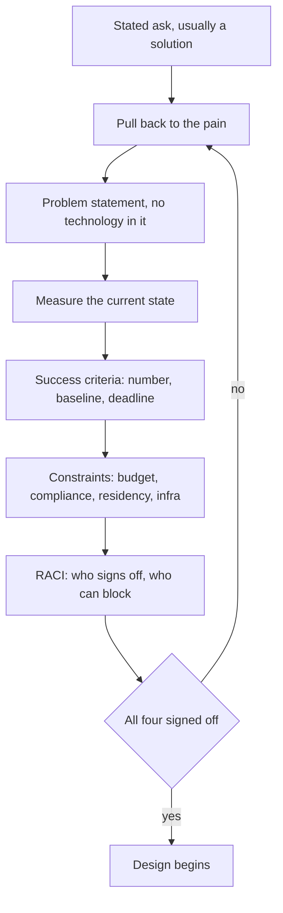
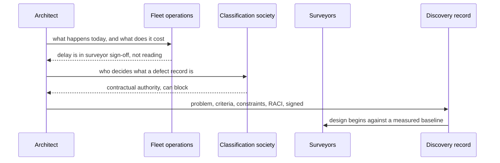

## What Problem Are We Solving?

A shipping line wanted an assistant for vessel inspections. The ask arrived fully formed: *"We
need an AI that reads inspection reports and flags defects."*

Discovery was two calls with the fleet operations manager. Eleven weeks later the system worked
and was cancelled.

Three separate things had never been established. Nobody had asked what the defect-flagging was
*for* — it turned out inspections weren't the bottleneck; the delay was in getting a
classification-society surveyor to agree, and flagging faster changed nothing downstream. Nobody
had defined success, so at review the sponsor said it "didn't feel like it was saving much" and
there was no number to argue with. And nobody had mapped who signs off: the classification society
had contractual authority over what counts as a defect record, and had never been consulted.

None of those is a technical failure. Each is a **missing artefact** from discovery — and each
maps to a specific, predictable way a project dies later.

Structured discovery isn't more conversations. It's four durable artefacts that survive staff
turnover, scope changes and executive review: a **problem statement**, **measurable success
criteria**, a **constraint list**, and a **stakeholder map**. Each de-risks a different failure.

> **🗣️ In plain English:** Teams arrive with a solution. Discovery's job is to get back to the problem, put a number on success, write down what you can't change, and find out who can say no.

## Meet the Moving Parts

| Artefact | What it prevents | What it looks like |
|---|---|---|
| **Problem statement** | Building the wrong thing | Current-state pain, who feels it, why the business cares — **no solution named** |
| **Success criteria** | "It didn't feel like much" at review | A number with a baseline and a deadline |
| **Constraint list** | Elegant designs that turn out unbuildable | Budget, deadline, compliance, data residency, approved vendors, existing infrastructure |
| **Stakeholder map** | Late-stage political failure | RACI: who signs off, who lives with it, who's merely informed |

Three things decide whether these are real.

**The problem statement must not name a solution.** "We need a chatbot" and "we need RAG"
(retrieval-augmented generation) are
solutions arriving disguised as requirements. Pull back to the pain, in the stakeholders' own
words, before any architecture is chosen — the shipping line's stated problem was about reading
reports, and the actual pain was in an approval step nobody had mentioned.

**Success is meaningless until it's a number.** "Support agents spend too long on routine
questions" becomes "reduce average handle time by 20% within two quarters without increasing
complaint rate". Those metrics become the acceptance criteria for the project and the basis of the
SLA conversation (6.3).

**Authority and impact are different axes.** Not everyone affected has authority; not everyone
with authority is affected. A RACI makes explicit who signs off on the problem, who signs off on
the architecture, who operates it, and who simply needs telling — and skipping it is a leading
cause of systems that work technically while the wrong people are surprised.

> **💡 Tip:** If you can't name who would have to approve killing the project, your stakeholder map is incomplete — and that person will appear in week ten.

## How It Works, Step by Step

1. **Refuse the solution framing.** Ask what happens today, who it hurts, and what it costs.
2. **Write the problem statement** in the stakeholders' language, with no technology in it, and
   get it reviewed.
3. **Instrument the current state** so the baseline is measured rather than recalled (CCAR-P 1.1).
4. **Turn the pain into a number** — target, baseline, deadline, and a guardrail that must not
   regress.
5. **Enumerate constraints** across budget, timeline, compliance, data residency and existing
   infrastructure (5.2).
6. **Build the RACI**, explicitly asking who can block.
7. **Circulate all four for sign-off** before design begins. Unreviewed artefacts are notes.
8. **Re-open discovery when a constraint or stakeholder changes.** These are living documents, not
   a phase you exit.



## Minimal Working Implementation

The exam skill and the real one are the same: map a symptom to the missing artefact. Save as
`discovery.py` and run it — no API key needed.

```python
import dataclasses

@dataclasses.dataclass(frozen=True)
class Discovery:
    problem_statement: str | None
    names_a_solution: bool
    success_metric: str | None
    baseline_measured: bool
    deadline: str | None
    constraints: tuple[str, ...]
    raci: dict                    # role -> R/A/C/I
    blockers_identified: bool

REQUIRED_CONSTRAINTS = {"budget", "timeline", "compliance", "infrastructure"}
def audit(d: Discovery) -> list[str]:
    gaps = []
    if not d.problem_statement:
        gaps.append("PROBLEM STATEMENT missing - built the wrong thing")
    elif d.names_a_solution:
        gaps.append("PROBLEM STATEMENT names a solution - the pain was "
                    "never separated from the proposed fix")
    if not d.success_metric:
        gaps.append("SUCCESS CRITERIA missing - no number to argue with")
    elif not d.baseline_measured:
        gaps.append("SUCCESS CRITERIA has no measured baseline - the "
                    "improvement is unprovable either way")
    if not d.deadline:
        gaps.append("SUCCESS CRITERIA has no deadline - deferrable")
    if missing := REQUIRED_CONSTRAINTS - {c.split(":")[0]
                                          for c in d.constraints}:
        gaps.append(f"CONSTRAINTS missing {sorted(missing)} - expect "
                    f"rework when one surfaces mid-build")
    if "A" not in d.raci.values():
        gaps.append("STAKEHOLDER MAP has no Accountable party")
    if not d.blockers_identified:
        gaps.append("STAKEHOLDER MAP does not identify who can block - "
                    "expect a late veto from an unconsulted authority")
    return gaps

SHIPPING = Discovery(
    "An AI that reads inspection reports and flags defects",
    names_a_solution=True, success_metric=None, baseline_measured=False,
    deadline=None, constraints=("budget: 200k",),
    raci={"fleet_ops": "A"}, blockers_identified=False)
print("\n".join(f"- {g}" for g in audit(SHIPPING)))
```

Five findings from a project that had a sponsor, a budget and an engaged stakeholder. Every one is
an absence, which is why discovery failures survive a kickoff review — the meeting examines what
was said, and these are the things nobody said.

## Production Implementation

Production treats the four artefacts as versioned, signed records with owners.

```python
import dataclasses
import datetime as dt

@dataclasses.dataclass(frozen=True)
class SuccessCriterion:
    metric: str               # queryable field, not a sentiment
    baseline: float           # measured, with a method recorded
    baseline_method: str
    target: float
    deadline: dt.date
    guardrail: str            # what must not regress
    accountable: str

CRITERIA = (
    SuccessCriterion(
        metric="hours_from_inspection_to_surveyor_signoff",
        baseline=61.4, baseline_method="180 inspections, Q3 sample",
        target=24.0, deadline=dt.date(2026, 9, 30),
        guardrail="defect_miss_rate must not rise above 0.5%",
        accountable="head-of-fleet-operations"),
)

def unprovable(c: SuccessCriterion) -> list[str]:
    """A criterion you cannot evaluate is a criterion you will argue
    about at review instead of measuring."""
    out = []
    if c.baseline_method.startswith("estimated"):
        out.append(f"{c.metric}: baseline estimated, not measured")
    if not c.guardrail:
        out.append(f"{c.metric}: no guardrail - the target can be met by "
                   f"sacrificing something nobody wrote down")
    return out
```

The stakeholder map is a structure with decision rights, not a list of names:

```python
@dataclasses.dataclass(frozen=True)
class Stakeholder:
    name: str
    role: str                 # R | A | C | I
    can_block: bool
    blocks_on: str | None

MAP = (
    Stakeholder("head-of-fleet-operations", "A", True, "business case"),
    Stakeholder("classification-society", "C", True,
                "what counts as a defect record"),
    Stakeholder("surveyor-team", "R", False, None),
    Stakeholder("IT-security", "C", True, "data leaving the vessel network"),
    Stakeholder("board", "I", False, None),
)

def unconsulted_blockers() -> list[str]:
    return [s.name for s in MAP if s.can_block and s.role == "I"]
    # ...
```

**What changed, and why:**

- **The baseline records its method.** "61.4 hours, from 180 inspections in Q3" can be defended;
  "about three days" cannot, and the difference surfaces at exactly the review where it matters.
- **Every criterion carries a guardrail.** A target met by sacrificing something unstated is the
  classic way a project succeeds on paper and fails in use.
- **`can_block` is separate from RACI role.** The classification society is only *Consulted* and
  can still veto — conflating authority with involvement is precisely what killed the original
  project.
- **The map is checked for blockers marked Informed.** Someone who can stop the project and is
  only being told about it is a scheduled crisis.

## In Production: Vessel Inspection at a Shipping Line

A fleet of 140 vessels, roughly 900 inspections a quarter, feeding a classification-society
approval process that governs whether a ship can sail.



**The second attempt.** Discovery was run properly and reframed the project. Reading reports was
never the bottleneck: the 61-hour median from inspection to sign-off was mostly a surveyor waiting
for a complete, correctly-formatted evidence pack. The assistant that got built assembles that
pack — photographs matched to defect codes, prior-inspection history, the specific clause invoked
— rather than flagging defects.

**What the constraint list changed.** Two constraints surfaced that would have been fatal later.
Vessel networks are bandwidth-limited and intermittently connected, so anything requiring a live
call from the ship was out. And the classification society's format requirements are contractual,
meaning the output shape was fixed input rather than a design choice.

**What the RACI changed.** The classification society moved from unconsulted to Consulted with a
blocking right recorded. They reviewed the evidence-pack format before it was built, and asked for
two fields nobody internally had known were mandatory.

**Result against the criterion.** Median hours from inspection to sign-off went from 61.4 to 19.2
against a target of 24, measured the same way as the baseline. The guardrail — defect miss rate —
stayed flat at 0.3%.

> **🌍 Real-world example:** The reframing is the whole value of discovery, and it cost about nine days. The first project spent eleven weeks building something that worked and solved nothing, because "we need an AI that reads inspection reports" was accepted as a requirement rather than treated as a proposed solution to an unstated problem. The question that unlocked it — "what happens between the inspection finishing and the ship sailing?" — was asked in the first discovery workshop of the second attempt.

## Where This Applies — and Where It Doesn't

| Situation | Use this | Use instead |
|---|---|---|
| The ask arrives as a named technology | Pull back to the pain first | Designing from the stated solution |
| Success is described in feelings | A metric with baseline, target, deadline | "We'll know it when we see it" |
| A regulated or contractual context | Constraint list including compliance and formats | Discovering them mid-build |
| Several teams are affected | RACI with blocking rights explicit | A list of people you spoke to |
| The project is already under way | Run discovery anyway; it's cheaper than rework | Pressing on to avoid looking slow |
| A genuine one-week experiment | — | The full artefact set; it exceeds the work |

Anti-patterns: accepting a solution as the problem statement; success criteria with no measured
baseline; constraint lists that omit compliance or infrastructure; stakeholder lists without
decision rights; and treating discovery as a phase you exit rather than a record you maintain.

## Failure Modes Seen in the Wild

### 1. The solution that arrived as a requirement

**Symptom.** A system that works and doesn't help.
**Cause.** The stated ask named a technology, and nobody asked what pain it addressed.
**Fix.** A problem statement with no technology in it, reviewed by the people who feel the pain.

### 2. Unfalsifiable success

**Symptom.** A review where the sponsor says it doesn't feel like much and nobody can respond.
**Cause.** No number, or a number with no measured baseline.
**Fix.** Metric, baseline with method, target, deadline, guardrail.

### 3. The constraint discovered in week ten

**Symptom.** A redesign forced by something that was always true.
**Cause.** Constraints were never enumerated across budget, compliance, residency and
infrastructure.
**Fix.** An explicit list, reviewed by the people who own each area.

### 4. The unconsulted veto

**Symptom.** A finished system blocked by someone nobody had spoken to.
**Cause.** Authority and involvement were conflated in an informal stakeholder list.
**Fix.** RACI with an explicit `can_block` flag, and check nobody who can block is merely
Informed.

> **⚠️ Watch out:** All four of these failures are invisible at kickoff, because a kickoff reviews what people said and these are things nobody said. The only reliable detection is to write the four artefacts down and circulate them for signature — an artefact nobody will sign is an artefact that was never actually agreed.

## Exam Lens & Key Takeaway

> **📝 Exam focus:** Expect scenario questions describing a project going wrong — scope creep, stakeholder surprise, unmeasurable "success" — and asking **which discovery artefact was missing**. Learn the symptom-to-artefact mapping: built the wrong thing → **problem statement** (and note that a well-formed one names current-state pain, who experiences it, and why the business cares, **without naming a technical solution**); "success" is arguable at review → **success criteria**, which must be metrics and KPIs agreed *before* design and which become the project's acceptance criteria; rework forced by a budget, compliance, data-residency or infrastructure limit → **constraint list**; and the system works but the wrong people were surprised, or someone unexpected vetoes it → **stakeholder map**, typically a **RACI** making decision rights explicit. The contrast with ad-hoc discovery is itself tested: structured produces written, reviewed artefacts, while unstructured assumes the problem from one conversation and discovers constraints mid-project.

> **🔑 Key takeaway:** Teams arrive with solutions, and discovery's job is to get back to the problem and leave behind four artefacts someone will sign: a problem statement with no technology in it, success criteria with a measured baseline and a deadline, a constraint list covering budget, compliance and infrastructure, and a stakeholder map that separates authority from involvement. Every one of those absences kills a project later in a specific and predictable way.
