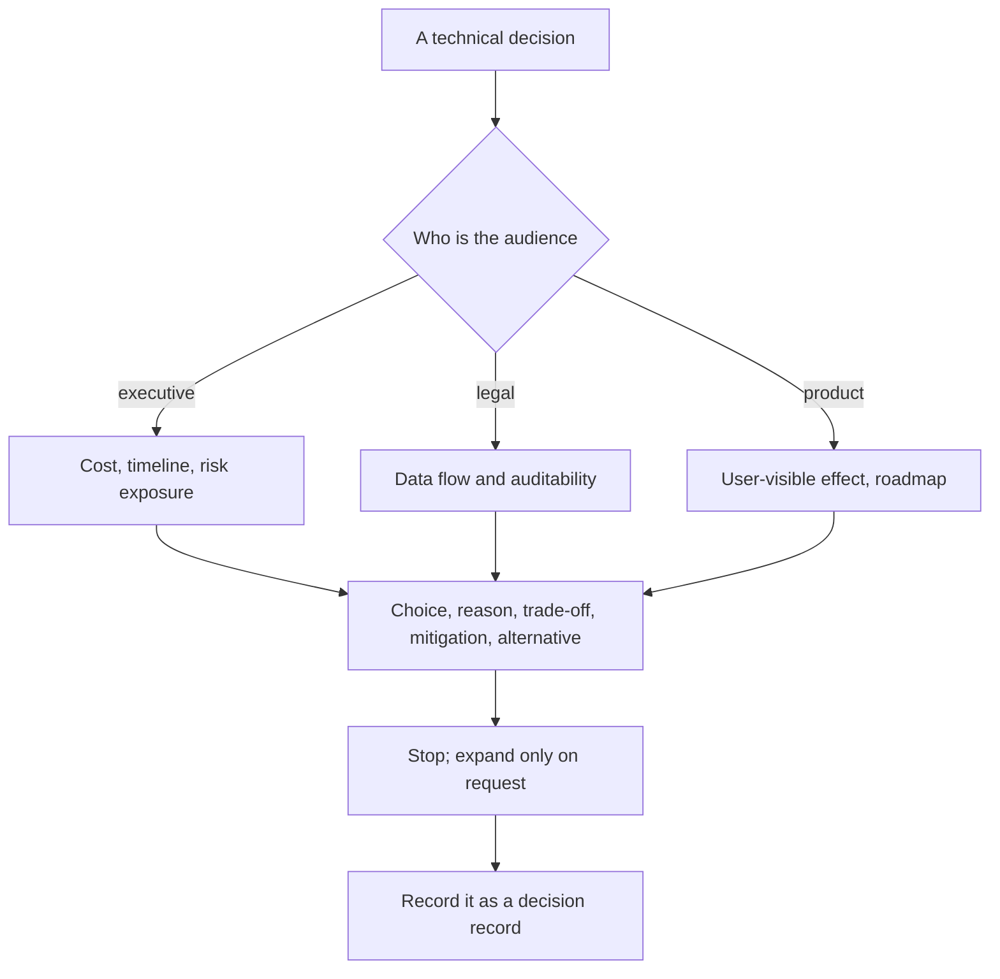
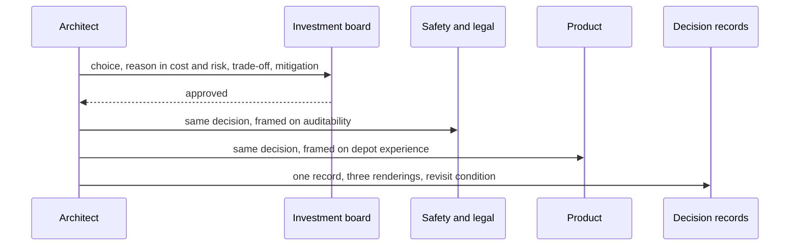

## What Problem Are We Solving?

A rail operator's architect took a maintenance-scheduling design to the investment board. The
design was right. The presentation took forty minutes and the decision was deferred twice.

The first attempt explained the mechanics: embeddings over historical fault records, a retrieval
step scoped to rolling-stock class, a smaller model to stay inside the depot's latency budget. All
accurate, all incomprehensible to a board whose members own capital allocation and safety risk.

The second attempt "simplified" — same content, fewer technical words. It went worse, because
simplification without reframing sounds evasive. The board couldn't tell what they were being
asked to accept, so they asked pointed questions and, getting hedged answers, deferred again.

The problem was never vocabulary. A board doesn't want a technical decision explained; it wants a
**business decision with technical consequences** — what are we choosing, what does it buy, what
does it cost, and what happens if we don't.

The third attempt used four sentences and was approved in nine minutes.

That structure is the topic. Skip any of its four parts and a specific failure follows: state the
choice and the justification only, and the audience correctly senses something is being hidden;
state the trade-off without a mitigation and you sound like you have an unmanaged risk; omit the
alternative and the choice looks arbitrary rather than deliberate.

> **🗣️ In plain English:** Don't explain the technology in simpler words. Say what you chose, why it serves their priority, what it costs, how you manage that cost, and what the alternative would have done.

## Meet the Moving Parts

The template, and what each clause is load-bearing for:

*"We chose `Option A` over `Option B` because `reason tied to a business priority`. The trade-off
is `what we give up`. We mitigate this by `mitigation`. The alternative would have resulted in
`cost / delay / risk`."*

| Clause | Makes explicit | Failure if omitted |
|---|---|---|
| The choice | What is actually being decided | The audience can't tell what they're approving |
| The business reason | Why it serves a priority they own | Sounds like an engineering preference |
| The trade-off | The honest cost | They sense something is hidden, and probe |
| The mitigation | That the cost is managed | Sounds like an unmanaged risk |
| The alternative | The contrast | The choice looks arbitrary, not deliberate |

Different audiences weigh different things:

| Audience | What they care about | How to frame it |
|---|---|---|
| **Executives** | Cost, timeline, competitive position, risk exposure | Business outcome first; technical detail only if asked |
| **Legal / Compliance** | Regulatory exposure, data handling, auditability | What data goes where, and what can be proven afterwards |
| **Product managers** | User experience, feature velocity, roadmap impact | What the user will notice, and what it enables or blocks |
| **Engineers** | Correctness, maintainability, technical debt | Implementation detail and long-term system health |

The mistake worth naming: this is **not a simplification problem**. Saying the same technical
thing with fewer technical words leaves the audience unable to weigh it against the other things
they own. Re-framing means the decision arrives already denominated in their currency.

> **💡 Tip:** Write the trade-off clause first. If you can't state honestly what the design gives up, you don't understand it well enough to present it — and the audience will find the gap faster than you will.

## How It Works, Step by Step

1. **Identify the audience's currency** — cost and risk, regulatory exposure, user experience, or
   maintainability.
2. **State the decision as a choice between two named options**, not as a description of what you
   built.
3. **Tie the reason to a priority they already own**, ideally one from the success criteria (6.1)
   or the SLA (6.3).
4. **Name the trade-off honestly**, including the part you'd rather not raise.
5. **Give the mitigation**, concretely — a monitor, an evaluation, a fallback, a review cadence.
6. **State what the alternative would have cost** in their units: money, delay, or exposure.
7. **Stop.** Add technical detail only when asked, and answer at the depth asked for.
8. **Record it as a decision record**, so the reasoning survives you (6.4).



## Minimal Working Implementation

The template is checkable, which is what makes it teachable. Save as `tradeoff.py` and run it — no
API key needed.

```python
import dataclasses

AUDIENCE_CURRENCY = {
    "executive": ("cost", "timeline", "risk", "revenue", "competitive"),
    "legal": ("audit", "exposure", "retention", "residency", "provable"),
    "product": ("user", "experience", "latency", "roadmap", "feature"),
}

@dataclasses.dataclass(frozen=True)
class Decision:
    chosen: str
    rejected: str
    reason: str
    tradeoff: str
    mitigation: str
    alternative_cost: str

def render(d: Decision) -> str:
    return (f"We chose {d.chosen} over {d.rejected} because {d.reason}. "
            f"The trade-off is {d.tradeoff}. We mitigate this by "
            f"{d.mitigation}. The alternative would have resulted in "
            f"{d.alternative_cost}.")

def critique(d: Decision, audience: str) -> list[str]:
    out = [f"missing {f.name} - see the failure table"
           for f in dataclasses.fields(d) if not getattr(d, f.name).strip()]
    words = AUDIENCE_CURRENCY[audience]
    if not any(w in d.reason.lower() for w in words):
        out.append(f"reason is not in {audience} currency "
                   f"{list(words)} - reads as an engineering preference")
    return out

BOARD = Decision(
    "a smaller model with retrieval", "a larger standalone model",
    reason="it meets the depot's 2-second scheduling window at about a "
           "third of the run cost",
    tradeoff="answers depend on the quality of our fault-history records "
             "rather than the model's general knowledge",
    mitigation="curating that history quarterly and testing accuracy "
               "against a fixed set of past faults before each release",
    alternative_cost="roughly 3x the annual run cost and still missing "
                     "the scheduling window on the busiest depots")
print(render(BOARD), "\n")
print("\n".join(critique(BOARD, "executive")) or "all five clauses present")
```

The critique function is the useful half. It enforces that every clause exists and that the
*reason* is stated in the audience's vocabulary — which is the specific thing "explain it simpler"
never fixes, because a simplified engineering justification is still an engineering justification.

## Production Implementation

Production makes decision records durable, because the reasoning outlives the architect.

```python
import dataclasses
import datetime as dt

@dataclasses.dataclass(frozen=True)
class DecisionRecord:
    adr_id: str
    title: str
    status: str               # proposed | accepted | superseded
    decided_on: dt.date
    decided_by: str           # the Accountable party from the RACI
    decision: Decision
    revisit_when: str         # the condition that invalidates this

RECORDS = (
    DecisionRecord(
        "ADR-014", "Model tier for depot scheduling", "accepted",
        dt.date(2026, 3, 11), "director-of-engineering", BOARD,
        revisit_when="depot throughput exceeds 400 jobs/day, or the "
                     "scheduling window tightens below 2 seconds"),
)

def stale(records, context: dict) -> list[str]:
    """A decision record without a revisit condition becomes folklore:
    everyone knows the rule, nobody knows whether it still applies."""
    return [r.adr_id for r in records
            if r.status == "accepted" and not r.revisit_when]
```

Each record is rendered per audience rather than rewritten by hand:

```python
def brief(record: DecisionRecord, audience: str) -> str:
    body = render(record.decision)
    problems = critique(record.decision, audience)
    header = f"{record.adr_id}: {record.title} ({record.status})"
    warn = ("\n[review] " + "; ".join(problems)) if problems else ""
    return f"{header}\n{body}\nRevisit when: {record.revisit_when}{warn}"
    # ...
```

**What changed, and why:**

- **Every decision has a `revisit_when` condition.** Without it, a decision that was correct at
  one scale becomes folklore — a rule everyone follows and nobody can date. This is the artefact
  that makes 6.4's iteration phase actionable.
- **The Accountable party from the RACI is recorded** (6.1), so a later challenge has a person to
  go to rather than a document.
- **The critique runs on stored records, not just at authoring.** An audience changes — a new
  CFO, a new regulator — and a reason stated in the old currency needs re-framing, not rewriting.
- **Rendering is generated from one record.** Maintaining separate executive and engineering
  narratives is how the two versions drift and someone notices the difference in a meeting.

## In Production: A Maintenance Scheduler at a Rail Operator

A fleet of 340 units across nine depots, with a capital board that approves anything over £250k
and a safety case that constrains what can be automated.



**The three attempts.** Forty minutes of mechanics: deferred. Twenty minutes of simplified
mechanics: deferred, with more suspicion. Four sentences in the template: approved in nine
minutes, with two clarifying questions that the architect answered at the depth asked and then
stopped.

**Why the second attempt was worse than the first.** Simplification removed detail without adding
framing, so the board heard confident assertions with no way to evaluate them. One member said
afterwards that it felt like being managed. The honest trade-off clause was what changed that —
volunteering the weakness is what made the rest credible.

**The same decision, three renderings.** Safety and legal got the identical choice framed on what
can be proven after an incident: every scheduling recommendation cites the fault records it drew
on, which is auditable, where the larger model's reasoning would not have been. Product got it
framed on depot experience: schedules appear within the shift-handover window rather than after
it. Nothing about the decision changed.

**What the decision record caught later.** Eighteen months on, a depot consolidation pushed
throughput past the recorded revisit threshold. The record surfaced in a routine review, the model
tier was re-evaluated, and the original reasoning was available to the engineer doing it — who had
joined after the architect left.

> **🌍 Real-world example:** The clause that did the work was the trade-off. The architect had been reluctant to say "answers depend on the quality of our fault-history records", because it sounds like a weakness in front of people holding a budget. It was the sentence that turned the room: it demonstrated that the risk was understood, which made the mitigation credible, which made the whole design look like a decision rather than a preference. Volunteering the cost is what buys the trust to be believed about everything else.

## Where This Applies — and Where It Doesn't

| Situation | Use this | Use instead |
|---|---|---|
| Presenting to executives | Business outcome first, the four clauses | Technical mechanics |
| Presenting to legal | Frame on data flow and what's provable | Explaining hallucination mechanics |
| Presenting to product | Frame on user-visible effect and roadmap | Cost-per-token arguments |
| A stakeholder is pushing back | Volunteer the trade-off explicitly | Reassurance |
| Talking to engineers | Implementation detail and maintainability | Business framing they don't need |
| A decision that will outlive you | A decision record with a revisit condition | A slide |
| A reversible, low-stakes choice | — | The full ceremony |

Anti-patterns: treating this as simplification; stating the choice and reason but hiding the
trade-off; a trade-off with no mitigation; omitting what the alternative would have cost;
maintaining separate narratives per audience that drift apart; and decision records with no
revisit condition.

## Failure Modes Seen in the Wild

### 1. Simplified, not reframed

**Symptom.** Fewer technical words, same deferral, more suspicion.
**Cause.** The decision is still an engineering decision, just shorter.
**Fix.** Re-denominate it in the audience's currency — cost, risk, auditability, user experience.

### 2. The hidden trade-off

**Symptom.** Pointed questions and a sense the architect is selling something.
**Cause.** Choice and justification given; cost omitted.
**Fix.** State the trade-off before you're asked. It buys credibility for everything else.

### 3. The unmanaged risk

**Symptom.** The trade-off is stated and the room gets more worried, not less.
**Cause.** No mitigation attached.
**Fix.** Pair every trade-off with a concrete control — a monitor, an eval, a fallback.

### 4. The undated rule

**Symptom.** A design constraint everyone follows and nobody can justify.
**Cause.** A decision recorded without the condition that would invalidate it.
**Fix.** A `revisit_when` on every record, checked during lifecycle reviews (6.4).

> **⚠️ Watch out:** The instinct under pressure is to leave out the trade-off, because a room holding a budget is not obviously the place to volunteer a weakness. It is exactly the place: an audience that senses an omission stops evaluating the proposal and starts probing the presenter, and you never get the decision back onto the merits.

## Exam Lens & Key Takeaway

> **📝 Exam focus:** Know the **four-part trade-off template** and why each part is load-bearing: *"We chose [A] over [B] because [reason tied to a business priority]. The trade-off is [what we give up]. We mitigate this by [mitigation]. The alternative would have resulted in [cost/delay/risk]."* Omitting the trade-off makes the audience sense something is hidden; omitting the mitigation makes it sound like an unmanaged risk; omitting the alternative makes the choice look arbitrary rather than deliberate. The framing point the exam rewards is that this is **not a simplification problem** — saying the same technical thing with fewer technical words is necessary but insufficient. The real skill is **re-framing a technical decision as a business decision with technical consequences**. Match the framing to the audience: **executives** want cost, timeline, competitive position and risk; **legal** wants what data goes where and what can be proven afterwards; **product** wants what the user notices and what it enables next.

> **🔑 Key takeaway:** A sound architecture you cannot defend in a room of non-specialists is an architecture that doesn't get built. Re-frame rather than simplify: state the choice against a named alternative, justify it in the currency the audience already reasons in, volunteer the cost honestly, attach a concrete mitigation, and say what the alternative would have cost. Then stop — and record it with the condition that would make you revisit it.
