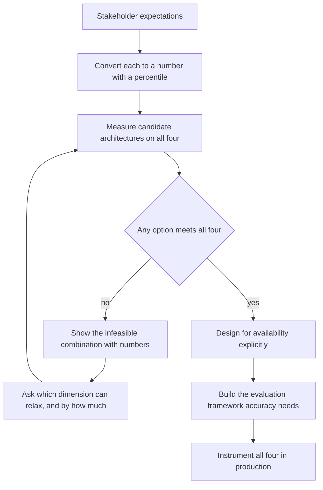
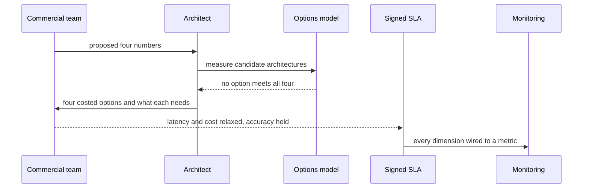

## What Problem Are We Solving?

A broadcaster contracted live captioning for its news channels. The SLA was agreed in the
commercial negotiation, before any architect saw it: **sub-second latency, 98% word accuracy,
99.99% availability, under $0.004 per minute of audio.**

Every number was reasonable on its own. Together they were unbuildable, and nobody had checked,
because the SLA had been treated as a sales artefact rather than a design input.

The architecture that eventually shipped missed three of the four, and the contract had
consequences attached. Working backwards from what was achievable would have produced a
negotiable position in a week; working forwards from a signed commitment produced eleven months of
missed targets and a renegotiation from a much worse footing.

The four dimensions **pull against each other by construction**. Sub-second latency wants a small
model and narrow context; 98% accuracy on live broadcast audio wants a larger model and
verification passes; 99.99% availability wants multi-region redundancy and provider fallback,
which adds both cost and latency on failover; and a tight cost ceiling competes with all three.

An SLA is therefore not a promise you make and then engineer toward. It's a **design input**:
every number constrains the architecture, and every architectural choice determines what can
honestly be promised. Which means the negotiation is really a prioritisation exercise, and the
architect's job is to make the trade explicit rather than let one dimension silently win.

> **🗣️ In plain English:** SLA numbers compete. You can't have the tightest value on all four, so the conversation is about which one matters most — and it has to happen before anyone signs.

## Meet the Moving Parts

| Dimension | Example | What it forces architecturally |
|---|---|---|
| **Latency (p95)** | "under 3s for 95% of requests" | Rules out large models without caching and unbounded agentic loops; favours right-sized models, caching, narrowly scoped retrieval |
| **Availability** | "99.9% uptime" | Redundancy, fallback models or providers, circuit breakers that fail gracefully |
| **Accuracy** | "at least 90% on benchmark" | An explicit evaluation framework *before* launch — you cannot honour an accuracy SLA you can't measure |
| **Cost per query** | "under $0.01" | Often the tightest, because it competes directly with the other three |

Three things carry the topic.

**Availability is an architecture problem wearing an operations costume.** A 99.9% commitment
requires no single point of failure, a fallback when the primary is degraded, and circuit breakers
that fail gracefully rather than hang. An architect who accepts it without designing failover has
promised something the system cannot keep.

**An accuracy SLA presupposes an evaluation framework.** You cannot honour a number you have no
way to measure, which makes "90% accurate" a commitment to build an evaluation set (4.2) as much
as a commitment about quality.

**Caching and batching exist to relax the cost tension**, which is why they appear in almost every
negotiated outcome — caching improves latency and cost together, and batching buys cost at the
expense of latency, so it's only available where nothing is waiting.

> **💡 Tip:** Never let an SLA reach a stakeholder before the architecture has been evaluated against it. An SLA agreed in a sales meeting with no architectural review is a liability the architect inherits.

## How It Works, Step by Step

1. **Get the SLA conversation before the commitment**, not after.
2. **Turn each expectation into a measurable number** with a percentile where relevant — "fast" is
   not an SLA, "p95 under 2s" is.
3. **Measure what each architecture option actually delivers** on all four dimensions.
4. **Show which combinations are infeasible**, with the numbers, rather than arguing in the
   abstract.
5. **Ask which dimension the business would relax**, and by how much. That's the prioritisation
   the negotiation is really about.
6. **Design for the availability number specifically** — redundancy, fallback, circuit breakers —
   because it doesn't come for free.
7. **Build the evaluation framework the accuracy number requires** before launch.
8. **Instrument every SLA dimension in production** (3.6) so the commitment is observable, not
   asserted.



## Minimal Working Implementation

Feasibility is arithmetic, and doing it before the negotiation is the whole job. Save as `sla.py`
and run it — no API key needed.

```python
import dataclasses

@dataclasses.dataclass(frozen=True)
class Option:
    name: str
    p95_ms: float
    accuracy: float
    availability: float       # achievable with this topology
    cost_per_min: float

@dataclasses.dataclass(frozen=True)
class SLA:
    p95_ms: float
    accuracy: float
    availability: float
    cost_per_min: float

OPTIONS = [
    Option("small, single region", 620, 0.942, 0.9910, 0.0021),
    Option("small, multi-region + fallback", 780, 0.942, 0.9999, 0.0038),
    Option("large, multi-region", 2400, 0.981, 0.9999, 0.0129),
    Option("large + verification, multi-region", 3900, 0.991, 0.9999,
           0.0204)]
PROPOSED = SLA(p95_ms=1000, accuracy=0.98, availability=0.9999,
               cost_per_min=0.004)

def misses(o: Option, s: SLA) -> list[str]:
    out = []
    if o.p95_ms > s.p95_ms:
        out.append(f"latency {o.p95_ms:.0f}ms > {s.p95_ms:.0f}ms")
    if o.accuracy < s.accuracy:
        out.append(f"accuracy {o.accuracy:.1%} < {s.accuracy:.1%}")
    if o.availability < s.availability:
        out.append(f"availability {o.availability:.2%} < "
                   f"{s.availability:.2%}")
    if o.cost_per_min > s.cost_per_min:
        out.append(f"cost ${o.cost_per_min:.4f} > ${s.cost_per_min:.4f}")
    return out

feasible = [o for o in OPTIONS if not misses(o, PROPOSED)]
for o in OPTIONS:
    gaps = misses(o, PROPOSED)
    print(f"{o.name:42} {'MEETS SLA' if not gaps else '; '.join(gaps)}")
print(f"\nfeasible options: {len(feasible)} of {len(OPTIONS)}")
```

Run it and no option meets the proposed SLA. That output is the artefact you take into the
negotiation: not "this is unrealistic", which is an opinion, but four costed architectures and
exactly which number each one misses — which converts an argument into a choice about what to
relax.

## Production Implementation

Production derives the achievable frontier rather than testing one proposal, and instruments every
committed number.

```python
import dataclasses

def relax_to_feasible(options, s: SLA) -> list[str]:
    """What would each option need? This is the negotiating position:
    concrete alternatives rather than a refusal."""
    out = []
    for o in options:
        need = []
        if o.p95_ms > s.p95_ms:
            need.append(f"latency relaxed to {o.p95_ms:.0f}ms")
        if o.accuracy < s.accuracy:
            need.append(f"accuracy relaxed to {o.accuracy:.1%}")
        if o.cost_per_min > s.cost_per_min:
            need.append(f"budget raised to ${o.cost_per_min:.4f}/min")
        if need:
            out.append(f"{o.name}: viable if {', '.join(need)}")
    return out

@dataclasses.dataclass(frozen=True)
class Commitment:
    dimension: str
    target: float
    measured_field: str       # must exist in telemetry (3.6)
    breach_consequence: str
    reviewed_quarterly: bool
```

Every committed dimension is wired to a live metric, because an unobservable SLA is an assertion:

```python
COMMITMENTS = (
    Commitment("latency_p95_ms", 2000, "caption_p95_ms",
               "service credit", True),
    Commitment("accuracy", 0.96, "eval_suite_word_accuracy",
               "remediation plan", True),
    Commitment("availability", 0.9999, "uptime_rolling_30d",
               "service credit", True),
    Commitment("cost_per_min", 0.0085, "cost_per_audio_minute",
               "internal margin review", True),
)

def unobservable(telemetry_fields: set[str]) -> list[str]:
    return [c.dimension for c in COMMITMENTS
            if c.measured_field not in telemetry_fields]
    # ...
```

**What changed, and why:**

- **The output is a set of alternatives, not a refusal.** "No option meets this" ends a
  conversation; "viable if latency relaxes to 780ms" starts a negotiation, and the architect who
  arrives with the second is the one who gets a workable SLA.
- **Every commitment names a telemetry field.** A number nobody measures cannot be honoured or
  defended, and `unobservable()` catches the gap before it's signed rather than at the first
  dispute.
- **Breach consequences are recorded alongside targets.** A dimension with a service credit
  attached deserves more architectural margin than one with an internal review, and that shapes
  where you spend.
- **Quarterly review is a field.** Traffic, model tiers and costs all move; an SLA agreed once and
  never revisited drifts from what the architecture can deliver.

## In Production: Live Captioning at a Broadcaster

Three news channels, roughly 400 hours of live audio a week, with regulatory obligations on
caption availability and a contract carrying service credits.



**The first contract.** Signed before architectural review. Latency achieved (610ms), accuracy
reached 94.2% against a committed 98%, availability 99.1% against 99.99%, and cost landed at
$0.0089 against $0.004. Three breaches, service credits, and a renegotiation conducted from a
position of having already failed.

**The renegotiation, done properly.** The options model was built in about four days and taken
into the conversation. Presented as four architectures with their measured numbers, the
conversation changed from "why can't you deliver what you promised" to "which of these do we
want". The broadcaster's actual priority turned out to be **availability** — a captioning outage
during a live bulletin is a regulatory matter, while a 2-second caption delay is a recognised norm
in live broadcast.

**The negotiated SLA.** Latency relaxed from sub-second to p95 under 2 seconds. Accuracy set at
96%, achievable with the mid-tier option. Availability held at 99.99%, which is what drove the
multi-region topology and provider fallback. Cost ceiling raised to $0.0085. Three of four numbers
moved, and the one that mattered most was held.

**What the availability commitment actually cost.** Multi-region with a second provider added
about 160ms on the failover path and roughly 45% to infrastructure spend. That was invisible in
the original negotiation, where 99.99% had been agreed as though it were an operations setting
rather than a topology decision.

> **🌍 Real-world example:** The most useful sentence in the renegotiation was "a 2-second caption delay is normal in live broadcast, and a 30-second outage is not." Nobody on the commercial side had articulated the relative weight of the four numbers, because nobody had been asked — they had simply written down the best value for each. Asking which one they would defend if they could only defend one is what produced a signable SLA, and it took ten minutes once there were numbers on the table.

## Where This Applies — and Where It Doesn't

| Situation | Use this | Use instead |
|---|---|---|
| An SLA is being drafted | Treat it as a design input; model feasibility first | Reviewing it after signature |
| Stakeholders want the best of all four | Show the infeasible combination with numbers | Arguing it's unrealistic |
| An availability number is proposed | Design redundancy, fallback, circuit breakers | Treating it as an ops concern |
| An accuracy number is proposed | Commit to building the evaluation framework | Promising a number you can't measure |
| Cost is the binding constraint | Caching, batching where nothing waits | A uniform model downgrade |
| A number is committed | Wire it to a telemetry field | Asserting it in a document |
| Internal tooling with no contract | — | Formal SLAs; success criteria suffice |

Anti-patterns: SLAs agreed commercially before architectural review; "fast" and "accurate" left
unquantified; availability accepted without failover design; accuracy committed with no evaluation
set; and committed numbers with no corresponding metric in production.

## Failure Modes Seen in the Wild

### 1. The SLA signed in a sales meeting

**Symptom.** A commitment the architecture cannot meet, discovered after signature.
**Cause.** The SLA was treated as a sales artefact rather than a design input.
**Fix.** Model feasibility across candidate architectures *before* anyone commits.

### 2. Availability as an ops setting

**Symptom.** A 99.99% commitment on a single-region deployment.
**Cause.** Availability sounds operational; it is a topology decision with cost and latency.
**Fix.** Design redundancy, fallback and circuit breakers to the committed number.

### 3. The unmeasurable accuracy promise

**Symptom.** An accuracy SLA nobody can report against.
**Cause.** No evaluation framework, so the number was never observable.
**Fix.** Build the evaluation set as part of honouring the commitment (4.2).

### 4. The refusal instead of the alternative

**Symptom.** The architect says it's unrealistic and loses the argument.
**Cause.** A position with no numbers attached is an opinion against a stakeholder's opinion.
**Fix.** Bring costed options and say what each one needs relaxed.

> **⚠️ Watch out:** Because the four dimensions compete, an SLA negotiation that produces the tightest number on every dimension has not succeeded — it has deferred the conflict to delivery, where the architect absorbs it. A negotiation that ends with three numbers relaxed and one defended is the successful outcome, and it only happens if someone asks which one the business would actually defend.

## Exam Lens & Key Takeaway

> **📝 Exam focus:** The core framing is that an SLA is a **design input, not a document handed down** — every number constrains the architecture and every architectural choice determines what can honestly be promised. Know what each forces: **latency (p95)** rules out large models without caching and unbounded agentic reasoning; **availability** is an architecture problem needing redundancy, fallback providers and circuit breakers; **accuracy** forces an evaluation framework *before* launch, since you cannot honour a number you can't measure; **cost per query** is often tightest, competing with the other three. The tested judgment is that these dimensions **pull against each other**, making an SLA negotiation a **prioritisation exercise** — stakeholders rarely get the tightest number on all four, and the architect's job is to make the trade-off explicit rather than silently pick one. Caching and batching exist specifically to relax the cost tension.

> **🔑 Key takeaway:** SLA numbers compete by construction, so the negotiation is about which dimension the business would defend if it could only defend one — and that conversation has to precede the commitment, not follow it. Bring measured, costed architectures and say exactly which number each one misses, because a refusal is an opinion while an option set is a choice. Then wire every committed dimension to a live metric, since an SLA nobody can observe is an assertion waiting to be disputed.
