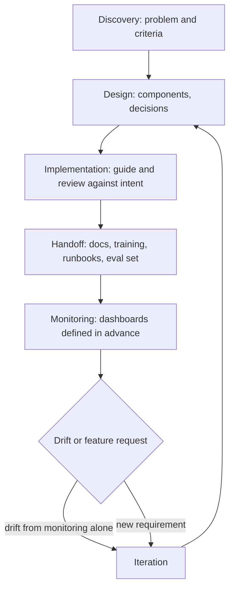
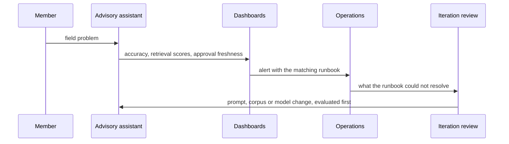

## What Problem Are We Solving?

An agricultural co-operative built a crop advisory assistant: members describe a problem in a
field, the assistant answers from agronomy guidance, regional trial data and pesticide approvals.

It launched well. The architect handed over a slide deck and moved to the next project.

Fourteen months later the co-op's agronomists had stopped using it. Nothing had broken and nobody
had raised a ticket. Three things had happened quietly: member phrasing shifted as a new pest
became common and the guidance corpus didn't cover it; the model provider pushed an update that
changed how the assistant handled uncertain cases; and a pesticide approval lapsed, so some advice
became not merely outdated but illegal to follow.

The operations team saw declining usage and had no way to diagnose any of it. There were no
dashboards, because none had been specified. No runbooks, because handoff was a deck. No
evaluation dataset, so "is it worse than last year?" was unanswerable.

**Quality degraded with zero code changes.** That is the property that makes AI systems different
from traditional software, and the reason lifecycle management is its own discipline rather than
generic project management. A traditional system that nobody touches mostly keeps working. An AI
system that nobody touches drifts, because the world it models keeps moving.

> **🗣️ In plain English:** An AI system is never done. It can get worse without anyone changing a line of code, so the architect's job doesn't end at launch — and handoff is where most of them end it anyway.

## Meet the Moving Parts

Six phases, with what the architect specifically owns in each:

1. **Discovery** — lead workshops, define success criteria (6.1). Everything downstream depends on
   it.
2. **Design** — choose components, document the reasoning, present trade-offs to stakeholders
   (6.2).
3. **Implementation** — guide developers through ambiguous decisions and review that the built
   system still matches the documented intent.
4. **Handoff** — **the phase most often under-invested in.** Document for an operations team who
   did not live through the decisions, train the people who will run it, and write **runbooks** for
   common scenarios.
5. **Monitoring** — dashboards and alerts **defined in advance**, not improvised after the first
   incident. This is where SLA commitments (6.3) become observable.
6. **Iteration** — monitoring and evaluation feed proposed improvements back into design, closing
   the loop.

What makes this different from a traditional software lifecycle:

| Aspect | Traditional software | AI system |
|---|---|---|
| "Done" | Ships, then maintenance | Never fully done — quality drifts with no code change |
| Cause of degradation | Bugs, changing requirements | Data drift, model updates, changing usage, prompt sensitivity |
| Monitoring focus | Uptime, errors, performance | Those **plus output quality**, which needs ongoing evaluation |
| Handoff artefact | Docs, deployment runbook | Those **plus evaluation datasets, prompt version history, model-behaviour expectations** |
| Iteration trigger | Feature requests | Those **plus metric drift detected from monitoring alone** |

That right-hand column — degradation with no code change — is the whole reason this is a domain
topic rather than project management.

> **💡 Tip:** The handoff test is whether an operations engineer who has never met you can diagnose a quality drop at 2am using only what you left behind.

## How It Works, Step by Step

1. **Name all six phases at kickoff** and who owns the architect's responsibilities in each.
2. **Carry discovery artefacts forward** — success criteria become the monitoring thresholds
   (6.1, 6.3).
3. **Record design decisions with revisit conditions** (6.2), so iteration has something to
   re-open.
4. **Budget handoff as real work**, not a meeting. Documentation for people who weren't there,
   plus training.
5. **Write runbooks per scenario**: accuracy drop detected, provider outage, prompt rollback,
   index staleness.
6. **Hand over the evaluation dataset and prompt version history**, not just architecture
   documentation.
7. **Define dashboards and alerts before launch**, mapped to the SLA dimensions.
8. **Schedule iteration reviews** on a cadence rather than convening them after an incident (6.5).



## Minimal Working Implementation

Handoff completeness is checkable, and checking it is what stops a deck counting as a handover.
Save as `lifecycle.py` and run it — no API key needed.

```python
import dataclasses

AI_SPECIFIC = {"evaluation_dataset", "prompt_version_history",
               "model_behaviour_expectations"}
REQUIRED_RUNBOOKS = {"accuracy_drop", "provider_outage",
                     "prompt_rollback", "index_staleness"}

@dataclasses.dataclass(frozen=True)
class Handoff:
    artefacts: frozenset
    runbooks: frozenset
    ops_trained: bool
    dashboards_defined_before_launch: bool
    iteration_cadence: str | None

def audit(h: Handoff) -> list[str]:
    gaps = []
    for missing in sorted(AI_SPECIFIC - h.artefacts):
        gaps.append(f"HANDOFF missing {missing} - an AI handover needs "
                    f"more than architecture docs")
    for missing in sorted(REQUIRED_RUNBOOKS - h.runbooks):
        gaps.append(f"HANDOFF no runbook for '{missing}' - ops will "
                    f"improvise during the incident")
    if not h.ops_trained:
        gaps.append("HANDOFF ops team not trained - documentation "
                    "nobody has been walked through is shelfware")
    if not h.dashboards_defined_before_launch:
        gaps.append("MONITORING dashboards not defined in advance - "
                    "they get improvised after the first incident")
    if not h.iteration_cadence:
        gaps.append("ITERATION has no cadence - reviews happen only "
                    "when something is already wrong")
    return gaps

CROP_ADVISORY = Handoff(
    artefacts=frozenset({"architecture_slides"}),
    runbooks=frozenset(), ops_trained=False,
    dashboards_defined_before_launch=False, iteration_cadence=None)

print("\n".join(f"- {g}" for g in audit(CROP_ADVISORY)))
print(f"\n{len(audit(CROP_ADVISORY))} gaps, all in Handoff, Monitoring "
      f"and Iteration - none in Design or Implementation.")
```

The last line is the point, and it's what the exam tests. The system was designed well and built
well. Every gap sits in the three phases that happen *after* the part architects find interesting.

## Production Implementation

Production makes handoff a gate rather than a milestone, and keeps the architect attached to the
iteration cadence.

```python
import dataclasses
import datetime as dt

@dataclasses.dataclass(frozen=True)
class Runbook:
    scenario: str
    trigger: str              # the alert that fires
    steps: tuple[str, ...]
    escalation: str
    last_rehearsed: dt.date | None

RUNBOOKS = (
    Runbook("accuracy_drop",
            trigger="eval_suite_accuracy < 0.92 on the nightly run",
            steps=("check retrieval score distribution (3.6)",
                   "check index freshness and last successful reindex",
                   "diff prompt version against last known-good",
                   "check for a model version change in the window"),
            escalation="platform-eng on-call, then the architect",
            last_rehearsed=dt.date(2026, 5, 14)),
)

def unrehearsed(books, months: int = 6) -> list[str]:
    """A runbook nobody has walked through is a document, not a control.
    The first rehearsal always finds a step that no longer works."""
    cutoff = dt.date.today() - dt.timedelta(days=months * 30)
    return [b.scenario for b in books
            if b.last_rehearsed is None or b.last_rehearsed < cutoff]
```

Monitoring is derived from the success criteria, so the thresholds aren't invented twice:

```python
def dashboards_from_criteria(criteria, commitments) -> list[dict]:
    """Discovery's success criteria (6.1) and the SLA (6.3) are the
    same numbers the dashboard should show. Deriving them stops the
    dashboard drifting from what was actually promised."""
    panels = [{"metric": c.metric, "threshold": c.target,
               "source": "success_criteria"} for c in criteria]
    panels += [{"metric": c.measured_field, "threshold": c.target,
                "source": "sla"} for c in commitments]
    return panels

def drift_review_due(last_review: dt.date, cadence_days: int) -> bool:
    return (dt.date.today() - last_review).days > cadence_days
    # ...
```

**What changed, and why:**

- **Runbooks record when they were last rehearsed.** The first walkthrough of any runbook finds a
  step that no longer works — a renamed dashboard, a rotated credential — and an unrehearsed
  runbook is a document that will fail at 2am.
- **Dashboards are derived from the success criteria and SLA.** Inventing monitoring thresholds
  separately is how a dashboard ends up showing numbers nobody committed to while the committed
  ones go unwatched.
- **The escalation path names the architect explicitly.** Lifecycle management fails at the seam
  between "the project" and "the product"; naming the architect in the runbook keeps the seam
  closed.
- **Iteration has a cadence, checked.** A review that convenes only when something is wrong is
  reactive by construction, which is the opposite of what the iteration phase is for.

## In Production: A Crop Advisory Assistant at an Agricultural Co-operative

About 2,100 member queries a week, seasonal by nature, over agronomy guidance that changes with
regulatory approvals and each year's trial results.



**The rebuild's handoff.** Four runbooks, a walkthrough with the two operations engineers who would
carry the pager, the evaluation dataset transferred with its 340 labelled cases, and prompt
version history in the same repository as the code. It took nine days, against a first handover
that had been a one-hour meeting.

**What monitoring caught that nobody would have.** An alert on **approval freshness** — the share
of cited pesticide approvals still valid — which is not a quality metric in any general sense and
is the single most important number in this system. It fired eleven days after a lapse, and the
corpus was updated before any member acted on the advice.

**The model update.** A provider version change was detected by the nightly evaluation run
dropping 4.1 points on the uncertainty-handling category. Under the old arrangement this was the
exact failure that went unnoticed for months. The runbook's fourth step — check for a model version
change in the window — took it from alert to diagnosis in about twenty minutes.

**The seasonal iteration.** Reviews are scheduled quarterly and, deliberately, one extra ahead of
each growing season, because that's when member phrasing shifts hardest. Two of the four annual
reviews now produce corpus changes rather than prompt changes, which is the co-op noticing that
its content was the drift rather than its system.

> **🌍 Real-world example:** The runbook rehearsal is what most teams skip and what pays. The first walkthrough of "accuracy drop detected" failed at step two: the reindex status dashboard the architect had specified had been renamed during a platform migration, and the link in the runbook was dead. Finding that in a calm rehearsal cost twenty minutes. Finding it during an incident, with an agronomist waiting, would have cost the rest of the afternoon.

## Where This Applies — and Where It Doesn't

| Situation | Use this | Use instead |
|---|---|---|
| Any system going into production | Name all six phases and their owners | Treating delivery as the end |
| Handing over to an operations team | Docs, training, runbooks, eval set, prompt history | A slide deck |
| Defining monitoring | Derive from success criteria and SLA, before launch | Improvising after the first incident |
| A quality drop months after launch | Runbook plus dashboards; the drift is expected | Treating it as a surprise |
| Scheduling improvement work | A cadence, with extra reviews before known shifts | Convening when something breaks |
| A genuine throwaway prototype | — | Full lifecycle machinery |

Anti-patterns: handoff as a meeting; monitoring designed after launch; runbooks never rehearsed;
evaluation datasets and prompt history left with the build team; iteration reviews that only
happen reactively; and treating "no code changed" as evidence that nothing changed.

## Failure Modes Seen in the Wild

### 1. The slide-deck handover

**Symptom.** Operations can see a problem and cannot diagnose it.
**Cause.** Handoff produced documentation for people who were in the room, not for those who
weren't.
**Fix.** Runbooks, training, evaluation dataset and prompt history — and a walkthrough.

### 2. Monitoring invented after the incident

**Symptom.** The first incident is spent building dashboards.
**Cause.** Monitoring was treated as an operations activity rather than a design deliverable.
**Fix.** Define dashboards and alerts before launch, derived from the success criteria and SLA.

### 3. The unrehearsed runbook

**Symptom.** A runbook exists and fails at step two during a real incident.
**Cause.** Written once, never walked through; the environment moved underneath it.
**Fix.** Rehearse on a cadence and record the date.

### 4. Silent drift

**Symptom.** Usage declines with no tickets and no errors.
**Cause.** Quality degraded with no code change — the AI-specific failure.
**Fix.** Continuous evaluation against a held dataset, and an iteration cadence that doesn't wait
for a complaint.

> **⚠️ Watch out:** The distinguishing property of an AI system is that it can get worse while nothing about it changes — so "we haven't touched it" is a reason to check rather than a reason for confidence. A traditional system left alone is usually fine; this one is drifting, and the only question is whether you find out from a dashboard or from declining usage.

## Exam Lens & Key Takeaway

> **📝 Exam focus:** Expect questions describing a failure occurring **well after "the project ended"** and asking which lifecycle phase was skipped — and the answer is usually **Handoff** (no runbooks, no training) or **Monitoring** (no dashboards or alerts), **not Design or Implementation**. Know the six phases in order — **discovery, design, implementation, handoff, monitoring, iteration** — and what the architect owns in each, particularly that handoff is the phase most often under-invested in and must produce documentation an operations team who *did not live through the decisions* can use, plus training and runbooks. Know the AI-specific differences: **quality silently drifts with zero code changes**; degradation comes from data drift, model updates and changing usage rather than bugs; monitoring must cover **output quality** as well as uptime; the handoff artefact adds **evaluation datasets, prompt version history and model-behaviour expectations**; and iteration is triggered by **metric drift from monitoring alone**.

> **🔑 Key takeaway:** An AI system can get worse with nobody touching it, which is why responsibility runs past delivery and why the phases that fail are the ones after the interesting part. Budget handoff as real work — runbooks, training, the evaluation dataset and prompt history, not a deck — define the dashboards before launch from the numbers you already committed to, and put iteration on a cadence, because a review that only convenes when something is wrong has already missed the drift it existed to catch.
