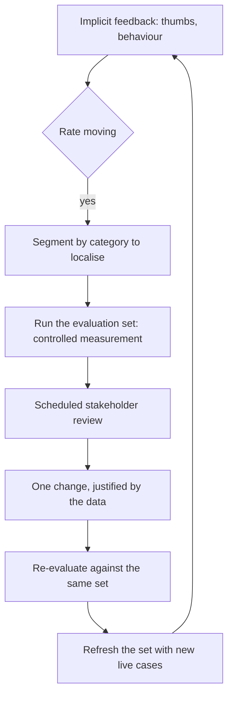
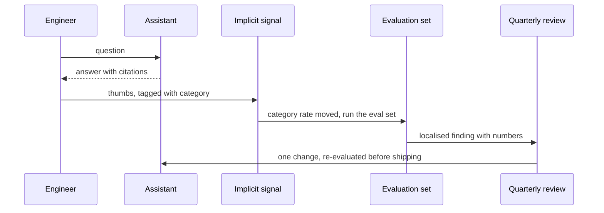

## What Problem Are We Solving?

An engineering consultancy runs a knowledge assistant over 30 years of project reports — soil
surveys, structural calculations, planning submissions. Engineers ask it questions and it cites
the reports.

It had thumbs up/down from day one, and the team watched the ratings.

In March the thumbs-down rate rose from 6% to 14% over about three weeks. The team could see that
something had changed. They could not see *what*, and spent a month investigating: a prompt tweak
was reverted, retrieval depth was increased, the corpus was re-indexed. The rate stayed at 14%.

What had actually happened: the provider had updated the model, and it had become noticeably more
hedged on questions with incomplete source material. Engineers rated those answers down not
because they were wrong but because they were unhelpful. And the same update had *improved*
multi-part questions, which nobody noticed, because the thumbs-down rate is one number covering
everything.

The team had a smoke detector and no diagnosis. Thumbs up/down is high-volume, near-free, and
hopelessly noisy — users rate on tone, speed and unrelated frustration as often as on correctness.
It tells you *that* something may be wrong. Only a controlled measurement — the same questions,
scored the same way, every time — tells you *what*, and whether a change you made helped.

> **🗣️ In plain English:** Thumbs up/down is a smoke detector. An evaluation dataset is the diagnosis. You need both, and the second is the one teams skip.

## Meet the Moving Parts

Five components, and how they connect:

1. **Collect user feedback.** Cheapest and highest-volume, also noisiest. Directional early
   warning, never ground truth.
2. **Monitor quality metrics over time.** The quantitative backbone — the SLA metrics (6.3),
   tracked continuously so a slow decline shows before it's a crisis.
3. **Regular evaluation against a test dataset.** Controlled and repeatable: the same questions
   scored the same way, the only way to know a change objectively helped (4.3).
4. **Stakeholder review at defined intervals.** Someone with authority has to look and approve;
   scheduling it in advance keeps iteration proactive.
5. **Prompt and architecture iteration based on data.** The loop closing: evidence becomes a
   specific change, which gets evaluated and monitored again.

| Aspect | Implicit (thumbs, behaviour) | Explicit (test dataset evaluation) |
|---|---|---|
| Volume | High — passive, at scale | Low — deliberately curated |
| Noise | High — conflates many causes | Low — isolates the variable |
| Cost to collect | Near zero, built into the product | Upfront investment to build and maintain |
| Best for | Spotting *that* something may be wrong | Confirming *whether* a change actually helped |
| Risk if used alone | Can't separate a quality drop from UX complaints | Goes stale and misses real drift if never refreshed |

Two things worth being precise about.

**Neither alone is sufficient**, and they fail in opposite directions: implicit-only detects
without diagnosing; explicit-only diagnoses a world that may have moved on.

**The review cadence is part of the loop.** With no scheduled forum it closes only when something
breaks, which is reactive by construction.

> **💡 Tip:** Feed live cases back into the evaluation set on a cadence. The set that catches today's drift is the one that was refreshed with last quarter's traffic.

## How It Works, Step by Step

1. **Instrument implicit feedback** and treat it as directional — an early-warning rate, not a
   quality metric.
2. **Track the SLA metrics continuously** so a slow decline is visible as a trend (3.6).
3. **Run the evaluation set on a schedule** and on every change, to separate real movement from
   fluctuation.
4. **Segment the implicit signal** by question type or category, so "something changed" narrows to
   "something changed *here*".
5. **When implicit moves, run explicit.** The smoke detector triggers the diagnosis; don't start
   changing things first.
6. **Take the evidence to a scheduled review** with someone who can authorise action.
7. **Make one change, evaluate it against the same set** (4.3), and confirm before shipping.
8. **Refresh the evaluation set** with new live cases, especially the ones that caused the drift.



## Minimal Working Implementation

The two signals behave differently, and seeing that is what stops a team trusting the wrong one.
Save as `feedback.py` and run it — no API key needed.

```python
CATEGORIES = ("factual_lookup", "multi_part", "incomplete_source")

BEFORE = {"factual_lookup": (0.96, 0.05), "multi_part": (0.81, 0.08),
          "incomplete_source": (0.74, 0.06)}
AFTER = {"factual_lookup": (0.96, 0.05), "multi_part": (0.89, 0.07),
         "incomplete_source": (0.52, 0.31)}
VOLUME = {"factual_lookup": 0.55, "multi_part": 0.30,
          "incomplete_source": 0.15}

def blended_thumbs_down(state: dict) -> float:
    """What the product dashboard shows: one number over everything."""
    return sum(VOLUME[c] * state[c][1] for c in CATEGORIES)

def eval_accuracy(state: dict) -> dict:
    """What the evaluation set shows: per category, controlled."""
    return {c: state[c][0] for c in CATEGORIES}

print(f"thumbs-down rate  before {blended_thumbs_down(BEFORE):.1%}  "
      f"after {blended_thumbs_down(AFTER):.1%}")
print("  -> something changed; the number cannot say what\n")

before, after = eval_accuracy(BEFORE), eval_accuracy(AFTER)
for c in CATEGORIES:
    delta = after[c] - before[c]
    arrow = "WORSE" if delta < -0.02 else "better" if delta > 0.02 else "flat"
    print(f"{c:20} {before[c]:.0%} -> {after[c]:.0%}  {arrow}")

moved = [c for c in CATEGORIES if abs(after[c] - before[c]) > 0.02]
print(f"\nlocalised to {moved} - and note multi_part improved while the "
      f"blended rate got worse.")
```

The blended rate rises and says nothing about where. The evaluation set localises it to one
category *and* shows that a second category improved — an effect the single number actively hides,
because the two movements partly cancel in the aggregate.

## Production Implementation

Production runs both signals, segments the noisy one, and keeps the evaluation set from going
stale.

```python
import collections
import dataclasses
import datetime as dt

@dataclasses.dataclass(frozen=True)
class Loop:
    implicit_window_days: int
    eval_cadence_days: int
    review_cadence_days: int
    refresh_cadence_days: int      # live cases into the eval set
    last_review: dt.date
    last_refresh: dt.date

thumbs = collections.defaultdict(lambda: collections.deque(maxlen=2000))

def observe(category: str, thumbs_down: bool) -> None:
    thumbs[category].append(thumbs_down)

def alert(baseline: dict, tolerance: float = 0.04) -> list[str]:
    """Segment first. A blended rate tells you to investigate; a
    per-category rate tells you where."""
    out = []
    for category, series in thumbs.items():
        if len(series) < 200:
            continue
        rate = sum(series) / len(series)
        if rate - baseline.get(category, 0.0) > tolerance:
            out.append(f"{category}: thumbs-down {rate:.1%} vs baseline "
                       f"{baseline[category]:.1%} - run the eval set")
    return out
```

The evaluation set is refreshed, because a stale one stops representing production:

```python
def loop_health(loop: Loop) -> list[str]:
    today, out = dt.date.today(), []
    if (today - loop.last_review).days > loop.review_cadence_days:
        out.append("review overdue - the loop is now reactive, and will "
                   "next close when something breaks")
    if (today - loop.last_refresh).days > loop.refresh_cadence_days:
        out.append("eval set not refreshed with live cases - it is "
                   "measuring a world that has moved on")
    return out
    # ...
```

**What changed, and why:**

- **Implicit feedback is segmented before it's alerted on.** A blended rate can only ever say
  "investigate"; a per-category rate says where, which is the difference between the consultancy's
  lost month and a morning.
- **The alert's action is "run the eval set", not "fix something".** The smoke detector's job is
  to trigger the diagnosis, and teams that start changing things at the alert are the ones who
  revert a prompt that was never the problem.
- **The evaluation set has a refresh cadence.** Its characteristic failure is going stale — it
  keeps giving confident, repeatable answers about a distribution that no longer exists.
- **An overdue review is itself an alert.** A loop without a scheduled forum has quietly become
  reactive, and that transition is invisible unless you check for it.

## In Production: A Knowledge Assistant at an Engineering Consultancy

About 4,000 queries a week from 600 engineers over a 30-year project archive.



**The lost month.** Three weeks of rising thumbs-down, then four weeks of changes made without a
controlled measurement — a prompt reverted, retrieval depth raised, a re-index — none of which
touched the cause. The blended rate never moved, which was the only feedback available on whether
any of it helped.

**After.** Thumbs are tagged by question category at collection. The evaluation set holds 280
labelled questions across the same categories, run nightly and on every change. When a category
rate moves more than 4 points, the alert says run the eval set, and the eval set localises.

**Re-running the March incident against the new setup.** The per-category thumbs-down rate would
have flagged `incomplete_source` within four days instead of three weeks of an undifferentiated
rise. The evaluation set would have shown the hedging behaviour and the multi-part improvement in
the same run. The fix — few-shot examples showing how to answer usefully from partial sources —
was eventually found by hand and took two days once the category was known.

**What refreshing the set caught.** Six months later the set was refreshed with 40 live cases, and
the newly added questions scored 14 points below the original set. The original had been built
from the archive's older, better-structured reports; real queries had drifted toward recent
projects with sparser documentation. The set had been quietly measuring an easier population than
production for a year.

**The review cadence.** Quarterly, with the data pre-circulated. Two of the four annual reviews
now produce no change at all, which the team treats as the correct outcome rather than a wasted
meeting — the loop's job is to decide, and deciding not to act is a decision.

> **🌍 Real-world example:** The detail worth carrying is that the model update made one category *better* at the same time. The blended thumbs-down rate moved in one direction, so the team reasoned about one problem, and the improvement was invisible for months. Any single aggregate over a mixed population can hide two opposite movements — which is the same lesson as segmenting evaluation for bias (5.4) and weighting a dataset to real traffic (4.2), arriving here from a third direction.

## Where This Applies — and Where It Doesn't

| Situation | Use this | Use instead |
|---|---|---|
| Detecting that quality may have changed | Implicit feedback, segmented by category | A blended rate |
| Confirming whether a change helped | Evaluation set, same questions each time | User ratings |
| A production system in continuous use | Both signals plus a scheduled review | Either alone |
| An implicit rate has moved | Run the eval set before changing anything | Reverting the most recent change |
| The eval set is over a year old | Refresh it with live cases | Trusting its numbers |
| Deciding to act on evidence | A scheduled forum with authority | Convening when something breaks |
| A short-lived internal tool | — | The full loop; it won't repay the set |

Anti-patterns: thumbs up/down as the only signal; a blended rate with no segmentation; changing
things at the alert rather than measuring first; an evaluation set never refreshed with live
cases; and reviews that convene only after an incident.

## Failure Modes Seen in the Wild

### 1. Smoke detector, no diagnosis

**Symptom.** You can see quality changed and spend weeks guessing why.
**Cause.** Implicit feedback only — high volume, no controlled measurement.
**Fix.** Build the evaluation set. It's the investment that turns detection into diagnosis.

### 2. The blended rate

**Symptom.** One number moves; investigation is undirected, and opposite movements cancel.
**Cause.** A single aggregate over a mixed population.
**Fix.** Segment the implicit signal by category at collection time.

### 3. The stale evaluation set

**Symptom.** Confident, repeatable scores that don't predict live behaviour.
**Cause.** The set was built once and never refreshed as traffic drifted.
**Fix.** A refresh cadence, feeding in live cases including the ones that caused incidents.

### 4. The reactive loop

**Symptom.** Iteration happens only after something breaks.
**Cause.** No scheduled review, so the only trigger is an incident.
**Fix.** A cadence with pre-circulated data and someone who can authorise action.

> **⚠️ Watch out:** If a system has only thumbs up/down and no evaluation dataset, it can detect *that* quality changed but never *why* — and worse, it cannot tell whether any fix you attempt helped, because the only feedback available is the same noisy number. Invest in the test dataset before scaling reliance on user ratings.

## Exam Lens & Key Takeaway

> **📝 Exam focus:** Know the **five components** and how they connect: **collect user feedback** (thumbs up/down — cheapest and highest-volume, but noisy, because users rate on tone, speed and unrelated frustration as much as correctness; treat it as a directional early-warning indicator, not ground truth), **monitor quality metrics over time** (the quantitative backbone tied to the SLA, so a slow decline is visible before it's a crisis), **regular evaluation against a test dataset** (controlled and repeatable — the same questions scored the same way, the only way to know a change objectively helped), **stakeholder review at defined intervals** (data alone doesn't drive change; scheduling keeps iteration proactive), and **prompt and architecture iteration based on data**. The most-tested contrast is **implicit versus explicit**: implicit spots *that* something may be wrong at scale, explicit confirms *whether* a change helped — and **neither alone is sufficient**.

> **🔑 Key takeaway:** Use implicit feedback as the smoke detector and the evaluation set as the diagnosis, because they fail in opposite directions and a system with only the first can detect a problem without ever explaining it. Segment the noisy signal so "something changed" becomes "something changed here", run the controlled measurement before changing anything, refresh the evaluation set with live cases so it keeps describing production — and put the review on a cadence, since a loop that closes only when something breaks isn't a feedback loop.
