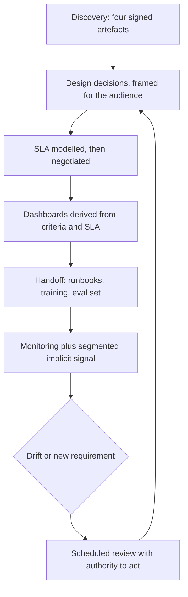
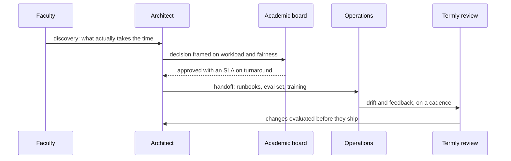

## What Problem Are We Solving?

Every other CCAR-P domain is about building the thing correctly. This one is about whether it was
the right thing, whether anyone approved it understanding what they were approving, and whether it
still works a year after you left.

Those are the failures that don't look like failures. A system that's technically excellent and
solves a problem nobody had. A design deferred twice by a board that couldn't evaluate it. An **SLA** — a
service level agreement, a binding promise about speed, accuracy or availability — signed before
anyone checked it was buildable. A handover that was a slide deck. A quality drop
nobody could diagnose because the only signal was a thumbs-down rate.

None of those is fixed by better engineering, and none of them shows up in a code review. They
share a shape: **the technical work was fine and the human boundary wasn't managed** — the
boundary where a problem becomes a requirement, where a design becomes an approval, where a
project becomes a product, where usage becomes evidence.

The second thread is that this domain runs on **artefacts rather than conversations**. A problem
statement someone signed. A decision record with a revisit condition. An SLA wired to a metric. A
runbook that's been rehearsed. An evaluation set that's been refreshed. Conversations are how they
get made; the artefact is what survives the staff turnover, the reorganisation and the architect
moving on.

> **🗣️ In plain English:** This domain is about the parts that aren't engineering: understanding the real problem, getting it approved by people who don't speak your language, and staying responsible after launch.

## Meet the Moving Parts

| Question | Topic | The artefact |
|---|---|---|
| Are we solving the right problem? | **6.1** Discovery | Problem statement, success criteria, constraints, RACI |
| Can we get it approved? | **6.2** Communicating decisions | A decision record using the four-clause trade-off template |
| What have we promised? | **6.3** SLAs | Committed numbers, each wired to a live metric |
| Who owns it after launch? | **6.4** Lifecycle | Runbooks, training, evaluation set, prompt history |
| How does it keep improving? | **6.5** Feedback loops | Segmented implicit signal plus a refreshed evaluation set |

Three relationships carry the domain.

**6.1's success criteria become 6.3's SLA and 6.4's dashboards.** They're the same numbers at
three stages, and deriving them rather than reinventing them is what stops a dashboard showing
metrics nobody committed to while the committed ones go unwatched.

**6.2 is how 6.1 and 6.3 get agreed at all.** Discovery produces a problem statement someone must
sign; the SLA is a negotiation. Both need a decision framed in the audience's currency rather than
in engineering terms.

**6.4 and 6.5 are the same loop at different cadences.** Lifecycle says responsibility continues
past launch; feedback loops are the mechanism by which that responsibility does anything. A
lifecycle with no feedback loop is a maintenance rota.

> **💡 Tip:** For each of the five, ask what artefact exists and who signed it. A stage whose only output was a meeting has not happened in any way that survives.

## How It Works, Step by Step

1. **Run discovery to four signed artefacts** — problem statement with no technology in it,
   measured success criteria, constraints, RACI with blocking rights (6.1).
2. **Frame every architectural decision in the audience's currency**, with choice, reason,
   trade-off, mitigation and alternative (6.2).
3. **Model SLA feasibility before anyone commits**, and negotiate which dimension relaxes (6.3).
4. **Derive dashboards from the success criteria and the SLA** rather than inventing thresholds
   twice.
5. **Budget handoff as real work**: runbooks, training, evaluation dataset, prompt version history
   (6.4).
6. **Rehearse the runbooks** — the first walkthrough always finds a broken step.
7. **Instrument both feedback signals**, segmenting the noisy one so a movement localises (6.5).
8. **Put review on a cadence**, and refresh the evaluation set with live cases so it keeps
   describing production.



## Minimal Working Implementation

The domain's failures are missing artefacts, so audit a programme for them. Save as
`programme_review.py` and run it — no API key needed.

```python
import json
import sys

AI_HANDOFF = {"evaluation_dataset", "prompt_version_history", "runbooks"}
TRADEOFF_CLAUSES = {"chosen", "reason", "tradeoff", "mitigation",
                    "alternative"}

def review(d: dict) -> list[str]:
    gaps = []
    disc = d.get("discovery", {})
    if disc.get("problem_statement_names_solution"):
        gaps.append("6.1 problem statement names a solution")
    if not disc.get("success_metric_baseline_measured"):
        gaps.append("6.1 success criteria have no measured baseline")
    if not disc.get("raci_blockers_identified"):
        gaps.append("6.1 RACI does not record who can block")
    for dec in d.get("decisions", []):
        if missing := TRADEOFF_CLAUSES - set(dec.get("clauses", [])):
            gaps.append(f"6.2 {dec.get('id')}: missing {sorted(missing)}")
        if not dec.get("revisit_when"):
            gaps.append(f"6.2 {dec.get('id')}: no revisit condition")
    sla = d.get("sla", {})
    if sla and not sla.get("feasibility_modelled_before_signature"):
        gaps.append("6.3 SLA committed without modelling feasibility")
    gaps += [f"6.3 {dim.get('name')}: committed but not observable"
             for dim in sla.get("dimensions", [])
             if not dim.get("telemetry_field")]
    ho = d.get("handoff", {})
    gaps += [f"6.4 handoff missing {m}"
             for m in sorted(AI_HANDOFF - set(ho.get("artefacts", [])))]
    if not ho.get("runbooks_rehearsed"):
        gaps.append("6.4 runbooks never rehearsed - a document, not a "
                    "control")
    fb = d.get("feedback", {})
    if fb.get("implicit") and not fb.get("evaluation_set"):
        gaps.append("6.5 implicit feedback only - can detect that quality "
                    "changed, never why")
    if not fb.get("review_cadence"):
        gaps.append("6.5 no review cadence - the loop is reactive")
    return gaps

if __name__ == "__main__":
    found = review(json.load(open(sys.argv[1], encoding="utf-8")))
    print("\n".join(f"- {g}" for g in found) or "no programme gaps found")
    sys.exit(1 if found else 0)
```

Every check is for an artefact that should exist. None inspects the system, because in this domain
the system is usually fine — which is exactly why these failures survive technical review.

## Production Implementation

Production makes the artefacts a gate at each stage transition, with an owner.

```python
import dataclasses
import datetime as dt

@dataclasses.dataclass(frozen=True)
class StageGate:
    stage: str
    required: tuple[str, ...]
    owner: str
    signed_by: str | None
    signed_on: dt.date | None

GATES = (
    StageGate("discovery",
              ("problem_statement", "success_criteria", "constraints",
               "raci"), "architect", "head-of-operations",
              dt.date(2026, 2, 3)),
    StageGate("design", ("decision_records", "sla_feasibility_model"),
              "architect", "cto", dt.date(2026, 3, 18)),
    StageGate("handoff",
              ("runbooks", "training_session", "evaluation_dataset",
               "prompt_version_history", "dashboards"),
              "architect", None, None),
)

def blocked() -> list[str]:
    """An unsigned gate is a stage that did not happen in a way anyone
    is accountable for."""
    return [g.stage for g in GATES if g.signed_by is None]
```

The numbers flow forward rather than being re-invented at each stage:

```python
def derive_dashboards(criteria, sla_dimensions) -> list[dict]:
    """Discovery's criteria and the SLA are the same numbers the
    dashboard should show. Deriving them stops three versions of the
    truth existing at once."""
    panels = [{"metric": c.metric, "target": c.target,
               "origin": "6.1 success criteria"} for c in criteria]
    panels += [{"metric": d["telemetry_field"], "target": d["target"],
                "origin": "6.3 SLA"} for d in sla_dimensions]
    seen, unique = set(), []
    for p in panels:
        if p["metric"] not in seen:
            seen.add(p["metric"])
            unique.append(p)
    return unique
    # ...
```

**What changed, and why:**

- **Each stage gate names who signed and when.** An artefact nobody signed is a draft, and the
  distinction matters precisely at the review where someone disputes what was agreed.
- **Handoff is a gate, not a milestone.** It's the phase most often under-invested in, and making
  it blocking is the only reliable way to get it budgeted.
- **Dashboards are derived from criteria and SLA.** Three teams inventing thresholds separately is
  how a programme ends up with three versions of what "good" means.
- **The gate list itself is checkable.** `blocked()` surfaces the stage nobody completed — usually
  handoff, usually because the project was considered finished at launch.

## In Production: A Grading Assistant Programme at a University

An assistant that drafts feedback on student submissions for academics to review, across 40
modules and roughly 18,000 submissions a term.



**How the five fit.** Discovery found that drafting wasn't the bottleneck — moderation was, and the
delay was academics waiting on each other's second-marking. The problem statement was rewritten
before any architecture (**6.1**). The board approved it framed on academic workload and
consistency of marking rather than on retrieval quality (**6.2**). The SLA committed to
turnaround, not accuracy — because accuracy of feedback is a matter of academic judgement and
committing to a number would have been indefensible (**6.3**). Handoff went to the central IT
team, with runbooks for term-start load and for a provider outage during an assessment period
(**6.4**). Feedback is segmented by module type, and the evaluation set is refreshed each term
with new submissions (**6.5**).

**What the SLA conversation avoided.** The original proposal included "90% of feedback requires no
substantive edit". Modelling it showed it was measurable only against a definition of "substantive"
that academics wouldn't agree on. Committing to turnaround and monitoring edit rate as an internal
metric gave the same operational control without a number the university would have had to defend
to a student appeals panel.

**What handoff caught.** The runbook rehearsal for term-start load found the scaling procedure
referenced a capacity dashboard that had been decommissioned. Twenty minutes in a rehearsal;
several hours during the first week of term, which is the worst possible week.

**What the feedback loop found.** Thumbs-down rose in one module type — practical lab reports —
and the segmented signal localised it in days. The evaluation set showed the assistant was
applying essay-style feedback conventions to lab reports. A module-type-specific prompt fixed it,
evaluated before shipping.

> **🌍 Real-world example:** The reframing in discovery is the whole programme. "An AI that drafts feedback" would have been built, worked, and saved perhaps 15% of the time academics actually spend — because the drafting was never the slow part. Asking what happens between a submission arriving and a mark being released took one workshop and changed what got built. Every other topic in this domain is downstream of getting that right.

## Where This Applies — and Where It Doesn't

| Situation | Use this | Use instead |
|---|---|---|
| A stated ask names a technology | Discovery back to the problem (6.1) | Designing from the ask |
| Approval needed from non-specialists | The four-clause trade-off template (6.2) | Explaining the mechanics |
| Numbers are being committed | Model feasibility first (6.3) | Signing, then engineering toward it |
| Handing to an operations team | Runbooks, training, eval set, prompt history (6.4) | A slide deck |
| Quality may drift after launch | Segmented implicit signal plus eval set (6.5) | Thumbs-down alone |
| Nobody can say who signed something | Stage gates with named signatories | Assuming it was agreed |
| A two-week internal experiment | — | The full artefact set |

Anti-patterns across the domain: accepting a solution as a problem statement; simplifying rather
than reframing a decision; SLAs agreed before architectural review; handoff as a meeting;
evaluation sets that go stale; and reviews that convene only after an incident.

## Failure Modes Seen in the Wild

### 1. The right system for the wrong problem

**Symptom.** It works, and adoption doesn't follow.
**Cause.** The stated ask was accepted as the requirement (6.1).
**Fix.** A problem statement with no technology in it, signed by the people who feel the pain.

### 2. The deferred decision

**Symptom.** A sound design that can't get approved.
**Cause.** Presented as technical mechanics, or simplified without reframing (6.2).
**Fix.** Choice, reason in their currency, honest trade-off, mitigation, alternative.

### 3. The inherited commitment

**Symptom.** An SLA the architecture cannot meet.
**Cause.** Numbers agreed commercially before feasibility was modelled (6.3).
**Fix.** Bring costed options and say which number each one misses.

### 4. The project that ended at launch

**Symptom.** Quality degrades with no code change and nobody can diagnose it.
**Cause.** Handoff was under-invested and no feedback loop exists (6.4, 6.5).
**Fix.** Runbooks and training as a gate; two feedback signals on a cadence.

> **⚠️ Watch out:** Everything in this domain fails quietly and none of it fails technically — so a team can pass every code review, hit every sprint, ship a system that works, and still produce all five failures. The only reliable detection is to ask, at each stage, which artefact exists and who signed it.

## Exam Lens & Key Takeaway

> **📝 Exam focus:** 14% of the exam, ~9 questions, on architecture's human side. Two question shapes recur. **A project going wrong, and which discovery artefact was missing** — map the symptom to problem statement, success criteria, constraints, or stakeholder map (6.1). And **a failure well after the project ended, and which lifecycle phase was skipped** — usually **handoff** or **monitoring**, not design or implementation (6.4). Beyond those: the **four-clause trade-off template**, and that communicating decisions is **re-framing, not simplification** (6.2); that an **SLA is a design input** whose four dimensions **pull against each other** (6.3); and **implicit versus explicit feedback**, where thumbs up/down spots *that* something changed and only an evaluation set says *what* (6.5). The framing rewarded throughout: "we chose the smaller model with caching because your SLA needs sub-second responses at this volume", not "the smaller model is faster".

> **🔑 Key takeaway:** A technically excellent system is worthless if you built the wrong thing, couldn't get it approved, promised something unbuildable, or walked away at launch — and none of those failures appear in a code review. The domain runs on artefacts rather than conversations: a signed problem statement, a decision record with a revisit condition, an SLA wired to a metric, a rehearsed runbook, a refreshed evaluation set. Ask at every stage which artefact exists and who signed it, because a stage whose only output was a meeting hasn't happened in any way that survives you.
