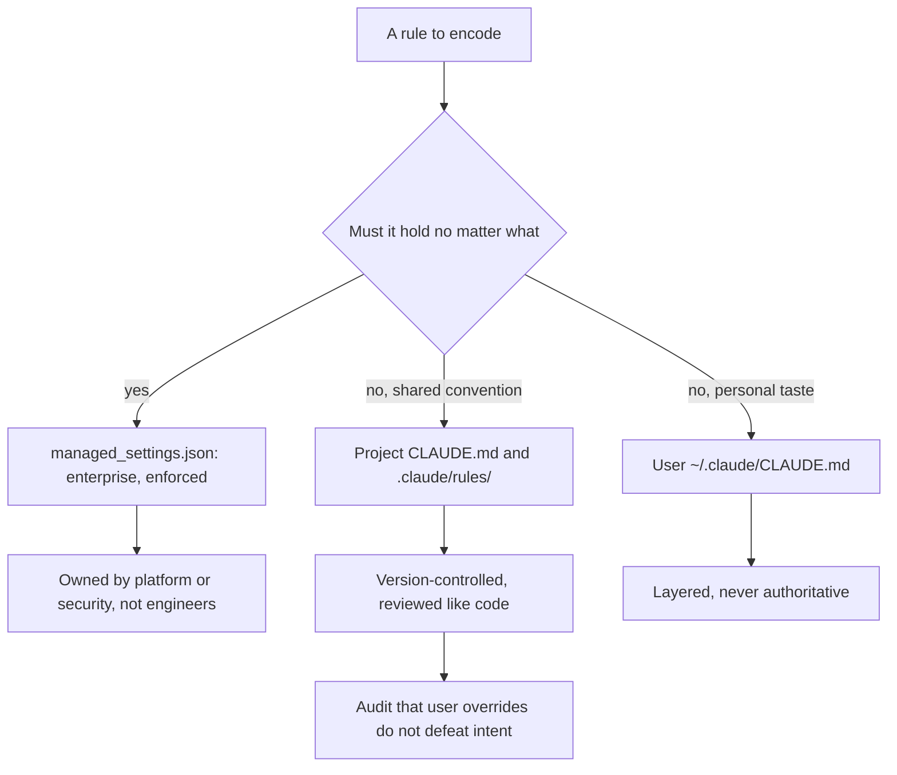
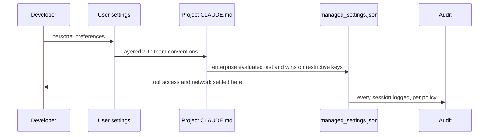

## What Problem Are We Solving?

A medical device manufacturer rolled Claude Code out to 60 engineers working on software that goes
through regulatory submission. Every change to that codebase must be traceable, and certain
directories cannot be modified without a documented review.

The rollout put everything in project `CLAUDE.md` files: the traceability rules, the
don't-touch-this-directory rules, the house style. It was thorough, version-controlled, and
reviewed.

It also wasn't a control. Six weeks in, an engineer working from a personal `~/.claude/CLAUDE.md`
tuned for speed had Claude modify a file under the regulated directory. Nothing malicious — the
project rule said not to, the personal preferences said move fast, and the model resolved a
conflict between two pieces of guidance the way models resolve conflicts between guidance.

The mistake was putting a **restrictive** control in a layer designed for **additive** guidance.
`CLAUDE.md` instructs. `managed_settings.json` enforces. Those are different mechanisms, and
choosing between them is the entire skill this topic tests.

At Foundations the question is what Claude Code can do for one developer. At this level it's how
you configure, govern and operate it across a team — which means reasoning about **which settings
apply, to whom, and who has authority to change them**.

> **🗣️ In plain English:** Project rules are guidance every teammate shares. Enterprise settings are policy nobody can opt out of. If a rule must hold, it belongs in the layer that enforces rather than the one that advises.

## Meet the Moving Parts

| Level | File | Scope | Who controls it |
|---|---|---|---|
| **Enterprise** | `managed_settings.json` | The whole organisation | IT/security admins — **highest authority, cannot be overridden by lower levels** |
| **Project** | `./CLAUDE.md` + `.claude/rules/` | Everyone in this repo | Tech leads and the team, checked into version control |
| **User** | `~/.claude/CLAUDE.md` | One developer, across all their projects | The individual developer |

Think of them as concentric rings: a broader, more authoritative scope enforces baseline
behaviour, and a narrower scope customises **within** those bounds, never outside them.

The nuance the exam turns on: **this is not "last one wins" in every dimension.**

- For genuinely **restrictive** controls — permissions, tool access — **enterprise wins
  outright**. Disabling tools, mandating audit logging, restricting network access are locked at
  this level precisely so no project or individual can silently opt out.
- For **additive** guidance — style rules, project context, architectural conventions — project
  and user content is layered together, with project rules taking precedence over personal
  preference where they conflict.

Project configuration is where teams spend most of their time, because it encodes house style,
testing requirements and "how we do things here" so that every teammate's session behaves
consistently regardless of who is driving.

> **💡 Tip:** Ask of each rule: would I accept an engineer overriding this on their laptop? If no, it's a `managed_settings.json` control, not a `CLAUDE.md` line.

## How It Works, Step by Step

1. **Sort rules by whether they must hold under pressure.** That sort decides the layer.
2. **Put restrictive controls in `managed_settings.json`** — tool access, permissions, network
   restrictions, audit logging.
3. **Put shared conventions in project `CLAUDE.md` and `.claude/rules/`** — style, testing
   requirements, architectural context.
4. **Leave personal preference to `~/.claude/CLAUDE.md`** and expect it to be layered, not
   authoritative.
5. **Version-control the project layer** alongside the code it describes, so it evolves with the
   codebase and goes through the same PR review.
6. **Treat `managed_settings.json` as a security control**, owned by a platform or security team
   rather than by individual engineers.
7. **Audit periodically** that user-level overrides aren't quietly defeating project or enterprise
   intent.
8. **Test the enforcement**, not the documentation — try the thing the rule forbids and confirm
   it's refused.



## Minimal Working Implementation

Precedence is the thing people get wrong, and it behaves differently for the two kinds of setting.
Save as `precedence.py` and run it — no API key needed.

```python
import dataclasses

RESTRICTIVE = {"allowed_tools", "network_access", "audit_logging",
               "permissions"}

@dataclasses.dataclass(frozen=True)
class Layer:
    name: str
    settings: dict

ENTERPRISE = Layer("enterprise (managed_settings.json)", {
    "allowed_tools": {"Read", "Grep", "Glob", "Edit"},
    "network_access": False,
    "audit_logging": True,
    "style": ("British spelling in user-facing strings",)})
PROJECT = Layer("project (CLAUDE.md, .claude/rules/)", {
    "allowed_tools": {"Read", "Grep", "Glob", "Edit", "Bash"},
    "style": ("run the linter before proposing a diff",
              "never modify /regulated without a documented review")})
USER = Layer("user (~/.claude/CLAUDE.md)", {
    "allowed_tools": {"Read", "Grep", "Glob", "Edit", "Bash", "WebFetch"},
    "network_access": True,
    "style": ("keep commit messages terse",)})

def resolve(layers: list[Layer]) -> dict:
    """Restrictive settings: the most authoritative layer wins outright.
    Additive guidance: layered, broader first, narrower appended."""
    out: dict = {}
    for layer in layers:                      # enterprise -> user
        for key, value in layer.settings.items():
            if key in RESTRICTIVE:
                out.setdefault(key, value)    # first (highest) wins
            else:
                out[key] = out.get(key, ()) + value
    return out

final = resolve([ENTERPRISE, PROJECT, USER])
print(f"allowed_tools  {sorted(final['allowed_tools'])}")
print(f"network_access {final['network_access']}")
print(f"audit_logging  {final['audit_logging']}")
print("style (layered, broad to narrow):")
for rule in final["style"]:
    print(f"  - {rule}")
```

Note what happens to `Bash` and `WebFetch`: the project and the user both ask for them and neither
gets them, because `allowed_tools` is restrictive and the enterprise layer settled it. Meanwhile
every style rule from all three layers survives, because guidance is additive. Same config file
shape, two completely different merge semantics.

## Production Implementation

Production makes the layer choice explicit per rule, and audits that the intent holds.

```python
import dataclasses

@dataclasses.dataclass(frozen=True)
class Rule:
    text: str
    must_hold: bool           # would you accept a local override?
    owner: str

def correct_layer(r: Rule) -> str:
    """The sort that decides everything. A must-hold rule in CLAUDE.md
    is guidance wearing the costume of a control."""
    return ("managed_settings.json" if r.must_hold
            else "project CLAUDE.md / .claude/rules/")

RULES = (
    Rule("no outbound network except via the approved MCP proxy",
         must_hold=True, owner="platform-security"),
    Rule("never modify /regulated without a documented review",
         must_hold=True, owner="quality-assurance"),
    Rule("run the linter before proposing a diff",
         must_hold=False, owner="tech-lead"),
    Rule("prefer table-driven tests", must_hold=False, owner="tech-lead"),
)

def misplaced(rules, current: dict) -> list[str]:
    return [f"{r.text!r}: in {current.get(r.text)}, should be "
            f"{correct_layer(r)}"
            for r in rules if current.get(r.text) != correct_layer(r)]
```

The audit tests enforcement rather than reading configuration:

```python
def enforcement_probe(forbidden_action: str, attempt) -> str:
    """Reading the config tells you what it says. Only attempting the
    forbidden action tells you whether it holds."""
    try:
        attempt()
    except PermissionError as exc:
        return f"ENFORCED: {forbidden_action} refused ({exc})"
    return (f"NOT ENFORCED: {forbidden_action} succeeded - the rule is "
            f"guidance, not a control")

def user_override_audit(user_settings: dict) -> list[str]:
    """User-level keys that touch restrictive settings are a smell even
    when precedence defeats them - they signal intent to opt out."""
    return [f"user layer attempts to set {k} - restrictive, will be "
            f"ignored, but worth a conversation"
            for k in user_settings if k in RESTRICTIVE]
    # ...
```

**What changed, and why:**

- **`must_hold` is the field that decides the layer.** Framing it as a question an engineer can
  answer — would you accept a local override? — turns a subtle precedence question into a
  mechanical one.
- **Every rule has an owner.** A restrictive control owned by the team it restricts is not a
  control; `managed_settings.json` belongs to platform or security.
- **The audit probes enforcement rather than reading config.** The manufacturer's original setup
  read correctly and enforced nothing, which is the exact failure a config review misses.
- **User attempts to set restrictive keys are surfaced.** Precedence defeats them, so they're
  harmless — and they tell you which rules engineers are trying to work around, which is worth
  knowing before someone finds a route that works.

## In Production: A Regulated Codebase at a Medical Device Manufacturer

60 engineers, three repositories under regulatory scope, and a submission process that requires
every change to be traceable.



**The incident.** A regulated file modified because a restrictive rule lived in an advisory layer.
No harm reached a submission — it was caught in code review — but the regulatory question "could
this have happened?" had the wrong answer, and answering it took a week of reconstructing what
each engineer's local configuration had been.

**The restructure.** Four rules moved from project `CLAUDE.md` into `managed_settings.json`: tool
allowlist, network restriction, mandatory audit logging, and write-protection on the regulated
paths. Eleven rules stayed in the project layer, where they belong — linting, test conventions,
architectural context.

**What the enforcement probe found.** Running the audit against the new setup caught a gap nobody
had noticed: the write-protection covered `/regulated` but not `/regulated-test`, which had been
added later and shares the traceability requirement. Reading the config would not have shown that,
because the config was correct about what it covered.

**The audit answer afterwards.** The next regulatory review asked the same question — could the
tooling have modified a controlled file, or sent code to an external service? The answer traced to
an enterprise control owned by platform security, independent of anything any project or developer
configured. That independence is the entire point of the hierarchy.

**What stayed additive, deliberately.** The style rules from all three layers coexist. An engineer
who prefers terse commit messages gets that, and the project's linting requirement still applies,
and the enterprise spelling convention still applies. Nobody had to choose, because guidance
layers.

> **🌍 Real-world example:** The `/regulated-test` gap is the reason the probe matters more than the review. Three people had read the `managed_settings.json` and confirmed it was correct — and it was correct, about the directory it named. Only attempting the forbidden write in a directory added six months later revealed that the rule's coverage had drifted from the codebase's shape. Configuration review checks what a rule says; only an attempt checks what it protects.

## Where This Applies — and Where It Doesn't

| Situation | Use this | Use instead |
|---|---|---|
| A rule must hold regardless of local config | `managed_settings.json` | A line in `CLAUDE.md` |
| Tool access, permissions, network | Enterprise layer — restrictive, wins outright | Project or user layers |
| House style, testing conventions, context | Project `CLAUDE.md` and `.claude/rules/` | Enterprise, which over-restricts |
| Personal preference | User `~/.claude/CLAUDE.md` | Project, which imposes it on everyone |
| Team conventions that should evolve with code | Version-controlled project layer, PR-reviewed | An unversioned shared doc |
| Verifying a control works | Attempt the forbidden action | Reading the configuration |
| A solo developer | — | The full hierarchy; user and project suffice |

Anti-patterns: restrictive rules in advisory layers; `managed_settings.json` owned by the engineers
it governs; project configuration not in version control; assuming "last one wins" for every
setting; and confirming a control by reading it rather than testing it.

## Failure Modes Seen in the Wild

### 1. The rule in the advisory layer

**Symptom.** A documented prohibition is violated by someone following different local guidance.
**Cause.** A restrictive rule was written in `CLAUDE.md`, which instructs rather than enforces.
**Fix.** Move it to `managed_settings.json`, where precedence makes it non-overridable.

### 2. "Last one wins" applied everywhere

**Symptom.** Surprise at which setting took effect.
**Cause.** Assuming a uniform merge; restrictive and additive settings resolve differently.
**Fix.** Know which keys are restrictive — enterprise wins outright — and which layer.

### 3. The control owned by the controlled

**Symptom.** A security setting quietly relaxed during a deadline.
**Cause.** `managed_settings.json` was editable by the engineering team it governs.
**Fix.** Platform or security ownership, with changes reviewed outside the team.

### 4. Coverage drift

**Symptom.** A rule that is correct and no longer covers what it was written to protect.
**Cause.** Paths and structures moved; the rule named the old shape.
**Fix.** Probe enforcement periodically rather than reviewing configuration.

> **⚠️ Watch out:** A `CLAUDE.md` rule and a `managed_settings.json` control read almost identically and behave completely differently under pressure — one is advice the model weighs against other advice, the other is a boundary it cannot cross. The distinction is invisible in a config review and decisive in an incident review.

## Exam Lens & Key Takeaway

> **📝 Exam focus:** Know the **three levels, their files and their owners**: **enterprise** (`managed_settings.json`, whole organisation, IT/security admins, **highest authority and cannot be overridden by lower levels**), **project** (`./CLAUDE.md` plus `.claude/rules/`, everyone in the repo, tech leads, checked into version control), and **user** (`~/.claude/CLAUDE.md`, one developer across all their projects). They're concentric rings: a broader scope enforces baseline behaviour, narrower scopes customise *within* those bounds. The tested nuance is that this is **not simple "last one wins"**: for **restrictive** controls — permissions, tool access — **enterprise wins outright**, which is why disabling tools, mandating audit logging and restricting network access are locked there; for **additive** guidance like style and project context, project and user content is **layered**, project taking precedence over personal preference. Operationally: version-control the project layer with the code, treat `managed_settings.json` as a security control owned by platform/security, and audit that user overrides aren't defeating higher-level intent.

> **🔑 Key takeaway:** The layer you put a rule in decides whether it's guidance or a boundary, and the sort is one question: would you accept an engineer overriding this locally? If not, it belongs in `managed_settings.json`, where restrictive settings win outright and no project or individual can opt out — while style and convention layer additively across all three. And verify controls by attempting the forbidden action, because a configuration review tells you what a rule says, not what it actually protects.
