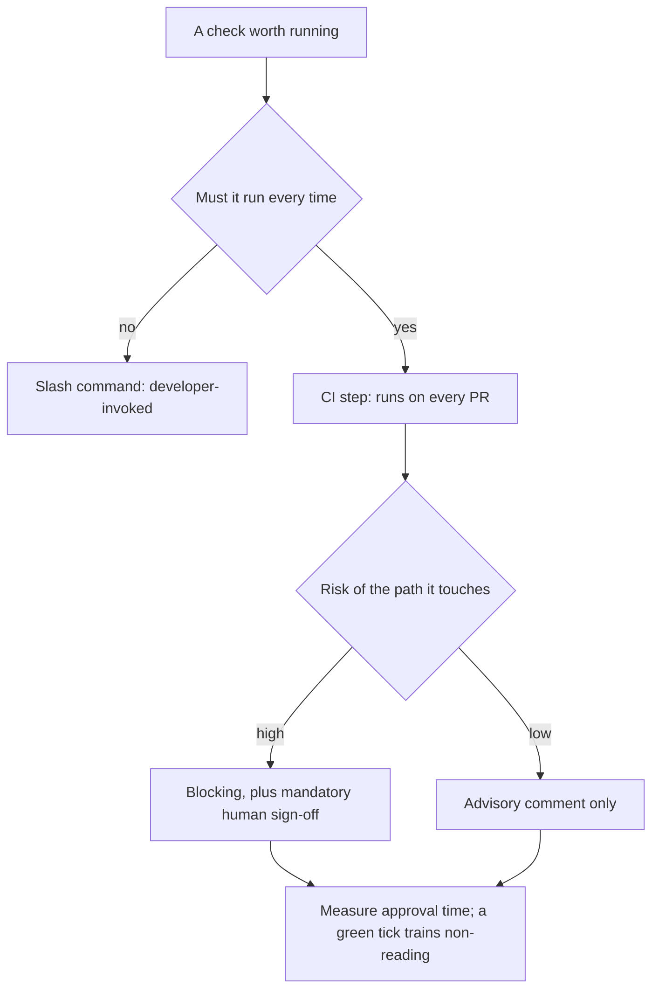
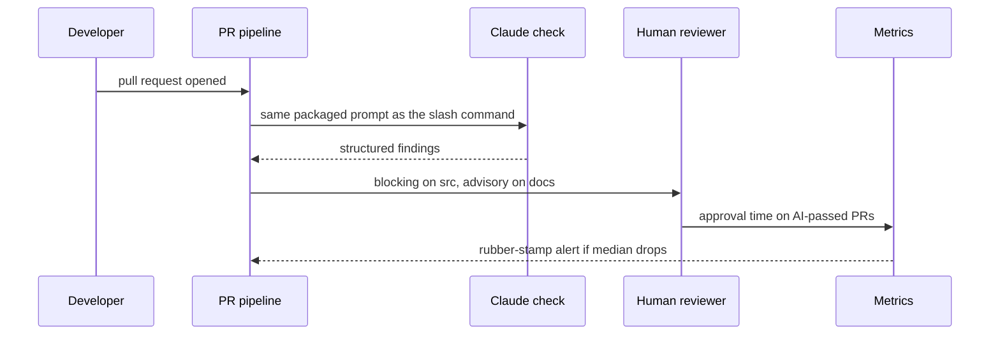

## What Problem Are We Solving?

A publishing platform's engineering team built a good `/code-review` slash command. It checked
security patterns, style, and edge cases the team kept missing, and it worked well.

Six months later, review quality was worse than before it existed.

Two things had happened. Under deadline pressure, developers stopped invoking it — it was optional
and optional things lose to a release date. And the reviewers who used to apply the checklist from
memory had stopped, because the tool existed. The team had removed a habit and replaced it with
something nobody was obliged to run.

They fixed that by moving the same logic into a CI step, which produced the opposite failure. It
now ran on every PR, consistently, and within two months engineers were merging on a green AI
check without reading it — including on the payments module, where a subtly wrong authorisation
change went through with an approving comment from the bot and a rubber-stamp from a human who
trusted it.

The distinction is the topic. **A slash command is a tool; a CI-integrated gate is a policy.** They
have different trigger models, different consistency properties and — crucially — opposite failure
modes: the tool fails by underuse, the gate fails by overuse and misplaced trust.

Choosing between them, and deciding what happens on failure, is the architectural work.

> **🗣️ In plain English:** If a developer has to remember to run it, they won't under pressure. If the pipeline runs it every time, people stop reading it. Both are real, and they need different answers.

## Meet the Moving Parts

Five patterns, from interactive toward fully automated:

- **Automated code review via slash commands** — a repeatable review prompt packaged so anyone can
  trigger a consistent first pass, instead of relying on a reviewer's memory of the checklist.
- **CI/CD integration for quality gates** — the same logic run headlessly against the diff, where
  the result becomes a gate a merge cannot bypass. This is the shift from on-demand assistant to
  enforced control.
- **PR review workflows triggered by Claude** — responding to PR events and posting review comments
  directly, automatically and consistently on every change.
- **Test generation for new code** — raising coverage and giving the author a second perspective on
  edge cases.
- **Documentation generation from code** — reducing doc drift, because generation is triggered by
  the same event as the code change.

| Dimension | Interactive (developer-invoked) | Pipeline-triggered (CI/CD) |
|---|---|---|
| Trigger | Developer runs a slash command | PR opened or updated, commit pushed |
| Human in the loop | Yes, at invocation | Only when reviewing output afterwards |
| Consistency | Depends on remembering to invoke | Runs identically every time |
| Best for | Exploratory review, one-offs, learning | Enforced gates, mandatory checks, audit trails |
| **Failure mode** | **Underuse** — skipped under deadline pressure | **Overuse** — treated as infallible, no human backstop |

The architectural decisions, and they're the exam's framing too: **what triggers the workflow, what
happens on failure** (block the merge, or just comment?), **who is accountable if the automated
check is wrong**, and **how you avoid rubber-stamping AI output** as a substitute for human
judgment on high-risk changes.

> **💡 Tip:** Decide blocking versus advisory per code path, not per tool. The same check can be advisory on documentation and blocking on the auth module.

## How It Works, Step by Step

1. **Decide whether the check is a tool or a policy.** Optional means it will be skipped when it
   matters most.
2. **Package the logic once** as a slash command, so interactive and pipeline paths run the same
   prompt.
3. **Wire it into CI** for anything that must run consistently.
4. **Choose blocking or advisory per path**, from the risk of the code it touches.
5. **Name who is accountable when the check is wrong** — both a false block and a false pass.
6. **Require human sign-off on high-risk paths regardless of the AI result**, so the gate augments
   rather than replaces judgment.
7. **Vary what the human sees on those paths** — a green tick trains people not to read.
8. **Measure the gate**: false-block rate, and how long humans spend on approvals it passed.



## Minimal Working Implementation

The policy is per path, and writing it down is what stops it being per tool. Save as `gates.py`
and run it — no API key needed.

```python
import dataclasses
import fnmatch

@dataclasses.dataclass(frozen=True)
class PathPolicy:
    pattern: str
    blocking: bool
    human_signoff: bool       # required regardless of the AI result
    accountable: str

POLICIES = (
    PathPolicy("src/payments/**", True, True, "payments-tech-lead"),
    PathPolicy("src/auth/**", True, True, "platform-security"),
    PathPolicy("src/**", True, False, "owning-team"),
    PathPolicy("docs/**", False, False, "owning-team"),
    PathPolicy("**/*.md", False, False, "owning-team"),
)

def policy_for(path: str) -> PathPolicy:
    for p in POLICIES:                       # most specific first
        if fnmatch.fnmatch(path, p.pattern):
            return p
    return POLICIES[-1]

def decide(changed: list[str], ai_passed: bool) -> dict:
    applied = {policy_for(p) for p in changed}
    blocking = [p for p in applied if p.blocking]
    signoff = sorted({p.accountable for p in applied if p.human_signoff})
    merge_blocked = bool(blocking) and not ai_passed
    return {"merge_blocked": merge_blocked,
            "human_signoff_required": signoff,
            "note": ("AI check is advisory on these paths"
                     if not blocking else
                     "AI check gates the merge")}

CASES = [
    (["docs/api.md"], False),
    (["src/search/index.ts"], False),
    (["src/payments/refund.ts"], True),
]
for changed, passed in CASES:
    d = decide(changed, passed)
    print(f"{changed[0]:28} ai_passed={str(passed):5} "
          f"blocked={str(d['merge_blocked']):5} "
          f"signoff={d['human_signoff_required'] or 'none'}")
```

The third row is the important one. The AI check **passed**, and human sign-off is still required,
because the path is high-risk. A gate that only asks for a human when the AI is unhappy is a gate
that trusts the AI to know when it's wrong.

## Production Implementation

Production runs one packaged prompt from both paths and measures whether the humans are actually
reading.

```python
import dataclasses

@dataclasses.dataclass(frozen=True)
class Workflow:
    name: str
    trigger: str              # slash_command | pr_opened | pr_updated
    prompt_ref: str           # the same packaged prompt both paths use
    on_failure: str           # block | comment
    accountable: str

WORKFLOWS = (
    Workflow("code_review", "pr_opened", ".claude/commands/code-review.md",
             "block", "owning-team"),
    Workflow("code_review_adhoc", "slash_command",
             ".claude/commands/code-review.md", "comment", "developer"),
    Workflow("test_gaps", "pr_updated", ".claude/commands/test-gaps.md",
             "comment", "owning-team"),
    Workflow("doc_drift", "pr_updated", ".claude/commands/doc-drift.md",
             "comment", "owning-team"),
)

def divergent_prompts() -> list[str]:
    """Interactive and pipeline must run the same logic, or a developer's
    local pass says something different from the gate."""
    by_name: dict[str, set] = {}
    for w in WORKFLOWS:
        by_name.setdefault(w.name.split("_adhoc")[0], set()).add(w.prompt_ref)
    return [n for n, refs in by_name.items() if len(refs) > 1]
```

Rubber-stamping is the gate's characteristic failure, so it gets its own metric:

```python
import collections
import statistics

approvals = collections.defaultdict(list)

def record(path_class: str, seconds: float, ai_passed: bool) -> None:
    if ai_passed:
        approvals[path_class].append(seconds)

def rubber_stamp_alert(floor: float = 20.0) -> list[str]:
    """On AI-passed PRs, how long does a human spend before approving?
    Consistently under the floor means the tick is being read, not the
    review."""
    return [f"{cls}: median approval {statistics.median(s):.0f}s on "
            f"AI-passed PRs - the gate is being rubber-stamped"
            for cls, s in approvals.items()
            if len(s) >= 30 and statistics.median(s) < floor]
    # ...
```

**What changed, and why:**

- **Both paths reference the same packaged prompt.** If the interactive command and the CI gate
  drift apart, a developer's local pass stops predicting the gate, and they stop running it —
  which reintroduces the underuse failure through a side door.
- **`on_failure` is explicit per workflow.** Block versus comment is the decision that turns a tool
  into a policy, and leaving it implicit means it gets decided by whoever wires the pipeline.
- **Accountability is recorded per workflow.** A false block costs a team time and a false pass
  costs them an incident; both need someone who owns tuning it.
- **Approval time on AI-passed PRs is measured.** This is the only visible signal of
  rubber-stamping, and it's the same instrument as over-reliance in 5.5 — the human factor doesn't
  announce itself.

## In Production: A PR Pipeline at a Publishing Platform

About 180 pull requests a week across 14 services, including a payments module handling
subscriptions.



**The slash-command-only era.** Invocation rate fell from 78% in month one to 31% by month six,
with the steepest drops in release weeks. Review quality measured against escaped defects was
*worse* than the pre-tool baseline, because the informal checklist habit had been displaced by a
tool nobody was running.

**The gate-only era.** 100% coverage, and median human approval time on AI-passed PRs fell to 14
seconds. The payments incident followed: an authorisation change that the check had commented
approvingly on, merged with a human approval nobody would describe as a review.

**What they run now.** One packaged prompt, invoked both ways. Blocking on `src/**`, advisory on
docs. Mandatory human sign-off on payments and auth **regardless of the AI result**, with the
reviewer shown the diff and the findings rather than a summary tick — the UI deliberately does not
render a green check on those paths.

**What the UI change did.** Median approval time on payments PRs went from 14 seconds to 3.1
minutes, and the override rate — humans disagreeing with an AI-passed finding — rose from
effectively zero to 4.7%. Those overrides were the reviews that had not been happening.

**The measured cost.** The gate adds about 40 seconds to PR feedback and roughly $190 a month.
Small PRs merge faster than before, because trivial nits are caught immediately rather than waiting
on a human. The payments path is deliberately slower, and that's the design.

> **🌍 Real-world example:** The two eras are the same team making opposite mistakes with the same check. What changed on the third attempt wasn't the prompt — it was identical — but the trigger model, the per-path blocking policy, and one UI decision to not show a green tick where a human's judgment was load-bearing. The engineering was done in month one; the architecture took two incidents.

## Where This Applies — and Where It Doesn't

| Situation | Use this | Use instead |
|---|---|---|
| A check that must run every time | CI-integrated gate | A slash command people may skip |
| Exploratory review or learning | Slash command, developer-invoked | A blocking gate |
| Low-risk paths like documentation | Advisory comment | Blocking the merge |
| High-risk paths: payments, auth | Blocking **plus** mandatory human sign-off | Trusting a green check |
| New code with thin coverage | Test generation in the workflow | Hoping the author remembers |
| Public API signatures changing | Documentation generation on the same event | Periodic doc sweeps |
| Humans approving in seconds | Change what they're shown | Assuming review is happening |
| A one-person project | — | Pipeline machinery |

Anti-patterns: optional checks on things that matter; blocking gates on low-risk paths that train
people to click through; interactive and pipeline prompts drifting apart; no named accountability
for a wrong check; and treating an AI gate as a substitute for human judgment on high-risk code.

## Failure Modes Seen in the Wild

### 1. Underuse

**Symptom.** A good tool with a falling invocation rate, worst in release weeks.
**Cause.** It's optional, and optional loses to a deadline.
**Fix.** Move it into CI where it runs regardless — for the checks that genuinely must.

### 2. Rubber-stamping

**Symptom.** 100% coverage and humans approving in seconds.
**Cause.** A consistently-green gate trains people that reading is unnecessary.
**Fix.** Mandatory sign-off on high-risk paths, changed UI, and measure approval time.

### 3. Divergent prompts

**Symptom.** The local check passes and the gate fails, or vice versa.
**Cause.** Interactive and pipeline versions maintained separately.
**Fix.** One packaged prompt referenced by both.

### 4. Uniform blocking

**Symptom.** Developers routinely overriding or bypassing the gate.
**Cause.** Blocking applied everywhere, including paths where it isn't warranted.
**Fix.** Per-path policy — advisory where the risk doesn't justify a block.

> **⚠️ Watch out:** The two failure modes are opposites, so fixing one moves you toward the other. Making a check mandatory removes underuse and creates the conditions for rubber-stamping; keeping it optional avoids misplaced trust and guarantees it gets skipped when the pressure is on. The stable position is per-path policy plus a human requirement that doesn't depend on what the AI said.

## Exam Lens & Key Takeaway

> **📝 Exam focus:** Know the **five patterns**: **automated code review via slash commands** (a repeatable prompt anyone can trigger, replacing reliance on a reviewer's memory), **CI/CD integration for quality gates** (the same logic run headlessly so the result gates a merge — the shift from on-demand assistant to **enforced control**), **PR review workflows triggered by Claude**, **test generation**, and **documentation generation from code** (reducing doc drift, since it triggers on the same event as the change). The tested contrast is **interactive versus pipeline-triggered** and their **opposite failure modes**: interactive fails by **underuse** (skipped under deadline pressure), pipeline by **overuse** (an AI gate treated as infallible, no human backstop). The architectural decisions framed: **what triggers the workflow, what happens on failure (block or comment), who is accountable if the check is wrong, and how you avoid rubber-stamping AI output** on high-risk changes.

> **🔑 Key takeaway:** A slash command is a tool and a CI gate is a policy, and they fail in opposite directions — one gets skipped when it matters, the other gets trusted when it shouldn't be. Package the logic once so both paths run the same check, then decide blocking versus advisory **per code path** rather than per tool, require human sign-off on high-risk paths regardless of what the AI concluded, and measure approval time — because a consistently green check trains people not to read, and nothing else will tell you that it has.
