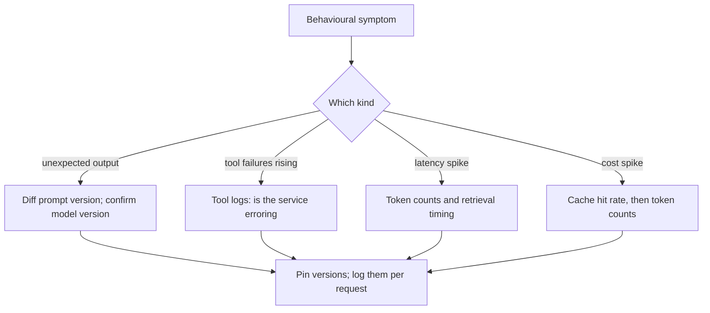
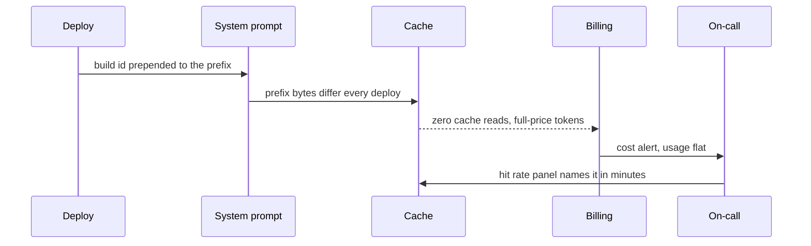

## What Problem Are We Solving?

An e-learning platform's on-call engineer got a cost alert on a Tuesday: spend on the course
assistant had tripled overnight. Usage was flat.

The first two days went into capacity work — someone assumed a traffic spike the dashboard wasn't
showing, then looked for a retry loop. Neither existed. The cause was a deploy on Monday evening
that had added a build identifier to the top of the system prompt. It changed per deploy, which
invalidated the cache prefix, and every request reverted to full-price uncached tokens.

Nothing in the system was broken. The prompt was fine, the model was fine, the tools were fine.
One byte moved and the economics changed.

Debugging here looks different from traditional software debugging. There's usually no stack trace
pointing at a line number. You're diagnosing **behavioural** problems — it did something wrong,
got slower, got more expensive — and the first job is narrowing down **which layer** is responsible
before going deeper.

The layers stack: the model, the prompt, the tools it calls, the retrieval or context you feed it,
and the caching layer underneath. Most operational issues trace to a change in exactly one of
them, and each symptom points at a different layer with enough regularity to be worth memorising.

The operational discipline that makes it tractable: **treat prompt and model versions like
dependency versions** — pin them, log which one served every request, and diff them the moment
behaviour looks off.

> **🗣️ In plain English:** There's no stack trace. Work out which layer moved — prompt, model, tool, retrieval or cache — and the symptom usually tells you which one to open first.

## Meet the Moving Parts

| Symptom | Check first | Why |
|---|---|---|
| **Unexpected output** | **Prompt version and model version** | The commonest root cause, and easy to miss because "nothing changed" is rarely true — a template edit, even whitespace or ordering, shifts behaviour; or the model was upgraded, sometimes silently if you point at a rolling alias |
| **Tool call failures increasing** | **Tool logs — is the external service erroring?** | Claude faithfully reports or retries whatever the tool gives it; look **downstream** before assuming tool-selection logic regressed |
| **Latency spike** | **Token counts and retrieval timing** | Response time is driven by tokens processed and how long retrieval takes; prompts silently growing explains far more regressions than anything in the model |
| **Costs suddenly higher** | **Cache hit rate, then token counts** | Frequently not usage growth at all — a prefix changed, the cache-eligible prefix stopped matching, and every request reverted to full price |

How this differs from traditional debugging:

| Aspect | Traditional | LLM / agentic |
|---|---|---|
| Primary artefact | Stack trace, exception, line number | Behaviour transcript, prompt/response pair |
| Same input, same output? | Usually — deterministic | **Not guaranteed** — version drift changes behaviour with no code change |
| First question | What changed in the code? | What changed in the **prompt, model version, tools, or retrieved context**? |
| Common blind spot | Off-by-one, null pointer | **Silent model upgrade, cache invalidation, prompt drift** |
| Root-cause layer | Usually one file | Could be any of five layers — isolate which first |

The two blind spots are worth naming because neither appears in a diff: a **rolling model alias**
updating underneath you, and a **cache prefix** broken by a byte nobody thought of as content.

> **💡 Tip:** Log the model version and prompt version on every request. Both failures above are invisible without it and obvious with it.

## How It Works, Step by Step

1. **Classify the symptom** — wrong output, tool failures, latency, cost — before forming any
   hypothesis.
2. **Check what changed in the window**, across all five layers, not just the code.
3. **Diff the prompt against the last known-good version**, including whitespace and ordering.
4. **Confirm which model version actually served the requests**, not which one you think you're
   pointed at.
5. **For tool failures, look downstream first** — the tool's own logs and error rates.
6. **For latency, compare token counts and time retrieval separately** from generation.
7. **For cost, check cache hit rate before anything else** — invalidation is the usual answer.
8. **Pin what you can**, and alert on unexpected version changes.



## Minimal Working Implementation

The diagnosis is a correlation between a symptom and what changed. Save as `triage.py` and run it
— no API key needed.

```python
import dataclasses

@dataclasses.dataclass(frozen=True)
class Window:
    # what the request logs say about the period in question
    prompt_version_changed: bool
    model_version_changed: bool
    model_alias_is_rolling: bool
    tool_error_rate: float
    mean_input_tokens: int
    baseline_input_tokens: int
    cache_hit_rate: float
    baseline_cache_hit_rate: float
def diagnose(symptom: str, w: Window) -> list[str]:
    out = []
    if symptom == "unexpected_output":
        if w.prompt_version_changed:
            out.append("PROMPT: version changed - diff it, including "
                       "whitespace and block ordering")
        if w.model_version_changed:
            out.append("MODEL: version changed - commonest cause, and "
                       "not in any diff")
        elif w.model_alias_is_rolling:
            out.append("MODEL: rolling alias - an upgrade can land "
                       "without you deploying anything")
    if symptom == "tool_failures" and w.tool_error_rate > 0.02:
        out.append(f"TOOL: downstream errors {w.tool_error_rate:.1%} - "
                   f"look at the service, not the selection logic")
    growth = w.mean_input_tokens / max(w.baseline_input_tokens, 1)
    if symptom == "latency" and growth > 1.2:
        out.append(f"TOKENS: input up {growth:.1f}x - prompts grew; "
                   f"time retrieval separately from generation")
    cache_dropped = w.cache_hit_rate < w.baseline_cache_hit_rate - 0.2
    if symptom == "cost" and cache_dropped:
        out.append(f"CACHE: hit rate {w.cache_hit_rate:.0%} vs baseline "
                   f"{w.baseline_cache_hit_rate:.0%} - a prefix byte "
                   f"changed; check for build ids or timestamps")
    return out or ["no layer implicated - widen the window"]
TUESDAY = Window(prompt_version_changed=True, model_version_changed=False,
                 model_alias_is_rolling=False, tool_error_rate=0.004,
                 mean_input_tokens=7100, baseline_input_tokens=7050,
                 cache_hit_rate=0.02, baseline_cache_hit_rate=0.94)

for symptom in ("cost", "latency", "unexpected_output"):
    print(f"{symptom}: " + " | ".join(diagnose(symptom, TUESDAY)))
```

Same window, three different questions. Asked about cost it names the cache; asked about latency
it correctly finds nothing, because token counts barely moved. That's the value of classifying the
symptom first — the e-learning team spent two days on capacity because they never asked which
layer the *cost* symptom pointed at.

## Production Implementation

Production logs the two invisible things and alerts on them, so neither failure can be silent.

```python
import dataclasses

@dataclasses.dataclass(frozen=True)
class RequestLog:
    """The fields that make the two blind spots visible."""
    request_id: str
    model_version: str        # what actually served it, not the alias
    prompt_version: str
    input_tokens: int
    cache_read_tokens: int
    tool_errors: int
    model_ms: float

def cache_hit_rate(log: RequestLog) -> float:
    total = log.cache_read_tokens + log.input_tokens
    return log.cache_read_tokens / total if total else 0.0

def version_alerts(seen: set[str], pinned: str) -> list[str]:
    """A model version you did not deploy is the definition of a silent
    upgrade. Alert on it rather than discovering it in a symptom."""
    unexpected = seen - {pinned}
    return [f"unexpected model version {v} served requests - pinned is "
            f"{pinned}" for v in sorted(unexpected)]
```

Cache hit rate is a first-class operational metric, not an afterthought:

```python
import collections

recent = collections.deque(maxlen=500)

def observe(log: RequestLog) -> None:
    recent.append(cache_hit_rate(log))

def cost_alert(baseline: float = 0.90, drop: float = 0.20) -> str | None:
    if len(recent) < 100:
        return None
    rate = sum(recent) / len(recent)
    if rate < baseline - drop:
        return (f"cache hit rate {rate:.0%} vs baseline {baseline:.0%} - "
                f"expect a proportional cost rise; something in the "
                f"prefix changed, not your traffic")
    return None
    # ...
```

**What changed, and why:**

- **`model_version` records what *served* the request, not the alias requested.** A rolling alias
  is the one change that reaches production without anyone deploying, and logging the resolved
  version is what turns it from a mystery into a line in a log.
- **`prompt_version` is on every request.** Prompts change without a deploy; without a version
  stamp, "we changed the prompt last week" and "behaviour changed last week" stay unjoinable
  (3.6 makes the same point about quality).
- **Cache hit rate is monitored with a baseline.** Cost spikes are usually invalidation rather than
  volume, and the hit rate is the fastest possible diagnosis — two days of capacity work reduced
  to one panel.
- **Unexpected versions alert rather than await a symptom.** By the time behaviour looks wrong,
  you're debugging; the version alert arrives before anyone notices.

## In Production: A Cost Spike at an E-Learning Platform

A course assistant answering student questions across 400 modules, roughly 90,000 requests a day,
with a 7,000-token instruction and syllabus prefix cached on every call.



**The two days.** Spent on capacity and retry hypotheses, because the symptom was read as a
traffic problem. Nobody looked at cache hit rate, which had gone from 94% to 2% on the Monday
evening deploy and stayed there.

**The cause.** A build identifier added to the top of the system prompt for traceability — a
sensible change, made by someone who reasonably did not think of the system prompt as a cache key.
It changed per deploy, which is exactly often enough to destroy caching and rarely enough that
nobody connected it to a deploy three days earlier.

**The fix, and the structural fix.** Immediately: move the build id into the user message, after
the cache breakpoint. Structurally: cache hit rate became a monitored metric with an alert at 20
points below baseline, and the same panel now sits on the on-call dashboard next to cost.

**The second thing it caught.** Six weeks later the alert fired again, this time from a different
cause — a conditional section had been added to the system prompt for beta users, fragmenting the
prefix into two variants. Caught within the hour rather than after a billing cycle.

**The model-version discipline.** Separately, the team found they were pointed at a rolling alias
on one path. They pinned it and added version logging. Three months later an unexpected-version
alert fired on a path someone had deployed without pinning, which is precisely the case that would
otherwise have surfaced as "the assistant is behaving oddly" a week later.

> **🌍 Real-world example:** The build id is the detail worth carrying, because the change was good practice. Adding traceability to a prompt is the sort of thing a careful engineer does. It was also invisible as a cost decision, because nothing in a code review flags "this string is a cache key". The structural fix wasn't a rule against build ids — it was making cache hit rate a metric someone would see the next morning.

## Where This Applies — and Where It Doesn't

| Situation | Use this | Use instead |
|---|---|---|
| Unexpected output | Diff prompt version; confirm the serving model version | Assuming the parsing code broke |
| Tool call failures rising | The tool's own logs and error rates | Suspecting tool-selection logic |
| Latency spike | Token counts, and time retrieval separately | Assuming the provider is slow |
| Cost spike with flat usage | Cache hit rate, first | Capacity or traffic investigation |
| "Nothing changed" | Check versions — it's rarely true | Taking it at face value |
| Behaviour differs run to run | Expected; compare distributions | Hunting for a deterministic bug |
| A genuine code exception | An ordinary stack trace | Layer triage |

Anti-patterns: debugging without per-request model and prompt versions; pointing at a rolling alias
in production; treating cache hit rate as an afterthought; assuming a cost rise means more usage;
and suspecting the model's logic when a downstream service is erroring.

## Failure Modes Seen in the Wild

### 1. The silent model upgrade

**Symptom.** Behaviour changes overnight with no deploy.
**Cause.** A rolling alias rather than a pinned version.
**Fix.** Pin versions; log the serving version per request; alert on unexpected ones.

### 2. Cache invalidation read as usage growth

**Symptom.** Cost multiplies while traffic is flat.
**Cause.** A byte changed in the cached prefix — a build id, a timestamp, a conditional section.
**Fix.** Monitor cache hit rate with a baseline; check it first on any cost symptom.

### 3. Blaming the model for a downstream fault

**Symptom.** Tool-calling looks broken.
**Cause.** The service being called is degraded, rate-limiting, or changed its response shape.
**Fix.** Look downstream first — Claude reports what the tool gave it.

### 4. Prompt drift with no version

**Symptom.** Output changed and nobody can say when or why.
**Cause.** Prompts edited without versioning, so there's nothing to diff.
**Fix.** Version prompt templates like dependencies and stamp the version on every request.

> **⚠️ Watch out:** "Nothing changed" is almost never true in an LLM system — a rolling alias can upgrade underneath you, a prompt can be edited without a deploy, a tool's response shape can shift, and a one-byte prefix change can invalidate every cache entry you have. None of those appear in a code diff, which is exactly why the first question is what changed across the *five layers* rather than what changed in the code.

## Exam Lens & Key Takeaway

> **📝 Exam focus:** A symptom-to-layer mapping, tested directly. **Unexpected output → check prompt version and model version** — the commonest root cause, easy to miss because "nothing changed" is rarely true: a template edit (even whitespace or ordering) shifts behaviour, or the model was upgraded, **sometimes silently if you're on a rolling alias rather than a pinned version**. **Tool call failures increasing → check tool logs; is the external service erroring?** — Claude reports or retries whatever the tool gives it, so look **downstream** before blaming tool-selection logic. **Latency spike → check token counts (are prompts getting longer?) and retrieval timing** — more often explained by prompts silently growing than by the model. **Costs suddenly higher → check whether cached prompts still hit cache, then token counts** — frequently a **cache invalidation** rather than usage growth. The discipline: **treat prompt and model versions like dependency versions** — pin, log, diff — and **monitor cache-hit rate as a first-class metric**.

> **🔑 Key takeaway:** There's no stack trace, so the first move is narrowing to a layer — model, prompt, tool, retrieval or cache — and each symptom points reliably at one. Unexpected output means versions; rising tool failures mean look downstream; a latency spike means token counts; a cost spike with flat usage means the cache. Make the two invisible changes visible by pinning and logging the serving model version and the prompt version on every request, and treating cache hit rate as a metric rather than an assumption.
