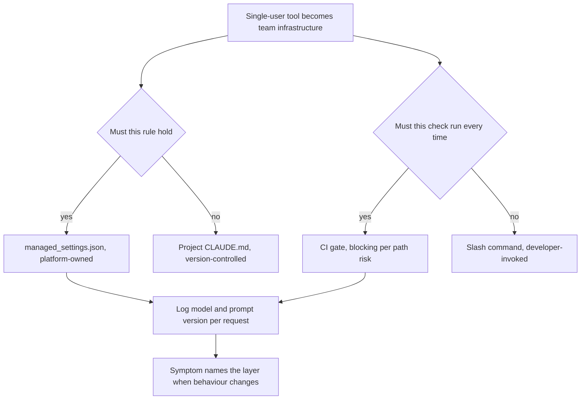
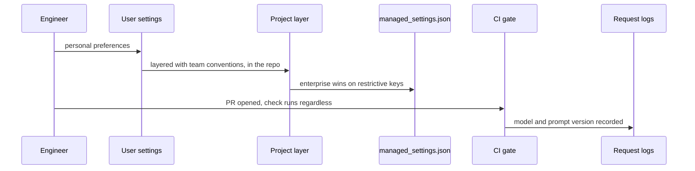

## What Problem Are We Solving?

A games studio rolled Claude Code out to 120 engineers. Every individual had used it and liked it;
the rollout was expected to be a licensing exercise.

Three months later the studio had three problems that no individual developer could have caused.
Configuration had fragmented — the build team's conventions lived in one engineer's home
directory, so nobody else got them. A `/review` command existed and invocation had fallen to a
third, because it was optional. And a cost alert took four days to diagnose because nothing logged
which prompt version or model version had served a request.

None of that is a Claude Code problem. Each is what happens when a **single-user tool becomes team
infrastructure** and nobody makes the decisions that transition requires: which settings apply to
whom and who may change them, which checks are optional and which are policy, and what gets logged
so an operator can diagnose behaviour they didn't cause.

That's the whole shift this domain tests. At Foundations the question is what Claude Code can do
for one developer. Here it's how you **configure, govern and operate** it across a team — and the
answers are ordinary infrastructure answers: precedence, policy, and telemetry.

It's also the smallest domain on the exam at 7%, roughly four questions, and it deliberately
overlaps Foundations material. It rewards a confident refresh rather than deep new study.

> **🗣️ In plain English:** The same tool, used by 120 people instead of one, needs decisions about authority, enforcement and logging. That's the only thing that changes — and it changes everything.

## Meet the Moving Parts

| Question | Topic | The decision |
|---|---|---|
| Which settings apply, to whom? | **7.1** Claude Code for teams | Enterprise / project / user, with restrictive settings resolving differently from additive ones |
| Tool or policy? | **7.2** AI-assisted workflows | Interactive versus pipeline-triggered, with opposite failure modes |
| Why did it behave like that? | **7.3** Debugging | Symptom names the layer: prompt, model, tool, retrieval, cache |

Two relationships matter.

**7.1 and 7.2 are the same question at different layers.** Both ask what must hold versus what is
advice. A `managed_settings.json` control and a blocking CI gate are enforcement; a `CLAUDE.md`
rule and a slash command are guidance. Getting the pairing wrong produces the same failure in both
places — a rule everyone agrees with that nobody is obliged to follow.

**7.3 is the tax on the other two.** Once configuration spans three layers and checks run
automatically, an operator debugging odd behaviour is looking at a system they didn't configure
and didn't invoke. Logging the prompt version and model version per request is what makes that
tractable, and it costs nothing until the day you need it.

> **💡 Tip:** Given the weight, don't over-invest here. A solid refresh of Foundations-level Claude Code configuration knowledge is usually enough.

## How It Works, Step by Step

1. **Sort every rule by whether it must hold** under local pressure — that decides enterprise
   versus project versus user (7.1).
2. **Put restrictive controls in `managed_settings.json`**, owned by platform or security rather
   than the teams they govern.
3. **Version-control the project layer** alongside the code, reviewed like code.
4. **Decide per check whether it's a tool or a policy** (7.2), and package the logic once so both
   paths run it.
5. **Set blocking versus advisory per code path**, with human sign-off on high-risk paths
   regardless of the AI result.
6. **Pin model versions and version prompt templates**, treating both like dependencies.
7. **Log the serving model version and prompt version on every request** (7.3).
8. **Monitor cache hit rate**, since cost symptoms are usually invalidation rather than volume.



## Minimal Working Implementation

The three failures all come from a missing team-level decision, so check for them. Save as
`team_readiness.py` and run it — no API key needed.

```python
import json
import sys

RESTRICTIVE = {"allowed_tools", "network_access", "audit_logging",
               "permissions"}
REQUIRED_LOGS = {"model_version", "prompt_version", "cache_read_tokens"}

def review(d: dict) -> list[str]:
    gaps = []
    for rule in d.get("rules", []):
        if rule.get("must_hold") and rule.get("layer") != "enterprise":
            gaps.append(f"7.1 {rule['name']!r} must hold but lives in "
                        f"{rule.get('layer')} - guidance, not enforcement")
    if d.get("managed_settings_owner") in d.get("governed_teams", []):
        gaps.append("7.1 managed_settings.json owned by a team it "
                    "governs - not a control")
    if not d.get("project_layer_version_controlled"):
        gaps.append("7.1 project CLAUDE.md not in version control")

    for check in d.get("checks", []):
        if check.get("must_run_every_time") and check.get("trigger") != "ci":
            gaps.append(f"7.2 {check['name']!r} must always run but is "
                        f"{check.get('trigger')}-triggered - expect "
                        f"underuse under deadline pressure")
        if check.get("blocking") and check.get("path_risk") == "low":
            gaps.append(f"7.2 {check['name']!r} blocks on low-risk paths "
                        f"- trains people to click through")
        if check.get("path_risk") == "high" and not check.get("human_signoff"):
            gaps.append(f"7.2 {check['name']!r} high-risk path with no "
                        f"human sign-off independent of the AI result")

    logged = set(d.get("logged_fields", []))
    gaps += [f"7.3 {f} not logged - the two blind spots are invisible "
             f"without it" for f in sorted(REQUIRED_LOGS - logged)]
    if d.get("model_alias") == "rolling":
        gaps.append("7.3 rolling model alias in production - upgrades "
                    "land without a deploy")
    return gaps

if __name__ == "__main__":
    found = review(json.load(open(sys.argv[1], encoding="utf-8")))
    print("\n".join(f"- {g}" for g in found) or "team-ready")
    sys.exit(1 if found else 0)
```

Every check is a decision that exists only once more than one person is involved. Run against a
single developer's setup, almost none of them apply — which is exactly why they get missed during
a rollout that feels like a licensing exercise.

## Production Implementation

Production makes the three decisions explicit and keeps the telemetry that makes the third
tractable.

```python
import dataclasses

@dataclasses.dataclass(frozen=True)
class TeamConfig:
    enterprise_owner: str          # platform or security, never the team
    enterprise_controls: tuple[str, ...]
    project_repo_path: str         # version-controlled
    pinned_model: str              # never a rolling alias
    logged_fields: frozenset

CONFIG = TeamConfig(
    enterprise_owner="platform-security",
    enterprise_controls=("allowed_tools", "network_access",
                         "audit_logging"),
    project_repo_path=".claude/",
    pinned_model="claude-opus-5",
    logged_fields=frozenset({"model_version", "prompt_version",
                             "input_tokens", "cache_read_tokens",
                             "tool_errors", "model_ms"}))

def enforcement_probe(action: str, attempt) -> str:
    """Config review says what a rule states. Only an attempt says what
    it protects - and coverage drifts as the codebase moves."""
    try:
        attempt()
    except PermissionError as exc:
        return f"ENFORCED: {action} refused ({exc})"
    return f"NOT ENFORCED: {action} succeeded - guidance, not a control"
```

The telemetry exists so an operator can diagnose behaviour nobody in the room configured:

```python
def diagnose(symptom: str, log: dict, baseline: dict) -> str:
    """The symptom names the layer. This is 7.3 compressed into the one
    lookup an on-call engineer needs at 2am."""
    layer = {"unexpected_output": "prompt_version and model_version",
             "tool_failures": "the downstream service's own logs",
             "latency": "input_tokens and retrieval timing",
             "cost": "cache hit rate, before anything else"}
    if symptom not in layer:
        return "unclassified symptom - widen the window"
    return f"{symptom}: check {layer[symptom]}"
    # ...
```

**What changed, and why:**

- **`enterprise_owner` is a field, and it isn't the governed team.** A restrictive control editable
  by the people it restricts is documentation, and this makes that reviewable rather than assumed.
- **`pinned_model` exists at all.** A rolling alias is the one change that reaches production
  without a deploy; pinning it converts a category of mystery into a category of decision.
- **`logged_fields` includes `cache_read_tokens`.** Cost symptoms are usually invalidation, and
  without that field the fastest diagnosis in the domain isn't available.
- **Enforcement is probed, not read.** Configuration review checks what a rule says; only
  attempting the forbidden action checks what it still protects as the codebase moves.

## In Production: Rolling Claude Code Out to a Games Studio

120 engineers across engine, gameplay, tools and live-ops, with a shared monorepo and a shipped
title under live service.



**The three fixes.** Restrictive rules — tool allowlist and no direct network access — moved into
`managed_settings.json`, owned by the platform team. Team conventions moved out of home
directories into the repo's `.claude/` directory, reviewed in PRs like code. The `/review` command
was wired into CI, blocking on engine and live-ops code, advisory on tools and content.

**The telemetry.** Model version, prompt version and cache tokens logged per request. The next cost
anomaly was diagnosed in eleven minutes rather than four days — a conditional block added to a
prompt for one team had fragmented the cache prefix.

**What the per-path policy avoided.** Blocking everywhere had been the first proposal. Content and
tools code is roughly 60% of PRs and low-risk, and a blocking gate there would have trained 120
engineers to treat the check as an obstacle. Advisory on those paths, blocking plus human sign-off
on live-ops, kept the gate meaningful where it mattered.

**The size of the work.** About a week, mostly writing down decisions that had been implicit. Which
is the honest summary of this domain: it is small, it overlaps material you already know, and the
value is in making three explicit choices that nobody makes by default.

> **🌍 Real-world example:** The build team's conventions living in one engineer's `~/.claude/CLAUDE.md` is the most ordinary failure here and the most instructive. Nothing was wrong with the rules, and they worked perfectly for the person who wrote them. They simply weren't shared, because the layer they lived in isn't shared — and nobody noticed for months, because everyone else's output was fine in a different way.

## Where This Applies — and Where It Doesn't

| Situation | Use this | Use instead |
|---|---|---|
| A rule must hold regardless of local config | `managed_settings.json` (7.1) | A `CLAUDE.md` line |
| Team conventions | Project layer, version-controlled | A home directory |
| A check that must run every time | CI gate (7.2) | An optional slash command |
| Low-risk paths | Advisory comment | Blocking, which trains clicking through |
| High-risk paths | Blocking **plus** independent human sign-off | Trusting a green check |
| Diagnosing odd behaviour | Symptom names the layer (7.3) | Guessing at the code |
| Production model selection | A pinned version | A rolling alias |
| A single developer | — | Most of this; it's team infrastructure |

Anti-patterns: restrictive rules in advisory layers; conventions in home directories; optional
checks on things that matter; blocking everywhere; rolling aliases in production; and debugging
without per-request model and prompt versions.

## Failure Modes Seen in the Wild

### 1. Configuration in the wrong layer

**Symptom.** A rule everyone agrees with that only some sessions follow.
**Cause.** A must-hold rule in `CLAUDE.md`, or a team convention in a home directory (7.1).
**Fix.** Sort by whether it must hold; enterprise enforces, project shares, user personalises.

### 2. The optional check

**Symptom.** Invocation falls, worst under deadline pressure.
**Cause.** Something that needed to be policy was left as a tool (7.2).
**Fix.** CI for what must run; keep the same packaged prompt for interactive use.

### 3. Blocking everywhere

**Symptom.** Engineers routinely clicking through a gate.
**Cause.** Uniform blocking, including where the risk doesn't justify it.
**Fix.** Per-path policy, with independent human sign-off on the high-risk paths.

### 4. Undiagnosable behaviour

**Symptom.** Days spent on a symptom whose cause was a version or a cache prefix.
**Cause.** No per-request model version, prompt version or cache telemetry (7.3).
**Fix.** Log all three; pin the model; alert on unexpected versions and hit-rate drops.

> **⚠️ Watch out:** Every failure in this domain is invisible to the individual developer who caused it. A personal setting that works, a check skipped once, a build id added to a prompt — each is locally reasonable and only becomes a problem at team scale, which is why none of them surfaces in the experience that made everyone want the tool.

## Exam Lens & Key Takeaway

> **📝 Exam focus:** 7% of the exam, about four questions — the smallest domain, deliberately overlapping Foundations material on Claude Code configuration, team tooling and operational workflows, but shifting the lens from an individual developer to the team and operational level. Expect questions on **configuring Claude Code for a team rather than one user** — the three-level hierarchy of `managed_settings.json` (enterprise, highest authority, cannot be overridden), project `CLAUDE.md` and `.claude/rules/`, and user `~/.claude/CLAUDE.md`, with restrictive controls resolving by enterprise winning outright while additive guidance layers. On **team-level workflows** — shared slash commands and CI/CD integration, and interactive (fails by underuse) versus pipeline-triggered (fails by rubber-stamping). And on **diagnosing operational issues from symptoms** — unexpected output points at prompt and model versions, tool failures at the downstream service, latency at token counts and retrieval timing, and cost at cache invalidation.

> **🔑 Key takeaway:** Everything here follows from one transition: a single-user tool becoming team infrastructure, which forces three decisions nobody makes by default — which settings apply to whom and who may change them, which checks are advice and which are policy, and what gets logged so an operator can diagnose behaviour they didn't configure. Sort rules by whether they must hold, decide blocking per code path rather than per tool, and log the model and prompt version on every request, because the two changes that reach production without a deploy are invisible without it.
